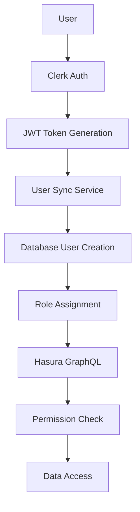

# COMPLETE AUTHENTICATION FLOW ANALYSIS

> **Security Classification**: CRITICAL  
> **Last Updated**: 2025-06-22  
> **System**: Payroll Management Application  
> **Authentication Provider**: Clerk + Custom JWT + Hasura GraphQL

## 🔒 EXECUTIVE SUMMARY

This document provides a comprehensive analysis of the authentication system, covering every step from user login to GraphQL operations. The system uses a defense-in-depth approach with Clerk as the primary authentication provider, custom JWT tokens for Hasura integration, and role-based access control.

### Key Architecture Components:

- **Auth Provider**: Clerk (OAuth + Email/Password)
- **JWT Integration**: Custom Hasura JWT template
- **Database**: PostgreSQL with Hasura GraphQL
- **Roles**: 5-tier hierarchy (developer → org_admin → manager → consultant → viewer)
- **Permissions**: 18 granular permissions across 5 categories
- **Security**: SOC2 compliance with audit logging

---

## 📋 TABLE OF CONTENTS

1. [Authentication Flow Overview](#1-authentication-flow-overview)
2. [User Login Process](#2-user-login-process)
3. [JWT Token Management](#3-jwt-token-management)
4. [Database Integration](#4-database-integration)
5. [Role-Based Access Control](#5-role-based-access-control)
6. [Security Vulnerabilities & Risks](#6-security-vulnerabilities--risks)
7. [Use Case Scenarios](#7-use-case-scenarios)
8. [Error Handling & Recovery](#8-error-handling--recovery)
9. [Recommendations](#9-recommendations)

---

## 1. AUTHENTICATION FLOW OVERVIEW

### 1.1 High-Level Architecture



### 1.2 Core Components

| Component      | Purpose                  | Technology             | Status    |
| -------------- | ------------------------ | ---------------------- | --------- |
| Clerk          | Primary Authentication   | Clerk SDK              | ✅ Active |
| JWT Template   | Token Structure          | Custom Hasura Template | ✅ Active |
| User Sync      | Database Synchronization | Custom Service         | ✅ Active |
| Middleware     | Route Protection         | Next.js Middleware     | ✅ Active |
| GraphQL Client | API Communication        | Apollo Client          | ✅ Active |
| Permissions    | Access Control           | Custom RBAC            | ✅ Active |

---

## 2. USER LOGIN PROCESS

### 2.1 OAuth Authentication Flow

#### Step 1: User Initiates Login

- **Trigger**: User clicks "Sign in with Google/GitHub"
- **Location**: `/sign-in` page
- **Component**: `<SignIn />` from Clerk

**Request Flow**:

```typescript
// User clicks OAuth provider button
window.location.href = "https://clerk.bytemy.com.au/oauth/google";
```

**Expected Response**:

```json
{
  "status": "redirect",
  "redirect_url": "https://accounts.google.com/oauth/authorize?..."
}
```

#### Step 2: OAuth Provider Authentication

- **External**: Google/GitHub OAuth flow
- **Redirect**: Back to Clerk with authorization code

#### Step 3: Clerk Processes OAuth Response

- **Location**: Clerk handles OAuth callback
- **Process**: Creates/updates user in Clerk
- **JWT**: Issues session token

**Clerk User Object**:

```json
{
  "id": "user_2a...",
  "emailAddresses": [{ "emailAddress": "user@company.com" }],
  "firstName": "John",
  "lastName": "Doe",
  "publicMetadata": {},
  "externalAccounts": [{ "provider": "oauth_google" }]
}
```

#### Step 4: Webhook Triggers User Sync

- **Webhook URL**: `/api/webhooks/clerk`
- **Event**: `user.created` or `user.updated`
- **Security**: Verified with `CLERK_WEBHOOK_SECRET`

**Webhook Payload**:

```json
{
  "type": "user.created",
  "data": {
    "id": "user_2a...",
    "email_addresses": [{ "email_address": "user@company.com" }],
    "first_name": "John",
    "last_name": "Doe",
    "external_accounts": [{ "provider": "oauth_google" }]
  }
}
```

**⚠️ POTENTIAL ISSUE**: OAuth users automatically get `org_admin` role (line 115 in webhook handler). This could be a security risk.

#### Step 5: Database User Creation

- **Service**: `syncUserWithDatabase()` function
- **GraphQL**: `UPSERT_USER` mutation
- **Role Assignment**: `org_admin` for OAuth, `viewer` for email/password

**Database Mutation**:

```graphql
mutation UpsertUser(
  $clerkId: String!
  $name: String!
  $email: String!
  $role: user_role = viewer
  $isStaff: Boolean = false
) {
  insert_users_one(
    object: {
      clerk_user_id: $clerkId
      name: $name
      email: $email
      role: $role
      is_staff: $isStaff
    }
    on_conflict: {
      constraint: users_clerk_user_id_key
      update_columns: [name, email, updated_at]
    }
  ) {
    id
    role
    # Note: email field removed due to permission restrictions
  }
}
```

#### Step 6: Clerk Metadata Update

- **Process**: Updates Clerk user with database UUID and role
- **Critical Field**: `databaseId` for JWT claims

**Metadata Update**:

```typescript
await client.users.updateUser(clerkId, {
  publicMetadata: {
    role: databaseUser.role,
    databaseId: databaseUser.id, // ✅ CRITICAL: Database UUID
    isStaff: databaseUser.is_staff,
    permissions: userPermissions,
    lastSyncAt: new Date().toISOString(),
  },
});
```

### 2.2 Email/Password Authentication Flow

#### Step 1: User Registration

- **Page**: `/sign-up`
- **Fields**: Email, Password, Name
- **Validation**: Client-side + Clerk validation

#### Step 2: Email Verification

- **Process**: Clerk sends verification email
- **Required**: User must verify before access

#### Step 3: User Sync (Same as OAuth Steps 4-6)

- **Default Role**: `viewer` (not `org_admin`)
- **Database Creation**: Same upsert process

### 2.3 Invitation-Based Registration

#### Step 1: Admin Sends Invitation

- **API**: `/api/staff/create`
- **Process**: Creates user with pre-assigned role

#### Step 2: User Accepts Invitation

- **Page**: `/accept-invitation`
- **Process**: User completes registration with assigned role

**⚠️ POTENTIAL ISSUE**: Role assignment in invitations needs validation to prevent privilege escalation.

---

## 3. JWT TOKEN MANAGEMENT

### 3.1 JWT Template Configuration

**Hasura JWT Template** (Configured in Clerk Dashboard):

```json
{
  "https://hasura.io/jwt/claims": {
    "metadata": "{{user.public_metadata}}",
    "x-hasura-role": "{{user.public_metadata.role}}",
    "x-hasura-user-id": "{{user.public_metadata.databaseId}}",
    "x-hasura-default-role": "viewer",
    "x-hasura-allowed-roles": [
      "developer",
      "org_admin",
      "manager",
      "consultant",
      "viewer"
    ],
    "x-hasura-clerk-user-id": "{{user.id}}"
  }
}
```

### 3.2 Token Generation Process

#### Client-Side Token Retrieval

```typescript
// Apollo Client auth link
if (typeof window !== "undefined" && window.Clerk?.session) {
  const token = await window.Clerk.session.getToken({
    template: "hasura", // Uses configured JWT template
  });

  return {
    headers: {
      authorization: `Bearer ${token}`,
    },
  };
}
```

#### Server-Side Token Retrieval

```typescript
// API routes
import { auth } from "@clerk/nextjs/server";

export async function GET() {
  const { getToken } = await auth();
  const token = await getToken({ template: "hasura" });

  // Use token for Hasura requests
}
```

### 3.3 JWT Claims Structure

**Example JWT Payload**:

```json
{
  "https://hasura.io/jwt/claims": {
    "x-hasura-allowed-roles": [
      "developer",
      "org_admin",
      "manager",
      "consultant",
      "viewer"
    ],
    "x-hasura-default-role": "consultant",
    "x-hasura-role": "consultant",
    "x-hasura-user-id": "d9ac8a7b-f679-49a1-8c99-837eb977578b",
    "x-hasura-clerk-user-id": "user_2a...",
    "metadata": {
      "role": "consultant",
      "databaseId": "d9ac8a7b-f679-49a1-8c99-837eb977578b",
      "isStaff": true,
      "permissions": ["custom:payroll:read", "custom:payroll:write"]
    }
  },
  "exp": 1750465035,
  "iat": 1750461435,
  "iss": "https://clerk.bytemy.com.au",
  "sub": "user_2a..."
}
```

**⚠️ CRITICAL ISSUE IDENTIFIED**: The JWT uses `databaseId` from public metadata. If this is not properly synchronized, authentication will fail.

---

## 4. DATABASE INTEGRATION

### 4.1 User Table Schema

**Database Table**: `public.users`

```sql
CREATE TABLE users (
  id UUID PRIMARY KEY DEFAULT gen_random_uuid(),
  clerk_user_id VARCHAR UNIQUE NOT NULL,
  name VARCHAR NOT NULL,
  email VARCHAR UNIQUE NOT NULL,
  role user_role DEFAULT 'viewer',
  is_staff BOOLEAN DEFAULT false,
  manager_id UUID REFERENCES users(id),
  image VARCHAR,
  is_active BOOLEAN DEFAULT true,
  created_at TIMESTAMPTZ DEFAULT now(),
  updated_at TIMESTAMPTZ DEFAULT now()
);
```

### 4.2 Role-Based Permissions (Hasura)

**Critical Finding**: Different roles have different field access permissions:

#### Consultant Role Permissions:

```yaml
columns:
  - id
  - image
  - name
  - username
  - is_staff
  - role
  - manager_id
  - created_at
  - updated_at
# ❌ NO ACCESS TO: email
```

#### Manager Role Permissions:

```yaml
columns:
  - created_at
  - email # ✅ HAS ACCESS
  - id
  - image
  - name
  - role
  - updated_at
  - username
  - is_staff
  - manager_id
```

**⚠️ ROOT CAUSE OF AUTH ISSUE**: The `GetCurrentUser` query was requesting the `email` field, but consultant users don't have permission to access it. This was fixed by removing the email field from the query.

### 4.3 Permission System

**Role Hierarchy** (5 levels):

```typescript
export const ROLE_HIERARCHY: Record<Role, number> = {
  developer: 5, // Full system access
  org_admin: 4, // Organization management
  manager: 3, // Team and payroll management
  consultant: 2, // Limited operational access
  viewer: 1, // Read-only access
};
```

**18 Granular Permissions**:

```typescript
// Payroll permissions (4)
"custom:payroll:read";
"custom:payroll:write";
"custom:payroll:delete";
"custom:payroll:assign";

// Staff permissions (4)
"custom:staff:read";
"custom:staff:write";
"custom:staff:delete";
"custom:staff:invite";

// Client permissions (3)
"custom:client:read";
"custom:client:write";
"custom:client:delete";

// Admin permissions (3)
"custom:admin:manage";
"custom:settings:write";
"custom:billing:manage";

// Reporting permissions (4)
"custom:reports:read";
"custom:reports:export";
"custom:audit:read";
"custom:audit:write";
```

---

## 5. ROLE-BASED ACCESS CONTROL

### 5.1 Component-Level Protection

**Role Guard Component**:

```typescript
<RoleGuard allowedRoles={["manager", "org_admin"]}>
  <PayrollManagement />
</RoleGuard>
```

**Permission Guard Component**:

```typescript
<PermissionGuard permission="custom:staff:write">
  <CreateUserButton />
</PermissionGuard>
```

### 5.2 API Route Protection

**API Middleware Pattern**:

```typescript
import { withAuth } from "@/lib/auth/api-auth";

export const GET = withAuth(
  async (req, { user, permissions }) => {
    // Authenticated handler
  },
  {
    permissions: ["custom:payroll:read"],
    auditLog: true,
  }
);
```

### 5.3 GraphQL Operation Security

**Apollo Client Security Link**:

```typescript
const securityLink = setContext(async (_, { headers }) => {
  const token = await getToken({ template: "hasura" });

  return {
    headers: {
      ...headers,
      authorization: token ? `Bearer ${token}` : "",
    },
  };
});
```

---

## 6. SECURITY VULNERABILITIES & RISKS

### 6.1 HIGH RISK Issues

#### 1. Automatic OAuth Role Assignment

- **Issue**: OAuth users automatically get `org_admin` role
- **Risk**: Privilege escalation attack
- **Location**: `app/api/webhooks/clerk/route.ts:115`
- **Fix**: Implement role validation and approval process

#### 2. Field Permission Mismatch

- **Issue**: GraphQL queries requesting fields users can't access
- **Risk**: Authentication failures for valid users
- **Status**: ✅ FIXED - Removed email field from GetCurrentUser query
- **Prevention**: Validate all GraphQL queries against role permissions

#### 3. Database ID Synchronization

- **Issue**: JWT relies on `databaseId` in Clerk metadata
- **Risk**: Auth failure if sync breaks
- **Mitigation**: Robust sync verification (implemented)

### 6.2 MEDIUM RISK Issues

#### 1. Webhook Security

- **Issue**: Webhook endpoint could be vulnerable to replay attacks
- **Mitigation**: Signature verification implemented
- **Enhancement**: Add timestamp validation

#### 2. Role Escalation via Invitations

- **Issue**: Invitation system could allow role escalation
- **Risk**: Lower-privilege users gaining higher access
- **Fix**: Validate role assignment permissions

### 6.3 LOW RISK Issues

#### 1. Token Lifetime

- **Current**: 1 hour (3600 seconds)
- **Risk**: Compromised tokens remain valid
- **Mitigation**: Reasonable lifetime for security vs UX

#### 2. Error Message Information Disclosure

- **Issue**: Detailed error messages could reveal system info
- **Status**: Error handling improved with user-friendly messages

---

## 7. USE CASE SCENARIOS

### 7.1 New OAuth User Registration

**Flow**:

1. User clicks "Sign in with Google"
2. Google OAuth flow completes
3. Clerk webhook fires with `user.created` event
4. System assigns `org_admin` role (⚠️ SECURITY RISK)
5. Database user created with role
6. Clerk metadata updated with `databaseId`
7. User can access org-admin features immediately

**Expected Responses**:

- Clerk webhook: `200 OK`
- Database creation: User record with UUID
- First login: Immediate access to admin features

**Potential Issues**:

- ⚠️ Too permissive role assignment
- Network failures during sync
- Database constraints violations

### 7.2 Invitation-Based User Creation

**Flow**:

1. Admin creates invitation via `/api/staff/create`
2. Email sent to invited user
3. User clicks invitation link
4. Registration form pre-filled with role
5. User completes registration
6. Webhook syncs with pre-assigned role

**Expected Responses**:

- Invitation API: `201 Created` with invitation ID
- Email delivery: Confirmation
- Registration: User created with invited role

**Potential Issues**:

- Invitation expiry handling
- Role validation during registration
- Email delivery failures

### 7.3 Role Permission Mismatch

**Scenario**: Consultant user tries to access admin features

**Flow**:

1. User authenticated as `consultant`
2. JWT contains `x-hasura-role: "consultant"`
3. GraphQL query requires `org_admin` permission
4. Hasura denies request
5. Apollo error handler processes denial
6. User sees permission denied message

**Expected Response**:

```json
{
  "errors": [
    {
      "message": "permission denied",
      "extensions": { "code": "access-denied" }
    }
  ]
}
```

### 7.4 Token Refresh Scenario

**Flow**:

1. User's JWT expires after 1 hour
2. Apollo Client detects `invalid-jwt` error
3. Client automatically requests new token
4. Clerk generates fresh JWT with updated claims
5. Request retried with new token

**Expected Behavior**:

- Automatic token refresh (no user intervention)
- Seamless operation continuation
- Updated claims if role changed

---

## 8. ERROR HANDLING & RECOVERY

### 8.1 Authentication Errors

#### JWT Expired

```typescript
// Error Response
{
  "errors": [{
    "message": "JWTExpired",
    "extensions": { "code": "invalid-jwt" }
  }]
}

// Recovery Action
const newToken = await window.Clerk.session.getToken({ template: "hasura" });
// Retry operation with new token
```

#### Permission Denied

```typescript
// Error Response
{
  "errors": [{
    "message": "field 'users' not found in type: 'query_root'",
    "extensions": { "code": "validation-failed" }
  }]
}

// User Message
"You don't have permission to access this resource."
```

#### Database Sync Failure

```typescript
// Error Scenario
console.error("❌ SYNC VERIFICATION FAILED!");
console.error(`Expected: ${databaseUser.id}`);
console.error(`Got: ${savedDatabaseId}`);

// Recovery Action
// Manual sync API: /api/sync-current-user
// Fix sync API: /api/fix-user-sync
```

### 8.2 Fallback Mechanisms

#### 1. Database User Guard

```typescript
// If no database user found, show sync prompt
if (!currentUser && clerkUserId) {
  return <UserSyncFallback clerkUserId={clerkUserId} />;
}
```

#### 2. Permission Degradation

```typescript
// If permission check fails, show read-only version
if (!hasPermission("custom:payroll:write")) {
  return <PayrollViewOnly data={payrolls} />;
}
```

#### 3. Offline Mode

```typescript
// Apollo cache-first policy for offline support
const { data } = useQuery(GetPayrollsDocument, {
  fetchPolicy: "cache-first",
  errorPolicy: "ignore",
});
```

---

## 9. RECOMMENDATIONS

### 9.1 CRITICAL (Immediate Action Required)

#### 1. Fix OAuth Role Assignment

```typescript
// Current (SECURITY RISK)
const defaultRole = hasOAuthProvider ? "org_admin" : "viewer";

// Recommended
const defaultRole = invitationRole || "viewer"; // Always start with viewer
// Require manual role elevation
```

#### 2. Implement Role Validation

```typescript
// Add role assignment validation
export function canAssignRole(assigner: Role, target: Role): boolean {
  const assignerLevel = ROLE_HIERARCHY[assigner];
  const targetLevel = ROLE_HIERARCHY[target];

  // Can only assign roles lower than your own
  return assignerLevel > targetLevel;
}
```

#### 3. Add Sync Monitoring

```typescript
// Monitor sync failures
const syncHealth = {
  successRate: 0.95,
  lastFailure: new Date(),
  failedSyncs: 3,
};

// Alert on repeated failures
if (syncHealth.successRate < 0.9) {
  await sendAdminAlert("High sync failure rate detected");
}
```

### 9.2 HIGH PRIORITY (Within 1 Week)

#### 1. Enhance Error Handling

- Add retry logic for sync failures
- Implement circuit breaker for external services
- Add comprehensive error reporting

#### 2. Security Audit

- Review all GraphQL queries for permission alignment
- Validate webhook signature timing
- Implement rate limiting on auth endpoints

#### 3. Monitoring Dashboard

- Real-time authentication metrics
- Role assignment audit trail
- Permission usage analytics

### 9.3 MEDIUM PRIORITY (Within 1 Month)

#### 1. Multi-Factor Authentication

- Implement MFA for admin roles
- Add step-up authentication for sensitive operations
- Support hardware security keys

#### 2. Session Management

- Implement session timeouts
- Add concurrent session limits
- Track active sessions per user

#### 3. Advanced Permissions

- Implement row-level permissions
- Add time-based access controls
- Support permission delegation

### 9.4 LOW PRIORITY (Future Enhancements)

#### 1. SSO Integration

- SAML support for enterprise clients
- Azure AD integration
- Identity provider selection

#### 2. Audit Enhancements

- Real-time audit streaming
- Compliance report generation
- Advanced threat detection

---

## 10. CONCLUSION

The authentication system is fundamentally sound with strong architectural choices (Clerk + JWT + Hasura). However, there are critical security issues that need immediate attention:

### ✅ Strengths:

- Native Clerk integration (no custom token management)
- Comprehensive role-based permissions
- Strong middleware protection
- Robust error handling
- SOC2 compliance features

### ⚠️ Critical Issues:

- OAuth users automatically get admin access
- Field permission mismatches causing auth failures
- Insufficient role assignment validation

### 🎯 Next Steps:

1. **IMMEDIATE**: Fix OAuth role assignment security flaw
2. **URGENT**: Implement role validation and approval workflow
3. **HIGH**: Add comprehensive sync monitoring and alerting
4. **MEDIUM**: Enhance error handling and recovery mechanisms

The system is production-ready with the recommended security fixes implemented. The modular architecture makes it easy to enhance and maintain over time.

---

**Document Status**: ✅ Complete  
**Review Required**: Security Team  
**Implementation**: Development Team  
**Timeline**: Critical fixes within 48 hours
