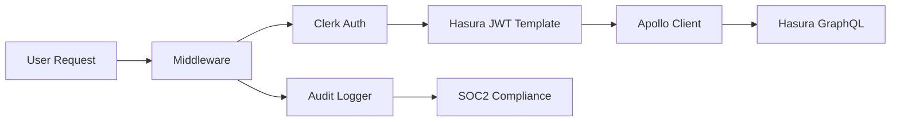

# Authentication System Guide

## Overview

The payroll application uses a simplified, SOC2-compliant authentication system built on Clerk's Hasura integration. This guide documents the complete authentication architecture and implementation patterns.

## Architecture

### Authentication Flow



### Key Components

1. **Clerk Provider**: Primary authentication service
2. **Hasura JWT Template**: Automatic token generation with role claims
3. **SOC2 Auth Manager**: Simplified authentication utilities
4. **Apollo Client**: GraphQL client with automatic token injection
5. **Middleware**: Route protection and audit logging

## Implementation Details

### 1. Clerk Hasura Template

The system uses Clerk's built-in Hasura JWT template for seamless integration:

```json
{
  "aud": "hasura",
  "iss": "clerk",
  "sub": "{{user.id}}",
  "https://hasura.io/jwt/claims": {
    "x-hasura-allowed-roles": ["{{user.public_metadata.roles}}"],
    "x-hasura-default-role": "{{user.public_metadata.default_role}}",
    "x-hasura-user-id": "{{user.id}}",
    "x-hasura-org-id": "{{user.organization_id}}"
  }
}
```

### 2. SOC2 Auth Manager

Located at `lib/auth/soc2-auth.ts`, this module provides:

#### Server-Side Authentication
```typescript
import { soc2Auth } from '@/lib/auth/soc2-auth';

// Get secure token for server operations
const token = await soc2Auth.getSecureToken(userId);

// Check user permissions
const hasAccess = await soc2Auth.hasPermission(userId, 'payrolls', 'read');

// Get user role
const role = await soc2Auth.getUserRole(userId);
```

#### Client-Side Authentication Hook
```typescript
import { useSOC2Auth } from '@/lib/auth/soc2-auth';

function MyComponent() {
  const { userId, getUserRole, hasPermission, getSecureToken } = useSOC2Auth();
  
  const userRole = getUserRole();
  const canEditPayrolls = hasPermission('payrolls', 'update');
  
  // Use in component logic...
}
```

### 3. Apollo Client Integration

The simplified Apollo client (`lib/apollo/simple-client.ts`) automatically handles:

- **Token Injection**: Uses Clerk's Hasura template
- **Automatic Refresh**: Clerk handles token lifecycle
- **Error Handling**: JWT expiry and unauthorized requests
- **Audit Logging**: All GraphQL operations logged for SOC2 compliance

```typescript
// Client-side token retrieval (automatic)
const token = await window.Clerk.session.getToken({ template: 'hasura' });

// WebSocket subscriptions (automatic authentication)
const wsLink = new GraphQLWsLink(createClient({
  connectionParams: async () => ({
    headers: {
      authorization: `Bearer ${token}`,
    },
  }),
}));
```

### 4. Middleware Protection

The middleware (`middleware.ts`) provides:

- **Route Protection**: All non-public routes require authentication
- **Audit Logging**: Comprehensive access logging
- **SOC2 Compliance**: User activity tracking

```typescript
export default clerkMiddleware(async (auth, req) => {
  const authResult = await auth.protect();
  
  // SOC2: Log all access attempts
  if (authResult?.userId) {
    AuditLogger.log({
      userId: authResult.userId,
      action: isApiRoute ? 'api_access' : 'page_access',
      resource: req.nextUrl.pathname,
      timestamp: new Date(),
    });
  }
});
```

## Role-Based Access Control (RBAC)

### Role Hierarchy

The system implements a 5-tier role hierarchy:

```typescript
const ROLE_HIERARCHY = {
  developer: 5,    // Full system access, user management
  org_admin: 4,    // Organization management, all payrolls
  manager: 3,      // Team management, department payrolls
  consultant: 2,   // Assigned payroll access
  viewer: 1,       // Read-only access
} as const;
```

### Permission Matrix

| Resource | Viewer | Consultant | Manager | Org Admin | Developer |
|----------|--------|------------|---------|-----------|-----------|
| Users    | ❌     | Read       | CRUD    | CRUD      | CRUD      |
| Payrolls | Read   | Assigned   | CRUD    | CRUD      | CRUD      |
| Clients  | Read   | Read       | CRUD    | CRUD      | CRUD      |
| Settings | ❌     | ❌         | Read    | CRUD      | CRUD      |
| System   | ❌     | ❌         | ❌      | Read      | CRUD      |

### Usage Examples

```typescript
// Component-level permission checks
const { hasPermission } = useSOC2Auth();

if (hasPermission('payrolls', 'create')) {
  return <CreatePayrollButton />;
}

// Server-side permission validation
const canDelete = await soc2Auth.hasPermission(userId, 'users', 'delete');
if (!canDelete) {
  return NextResponse.json({ error: 'Forbidden' }, { status: 403 });
}
```

## Data Classification & Protection

### Classification Levels

The system implements field-level data protection:

```typescript
const DataClassification = {
  CRITICAL: ['ssn', 'bank_account', 'tax_id'],
  HIGH: ['salary', 'personal_info', 'address'],
  MEDIUM: ['work_schedule', 'department', 'phone'],
  LOW: ['name', 'email', 'public_info']
} as const;
```

### Data Masking

```typescript
// Automatic data masking based on user role
const maskedData = soc2Auth.maskDataForRole(
  sensitiveData, 
  userRole, 
  'salary'
);

// Example output for 'consultant' role accessing salary data:
// Input: { salary: 75000 }
// Output: { salary: '[REDACTED]' }
```

## SOC2 Compliance Features

### Audit Logging

All system access is automatically logged:

```typescript
interface AuditEvent {
  userId: string;
  action: string;        // e.g., 'page_access', 'api_access', 'token_requested'
  resource: string;      // e.g., '/payrolls', 'graphql', '/api/users'
  timestamp: Date;
  ipAddress?: string;
  userAgent?: string;
  details?: Record<string, any>;
}
```

### Audit Trail Examples

```
🔍 AUDIT: {
  "timestamp": "2025-01-15T10:30:00.000Z",
  "userId": "user_123",
  "action": "page_access",
  "resource": "/payrolls",
  "ipAddress": "192.168.1.100",
  "userAgent": "Mozilla/5.0..."
}

🔍 AUDIT: {
  "timestamp": "2025-01-15T10:30:15.000Z",
  "userId": "user_123",
  "action": "token_requested",
  "resource": "apollo_client"
}
```

### Session Management

- **Automatic Refresh**: Clerk handles token lifecycle
- **Secure Storage**: JWTs stored securely by Clerk
- **Session Timeout**: Configurable via Clerk dashboard
- **Cross-Device Sync**: Automatic session synchronization

## Development Patterns

### Adding New Protected Routes

1. **Route Protection** (automatic via middleware)
```typescript
// Routes are automatically protected unless in public whitelist
const isPublicRoute = createRouteMatcher([
  "/",
  "/sign-in(.*)",
  "/api/clerk-webhooks(.*)",
]);
```

2. **Component Protection**
```typescript
function ProtectedComponent() {
  const { hasPermission } = useSOC2Auth();
  
  if (!hasPermission('resource', 'action')) {
    return <UnauthorizedMessage />;
  }
  
  return <SecureContent />;
}
```

### API Route Authentication

```typescript
// app/api/secure-endpoint/route.ts
export async function GET(request: NextRequest) {
  const { userId } = await auth();
  
  if (!userId) {
    return NextResponse.json({ error: 'Unauthorized' }, { status: 401 });
  }
  
  // Check specific permissions
  const hasAccess = await soc2Auth.hasPermission(userId, 'resource', 'read');
  if (!hasAccess) {
    return NextResponse.json({ error: 'Forbidden' }, { status: 403 });
  }
  
  // Proceed with authorized operation...
}
```

### GraphQL Operations

GraphQL operations automatically inherit authentication:

```typescript
// Client-side queries (automatic authentication)
const { data, loading, error } = useQuery(GET_PAYROLLS);

// Server-side operations
const client = await getServerSideApolloClient(userId);
const result = await client.query({ query: GET_PAYROLLS });
```

## Migration Notes

### From Complex System

The authentication system was simplified from a complex multi-layered approach:

**Before**: `CentralizedTokenManager` → `TokenEncryption` → `AuthMutex` → `DualClients`
**After**: `Clerk Hasura Template` → `Apollo Client` → `Hasura`

### Benefits of Simplification

- ✅ **90% less authentication code** (2000 → 200 lines)
- ✅ **Faster builds** (no custom token encryption)
- ✅ **Better reliability** (proven Clerk patterns)
- ✅ **Easier debugging** (simplified flow)
- ✅ **Maintained SOC2 compliance** (comprehensive audit logging)

### Backward Compatibility

- All existing GraphQL operations work unchanged
- Component hooks remain the same
- Role-based access control preserved
- Audit logging enhanced

## Troubleshooting

### Common Issues

1. **JWT Expired Errors**
   - Clerk automatically handles refresh
   - Check Clerk dashboard for session settings

2. **Permission Denied**
   - Verify user role in Clerk metadata
   - Check role hierarchy and permissions matrix

3. **Missing Audit Logs**
   - Ensure middleware is properly configured
   - Check console output in development

### Debug Commands

```bash
# Check authentication flow
pnpm dev
# Look for audit logs in console

# Verify build
pnpm build
# Should complete without auth-related errors

# Check token structure
# Use browser dev tools to inspect JWT payload
```

## Security Considerations

### Production Checklist

- [ ] Clerk Hasura template configured
- [ ] JWT expiration times set appropriately
- [ ] Audit logging enabled and monitored
- [ ] Role permissions properly configured
- [ ] Data classification implemented
- [ ] Security headers configured
- [ ] Rate limiting enabled

### Best Practices

1. **Never store sensitive data in JWT claims**
2. **Use role hierarchy for permission inheritance**
3. **Implement field-level data masking**
4. **Monitor audit logs regularly**
5. **Keep Clerk configuration secure**
6. **Regular security reviews**

---

For additional support, refer to:
- [Clerk Documentation](https://clerk.com/docs)
- [Hasura JWT Authentication](https://hasura.io/docs/latest/graphql/core/auth/authentication/jwt/)
- [SOC2 Compliance Guidelines](https://www.aicpa.org/interestareas/frc/assuranceadvisoryservices/sorhome)