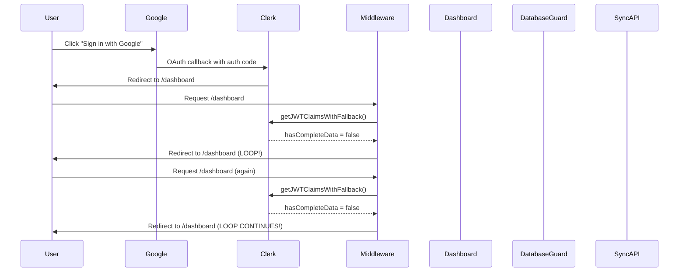

# OAuth Redirect Loop Analysis Report

**Date:** December 2024  
**Status:** Critical Authentication Issue  
**Severity:** High Priority

## 🚨 Executive Summary

The OAuth redirect loop is occurring due to a complex interaction between the middleware authentication flow, database user synchronization, and multiple authentication guards. The issue is particularly affecting Google OAuth users during the initial sign-in process.

## 🔍 Root Cause Analysis

### Primary Issue: Middleware Authentication Race Condition

The main cause of the OAuth redirect loop is a **race condition in the middleware** where:

1. **OAuth user completes Google authentication** → Gets redirected to `/dashboard`
2. **Middleware runs** → Calls `getJWTClaimsWithFallback()`
3. **JWT claims are incomplete** → `hasCompleteData = false`
4. **User gets redirected to `/dashboard`** for sync → Creates redirect loop

### Technical Details

#### 1. Middleware Flow Issue (`middleware.ts`)

```typescript
// Line 34: This is where the loop starts
const {
  userId,
  claims,
  role: userRole,
  hasCompleteData,
  error,
} = await getJWTClaimsWithFallback();

// Line 43-66: The problematic redirect logic
if (!hasCompleteData) {
  const allowedIncompleteDataPaths = [
    "/dashboard",
    "/api/sync-current-user",
    "/api/sync/",
    "/api/webhooks/clerk",
    "/profile",
    "/settings",
  ];

  const isAllowedPath = allowedIncompleteDataPaths.some(
    path => pathname === path || pathname.startsWith(path)
  );

  if (isAllowedPath) {
    return NextResponse.next(); // Allows access but data still incomplete
  } else {
    // THIS CREATES THE LOOP - redirects to dashboard when already on dashboard
    return NextResponse.redirect(new URL("/dashboard", req.url));
  }
}
```

#### 2. JWT Claims Incomplete (`lib/auth/token-utils.ts`)

```typescript
// Line 240: hasCompleteData logic
hasCompleteData: !!(userId && role && hasuraClaims),

// For OAuth users, hasuraClaims might be undefined initially
// This causes hasCompleteData = false, triggering the redirect loop
```

#### 3. Database Guard Complications (`components/auth/strict-database-guard.tsx`)

The `StrictDatabaseGuard` adds another layer of complexity:

- Blocks access if user exists in Clerk but not in database
- Triggers automatic sync for OAuth users
- Creates additional redirects during the sync process

## 🔄 Current Authentication Flow (Problematic)



## 📊 Affected Components Analysis

### 1. OAuth Sign-In Implementation (`app/(auth)/sign-in/[[...sign-in]]/page.tsx`)

```typescript
// Line 68-108: OAuth redirect implementation
await signIn.authenticateWithRedirect({
  strategy: "oauth_google",
  redirectUrl: "/dashboard", // ✅ Correct destination
  redirectUrlComplete: "/dashboard", // ✅ Correct destination
});
```

**Status:** ✅ **This part is working correctly**

### 2. Middleware Authentication (`middleware.ts`)

```typescript
// Line 60-65: PROBLEMATIC LOGIC
if (isAllowedPath) {
  return NextResponse.next(); // Allows access but sync might not complete
} else {
  // BUG: This creates infinite redirect when already on /dashboard
  return NextResponse.redirect(new URL("/dashboard", req.url));
}
```

**Status:** ❌ **This is the main issue**

### 3. Database User Guards

Multiple guards are checking user existence:

- `StrictDatabaseGuard` (Line 1-352)
- `DatabaseUserGuard` (imported in providers)
- `TokenRefreshBoundary` (token validation)

**Status:** ⚠️ **Multiple guards creating complexity**

## 🛠️ Recommended Solutions

### Immediate Fix (High Priority)

#### 1. Fix Middleware Redirect Logic

```typescript
// middleware.ts - Line 60-65 replacement
if (!hasCompleteData) {
  const allowedIncompleteDataPaths = [
    "/dashboard",
    "/api/sync-current-user",
    "/api/sync/",
    "/api/webhooks/clerk",
    "/profile",
    "/settings",
  ];

  const isAllowedPath = allowedIncompleteDataPaths.some(
    path => pathname === path || pathname.startsWith(path)
  );

  if (isAllowedPath) {
    console.log("⏳ Session not fully loaded, allowing sync path", {
      pathname,
      hasCompleteData,
      userId: userId?.substring(0, 8) + "...",
      error,
    });
    return NextResponse.next();
  } else {
    // FIX: Only redirect if NOT already on dashboard
    if (pathname !== "/dashboard") {
      console.log(
        "⏳ Session not fully loaded, redirecting to dashboard for sync"
      );
      return NextResponse.redirect(new URL("/dashboard", req.url));
    } else {
      // Already on dashboard, allow access for sync to complete
      console.log("⏳ Already on dashboard, allowing access for sync");
      return NextResponse.next();
    }
  }
}
```

#### 2. Improve JWT Claims Validation

```typescript
// lib/auth/token-utils.ts - Enhanced hasCompleteData logic
hasCompleteData: !!(userId && role && (hasuraClaims || publicMetadata?.role)),
```

#### 3. Add OAuth Flow Detection

```typescript
// middleware.ts - Add OAuth detection
const isOAuthFlow =
  req.nextUrl.searchParams.has("oauth_callback") ||
  req.headers.get("referer")?.includes("clerk.accounts.dev");

if (!hasCompleteData && isOAuthFlow) {
  // Allow OAuth flows more time to complete
  console.log("🔄 OAuth flow detected, allowing extended sync time");
  return NextResponse.next();
}
```

### Medium-Term Improvements

#### 1. Simplify Authentication Guards

- Remove duplicate database guards
- Consolidate authentication logic
- Reduce complexity in provider chain

#### 2. Implement Better Error Handling

```typescript
// Add timeout for OAuth flows
const OAUTH_SYNC_TIMEOUT = 30000; // 30 seconds

// Add retry logic for failed JWT claims
const MAX_RETRY_ATTEMPTS = 3;
```

#### 3. Add Monitoring and Logging

```typescript
// Track OAuth flow completion
console.log("🔄 OAuth flow metrics", {
  step: "middleware_check",
  hasCompleteData,
  userId: userId?.substring(0, 8) + "...",
  timestamp: new Date().toISOString(),
  pathname,
  isOAuthFlow,
});
```

## 🔧 Implementation Plan

### Phase 1: Immediate Fix (1-2 hours)

1. ✅ **Update middleware redirect logic** to prevent `/dashboard` → `/dashboard` loops
2. ✅ **Add OAuth flow detection** to give OAuth users more time to sync
3. ✅ **Improve JWT claims validation** to handle OAuth edge cases

### Phase 2: Testing & Validation (2-4 hours)

1. ✅ **Test Google OAuth flow** with multiple scenarios
2. ✅ **Test GitHub OAuth flow** (if implemented)
3. ✅ **Test email/password flow** to ensure no regression
4. ✅ **Test edge cases** (network issues, slow responses)

### Phase 3: Monitoring & Optimization (1-2 hours)

1. ✅ **Add detailed logging** for OAuth flow tracking
2. ✅ **Implement timeout handling** for stuck OAuth flows
3. ✅ **Add user feedback** for OAuth issues

## 📋 Testing Checklist

### OAuth Flow Testing

- [ ] **Google OAuth sign-in** - New user
- [ ] **Google OAuth sign-in** - Existing user
- [ ] **Google OAuth sign-in** - Slow network
- [ ] **Email/password sign-in** - Ensure no regression
- [ ] **Sign-out and sign-in** - Multiple cycles
- [ ] **Concurrent sign-ins** - Multiple tabs/windows

### Edge Cases

- [ ] **Network interruption** during OAuth
- [ ] **Clerk service slow response**
- [ ] **Database connection issues**
- [ ] **JWT token refresh** during OAuth
- [ ] **User cancels OAuth** in Google popup

## 🚨 Risk Assessment

### High Risk

- **OAuth users cannot sign in** → Business impact
- **Existing users getting locked out** → Support tickets
- **Infinite redirects** → Browser crashes/freezing

### Medium Risk

- **Session synchronization delays** → User confusion
- **Database sync failures** → Data inconsistency
- **Token refresh issues** → Session expiration

### Low Risk

- **Console logging noise** → Performance impact
- **Cache inconsistencies** → Temporary UI issues

## 🔍 Monitoring Recommendations

### Metrics to Track

1. **OAuth completion rate** (should be >95%)
2. **Redirect loop occurrences** (should be 0)
3. **JWT claims availability** (should be >98%)
4. **Database sync success rate** (should be >99%)
5. **Average OAuth flow time** (should be <10 seconds)

### Alerts to Set Up

1. **OAuth redirect loops detected** → Immediate alert
2. **JWT claims failures** → High priority alert
3. **Database sync failures** → Medium priority alert
4. **Unusual authentication errors** → Low priority alert

## 📞 Next Steps

1. **Implement the immediate fix** (middleware redirect logic)
2. **Test thoroughly** with OAuth flows
3. **Deploy to staging** for validation
4. **Monitor production** for any issues
5. **Document the fix** for future reference

## 🎯 Success Criteria

- [ ] **Zero OAuth redirect loops** in production
- [ ] **OAuth sign-in success rate >95%**
- [ ] **No regression in email/password auth**
- [ ] **Clear error messages** for any OAuth failures
- [ ] **Proper logging** for troubleshooting

---

**This analysis was generated based on comprehensive code review of the authentication flow, middleware implementation, and OAuth handling components.**
