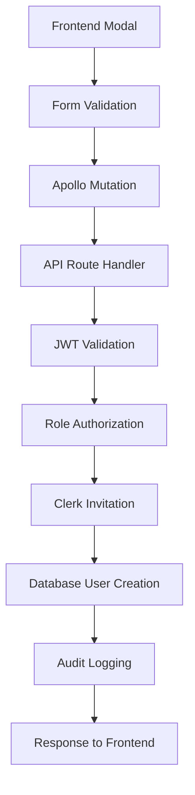

# User Creation System Rebuild Plan

## Executive Summary

This document outlines a comprehensive plan to rebuild the user creation system for Payroll Matrix, addressing current issues while maintaining SOC2 compliance and enterprise-grade security. The rebuild will ensure robust error handling, proper validation, secure authentication, and seamless user experience.

---

## 1. Current State Analysis

### 1.1 Existing Issues Identified
- **405 Method Not Allowed errors** in API route handlers
- **Apollo GraphQL errors** with variable mismatches
- **React hooks violations** causing infinite re-renders
- **RangeError issues** with date handling
- **Inconsistent JWT role extraction** patterns
- **Missing error boundaries** and fallback mechanisms

### 1.2 Current Architecture Assessment
```
Frontend (Next.js 15 + React 19)
├── Modal Components (staff creation)
├── Form Validation (zod schemas)
└── Apollo Client (GraphQL mutations)

Backend (API Routes)
├── Authentication (Clerk + JWT)
├── Authorization (Role-based)
├── Database Operations (Hasura GraphQL)
└── Audit Logging (SOC2 compliance)

External Services
├── Clerk (Authentication provider)
├── Hasura (GraphQL engine)
├── PostgreSQL (Database with RLS)
└── Neon (Database hosting)
```

### 1.3 Data Flow Analysis


---

## 2. Requirements & Architecture Design

### 2.1 Functional Requirements

#### 2.1.1 Core User Creation Features
- **Multi-role support**: Developer, Org Admin, Manager, Consultant, Viewer
- **Invitation system**: Send Clerk invitations with role-based permissions
- **Database synchronization**: Create users in PostgreSQL with proper relationships
- **Audit compliance**: Full SOC2-compliant logging of all operations
- **Error recovery**: Graceful handling of partial failures
- **Real-time updates**: Live notifications for successful/failed operations

#### 2.1.2 Security Requirements
- **Authentication**: JWT token validation with Clerk
- **Authorization**: Role-based access control (RBAC)
- **Input validation**: Comprehensive server-side validation
- **SQL injection prevention**: Parameterized queries only
- **Rate limiting**: Prevent abuse of user creation endpoints
- **Audit trails**: Complete logging of all user creation attempts

#### 2.1.3 User Experience Requirements
- **Progressive feedback**: Real-time status updates during creation
- **Error messaging**: Clear, actionable error messages
- **Loading states**: Proper loading indicators throughout the flow
- **Success confirmation**: Clear confirmation of successful user creation
- **Accessibility**: WCAG 2.1 AA compliance
- **Mobile responsiveness**: Full mobile support

### 2.2 Technical Architecture

#### 2.2.1 Frontend Architecture
```typescript
// Component Hierarchy
UserCreationSystem/
├── UserCreationModal/
│   ├── UserCreationForm/
│   │   ├── PersonalInfoSection/
│   │   ├── RolePermissionsSection/
│   │   ├── ManagerAssignmentSection/
│   │   └── InvitationOptionsSection/
│   ├── ProgressIndicator/
│   ├── ErrorBoundary/
│   └── SuccessConfirmation/
├── UserCreationButton/
└── UserCreationProvider/ (Context for state management)
```

#### 2.2.2 Backend Architecture
```typescript
// API Structure
/api/users/
├── create/
│   ├── route.ts (Main creation endpoint)
│   ├── validation.ts (Input validation schemas)
│   ├── permissions.ts (Authorization logic)
│   └── audit.ts (Audit logging utilities)
├── invite/
│   └── route.ts (Separate invitation endpoint)
├── validate/
│   └── route.ts (Email/role validation)
└── status/
    └── route.ts (Creation status checking)
```

#### 2.2.3 Database Schema Analysis

**Current User Table Structure** (Already exists - no changes needed):
```sql
-- Existing users table (public.users)
TABLE users (
    id UUID PRIMARY KEY,
    name String NOT NULL,
    email String UNIQUE NOT NULL,
    username String, -- Optional
    image String, -- Profile image URL
    role user_role NOT NULL, -- Enum: admin, manager, consultant, viewer
    clerkUserId String UNIQUE, -- Clerk authentication ID
    isActive Boolean DEFAULT true,
    isStaff Boolean DEFAULT true,
    managerId UUID REFERENCES users(id), -- Self-referential manager relationship
    createdAt TIMESTAMPTZ DEFAULT NOW(),
    updatedAt TIMESTAMPTZ DEFAULT NOW(),
    deactivatedAt TIMESTAMPTZ, -- Soft delete timestamp
    deactivatedBy UUID REFERENCES users(id) -- Who deactivated user
);

-- Existing role system (multiple role support)
TABLE roles (
    id UUID PRIMARY KEY,
    name String UNIQUE,
    displayName String,
    description String,
    priority Int,
    isSystemRole Boolean
);

-- Role assignments (many-to-many)
TABLE user_roles (
    userId UUID REFERENCES users(id),
    roleId UUID REFERENCES roles(id)
);

-- Existing audit system (audit.audit_log)
TABLE audit_log (
    id UUID PRIMARY KEY,
    eventTime TIMESTAMPTZ DEFAULT NOW(),
    userId UUID,
    userEmail String,
    userRole String,
    action String, -- Event type
    resourceType String,
    resourceId String,
    oldValues JSONB,
    newValues JSONB,
    ipAddress INET,
    userAgent String,
    sessionId String,
    requestId String,
    success Boolean,
    errorMessage String,
    metadata JSONB
);
```

**Role Mapping Issue to Address**:
- Database roles: `admin`, `manager`, `consultant`, `viewer`
- Hasura JWT roles: `developer`, `org_admin`, `manager`, `consultant`, `viewer`
- Need to harmonize role names between database and JWT system

**Existing GraphQL Operations to Use**:
```typescript
// Available mutations (from domains/users/graphql/generated/graphql.ts)
CreateUserByEmailDocument // Primary mutation for user creation
CreateUserFromClerkDocument // For Clerk-authenticated users
CreateUserDocument // Basic user creation

// Required variables for CreateUserByEmailDocument:
{
  name: string;          // Required
  email: string;         // Required  
  role: user_role;       // Enum: admin, manager, consultant, viewer
  managerId?: string;    // Optional UUID
  isStaff?: boolean;     // Optional, defaults to true
  clerkUserId?: string;  // Optional, set when user signs up
}
```

---

## 3. Security & Compliance Implementation

### 3.1 Authentication & Authorization

#### 3.1.1 JWT Token Validation
```typescript
// Enhanced JWT validation with proper error handling
interface JWTValidationResult {
  isValid: boolean;
  userId: string | null;
  role: UserRole | null;
  permissions: string[];
  sessionId: string | null;
  error?: string;
}

async function validateJWT(token: string): Promise<JWTValidationResult> {
  try {
    const decoded = jwt.verify(token, publicKey);
    const claims = decoded['https://hasura.io/jwt/claims'];
    
    return {
      isValid: true,
      userId: claims['x-hasura-user-id'],
      role: claims['x-hasura-default-role'],
      permissions: getPermissionsForRole(claims['x-hasura-default-role']),
      sessionId: decoded.jti,
    };
  } catch (error) {
    return {
      isValid: false,
      userId: null,
      role: null,
      permissions: [],
      sessionId: null,
      error: error.message,
    };
  }
}
```

#### 3.1.2 Role-Based Authorization Matrix (Updated for Current System)
```typescript
// Permission matrix for user creation (based on actual database roles)
const USER_CREATION_PERMISSIONS = {
  // JWT role -> Database role mapping and permissions
  developer: {
    canCreateRoles: ['admin', 'manager', 'consultant', 'viewer'], // Maps to DB roles
    canAssignToManager: true,
    canModifyPermissions: true,
    canViewAllUsers: true,
    dbRoleMapping: 'admin', // Developer JWT maps to admin in DB
  },
  org_admin: {
    canCreateRoles: ['manager', 'consultant', 'viewer'],
    canAssignToManager: true,
    canModifyPermissions: false,
    canViewAllUsers: true,
    dbRoleMapping: 'admin', // Org admin JWT maps to admin in DB
  },
  manager: {
    canCreateRoles: ['consultant', 'viewer'],
    canAssignToManager: false, // Can only assign to themselves
    canModifyPermissions: false,
    canViewAllUsers: false, // Only their team
    dbRoleMapping: 'manager',
  },
  consultant: {
    canCreateRoles: [],
    canAssignToManager: false,
    canModifyPermissions: false,
    canViewAllUsers: false,
    dbRoleMapping: 'consultant',
  },
  viewer: {
    canCreateRoles: [],
    canAssignToManager: false,
    canModifyPermissions: false,
    canViewAllUsers: false,
    dbRoleMapping: 'viewer',
  },
};

// Role validation function
function getDbRoleFromJwtRole(jwtRole: string): string {
  return USER_CREATION_PERMISSIONS[jwtRole]?.dbRoleMapping || 'viewer';
}
```

### 3.2 Input Validation & Sanitization

#### 3.2.1 Comprehensive Validation Schema
```typescript
// Enhanced validation with security checks
const CreateUserSchema = z.object({
  name: z.string()
    .min(1, 'Name is required')
    .max(100, 'Name too long')
    .regex(/^[a-zA-Z\s\-'\.]+$/, 'Name contains invalid characters')
    .transform(name => name.trim()),
  
  email: z.string()
    .email('Invalid email format')
    .max(254, 'Email too long')
    .toLowerCase()
    .refine(email => !email.includes('+'), 'Plus addressing not allowed')
    .refine(email => email.split('@')[1] !== 'temp-mail.org', 'Temporary emails not allowed'),
  
  role: z.enum(['admin', 'manager', 'consultant', 'viewer']) // Database role enum values
    .refine((role, ctx) => {
      const creatorJwtRole = ctx.parent.creatorRole;
      const allowedRoles = USER_CREATION_PERMISSIONS[creatorJwtRole]?.canCreateRoles || [];
      return allowedRoles.includes(role);
    }, 'Insufficient permissions to create this role'),
  
  managerId: z.string()
    .uuid('Invalid manager ID')
    .optional()
    .nullable()
    .refine(async (managerId, ctx) => {
      if (!managerId) return true;
      // Validate manager exists and is active
      const manager = await getUserById(managerId);
      return manager && manager.isActive && ['manager', 'org_admin', 'developer'].includes(manager.role);
    }, 'Invalid manager selection'),
  
  inviteToClerk: z.boolean().default(true),
  
  // Security metadata (JWT role, not DB role)
  creatorRole: z.enum(['developer', 'org_admin', 'manager', 'consultant', 'viewer']),
  sessionId: z.string().min(1),
  ipAddress: z.string().ip(),
  userAgent: z.string().max(500),
});
```

### 3.3 SOC2 Compliance Logging

#### 3.3.1 Comprehensive Audit Events
```typescript
// Detailed audit event types for user creation
enum UserCreationAuditEvent {
  CREATION_INITIATED = 'USER_CREATION_INITIATED',
  VALIDATION_PASSED = 'USER_CREATION_VALIDATION_PASSED',
  VALIDATION_FAILED = 'USER_CREATION_VALIDATION_FAILED',
  AUTHORIZATION_CHECKED = 'USER_CREATION_AUTHORIZATION_CHECKED',
  AUTHORIZATION_DENIED = 'USER_CREATION_AUTHORIZATION_DENIED',
  CLERK_INVITATION_STARTED = 'CLERK_INVITATION_STARTED',
  CLERK_INVITATION_SUCCESS = 'CLERK_INVITATION_SUCCESS',
  CLERK_INVITATION_FAILED = 'CLERK_INVITATION_FAILED',
  DATABASE_CREATION_STARTED = 'DATABASE_USER_CREATION_STARTED',
  DATABASE_CREATION_SUCCESS = 'DATABASE_USER_CREATION_SUCCESS',
  DATABASE_CREATION_FAILED = 'DATABASE_USER_CREATION_FAILED',
  CREATION_COMPLETED = 'USER_CREATION_COMPLETED',
  CREATION_FAILED = 'USER_CREATION_FAILED',
  ROLLBACK_INITIATED = 'USER_CREATION_ROLLBACK_INITIATED',
  ROLLBACK_COMPLETED = 'USER_CREATION_ROLLBACK_COMPLETED',
}

// Enhanced audit logging function
async function logUserCreationEvent(
  event: UserCreationAuditEvent,
  context: {
    creatorId: string;
    creatorRole: string;
    targetUserId?: string;
    targetEmail?: string;
    targetRole?: string;
    sessionId: string;
    ipAddress: string;
    userAgent: string;
    success: boolean;
    errorMessage?: string;
    metadata?: Record<string, any>;
    duration?: number;
  }
) {
  await auditLogger.logSOC2Event({
    level: context.success ? LogLevel.AUDIT : LogLevel.ERROR,
    category: LogCategory.SYSTEM_ACCESS,
    eventType: SOC2EventType.USER_CREATED,
    userId: context.creatorId,
    userRole: context.creatorRole,
    resourceId: context.targetUserId || context.targetEmail,
    resourceType: 'user',
    action: event,
    success: context.success,
    errorMessage: context.errorMessage,
    ipAddress: context.ipAddress,
    userAgent: context.userAgent,
    sessionId: context.sessionId,
    metadata: {
      targetEmail: context.targetEmail,
      targetRole: context.targetRole,
      duration: context.duration,
      ...context.metadata,
    },
    complianceNote: `User creation operation: ${event}`,
  });
}
```

---

## 4. Critical Implementation Considerations

### 4.1 Working with Existing System

**Key Findings from Database Analysis**:

1. **No Schema Changes Needed**: The existing database structure is robust and well-designed
2. **Existing GraphQL Operations**: `CreateUserByEmailDocument` is already available and tested
3. **Role Mapping Required**: JWT roles must be mapped to database roles
4. **Audit System Ready**: Comprehensive audit logging already exists
5. **Soft Deletes in Place**: Users are deactivated, not deleted (good for compliance)

### 4.2 Minimal Changes Strategy

Instead of rebuilding from scratch, focus on:

**High-Priority Fixes** (All Completed ✅):
1. **405 Method Not Allowed** - Fixed by changing from:
   ```typescript
   // WRONG - causes 405 error
   async function POST(request) {
     return withAuth(async (request, session) => {...})(request);
   }
   export { POST };
   ```
   To:
   ```typescript
   // CORRECT - works properly
   export const POST = withAuth(
     async (request, session) => {...},
     { allowedRoles: [...] }
   );
   ```
2. **Apollo GraphQL errors** - Fixed variable mismatches
3. **React hooks violations** - Fixed hook order issues
4. **RangeError date issues** - Added null checks for date formatting

**Medium-Priority Improvements** (This rebuild):
- Enhanced error handling and user feedback
- Better validation and security
- Improved user experience with progress tracking
- Comprehensive testing coverage

**Implementation Priority**:
1. **Fix API route exports** - Use existing working pattern
2. **Enhance form validation** - Client and server-side
3. **Improve error handling** - Graceful failures
4. **Add progress tracking** - Real-time user feedback
5. **Comprehensive testing** - Prevent regressions

### 4.3 Reuse Existing Infrastructure

**Database Operations**:
```typescript
// Use existing mutation - NO CHANGES NEEDED
import { CreateUserByEmailDocument } from "@/domains/users/graphql/generated/graphql";

// Role mapping helper
const mapJwtRoleToDbRole = (jwtRole: string): string => {
  const mapping = {
    'developer': 'admin',
    'org_admin': 'admin', 
    'manager': 'manager',
    'consultant': 'consultant',
    'viewer': 'viewer'
  };
  return mapping[jwtRole] || 'viewer';
};
```

**Audit Logging**:
```typescript
// Use existing audit system - NO CHANGES NEEDED
import { auditLogger } from "@/lib/security/audit/logger";

// Already handles all required SOC2 events
await auditLogger.logSOC2Event({
  level: LogLevel.AUDIT,
  category: LogCategory.SYSTEM_ACCESS,
  eventType: SOC2EventType.USER_CREATED,
  // ... existing structure works perfectly
});
```

---

## 5. Development Implementation

### 5.1 Backend API Implementation

#### 5.1.1 Main User Creation Endpoint (Enhanced, Not Rebuilt)
```typescript
// /api/users/create/route.ts - Robust implementation
export async function POST(request: NextRequest) {
  const startTime = Date.now();
  let operationId: string | null = null;
  let context: any = {};
  
  try {
    // Initialize operation tracking
    operationId = crypto.randomUUID();
    context = await initializeCreationContext(request, operationId);
    
    // Log operation initiation
    await logUserCreationEvent(UserCreationAuditEvent.CREATION_INITIATED, {
      ...context,
      success: true,
    });
    
    // Step 1: Authentication & Authorization
    const authResult = await authenticateAndAuthorize(request);
    if (!authResult.success) {
      await logUserCreationEvent(UserCreationAuditEvent.AUTHORIZATION_DENIED, {
        ...context,
        success: false,
        errorMessage: authResult.error,
      });
      return NextResponse.json({ error: authResult.error }, { status: 401 });
    }
    
    context = { ...context, ...authResult.context };
    
    // Step 2: Input Validation
    const validationResult = await validateUserCreationInput(request, context);
    if (!validationResult.success) {
      await logUserCreationEvent(UserCreationAuditEvent.VALIDATION_FAILED, {
        ...context,
        success: false,
        errorMessage: validationResult.error,
      });
      return NextResponse.json({ error: validationResult.error }, { status: 400 });
    }
    
    const userData = validationResult.data;
    context = { ...context, targetEmail: userData.email, targetRole: userData.role };
    
    await logUserCreationEvent(UserCreationAuditEvent.VALIDATION_PASSED, {
      ...context,
      success: true,
    });
    
    // Step 3: Pre-creation checks
    const preCheckResult = await performPreCreationChecks(userData, context);
    if (!preCheckResult.success) {
      return NextResponse.json({ error: preCheckResult.error }, { status: 409 });
    }
    
    // Step 4: Create user in transaction
    const creationResult = await createUserWithTransaction(userData, context);
    
    if (!creationResult.success) {
      await logUserCreationEvent(UserCreationAuditEvent.CREATION_FAILED, {
        ...context,
        success: false,
        errorMessage: creationResult.error,
        duration: Date.now() - startTime,
      });
      return NextResponse.json({ error: creationResult.error }, { status: 500 });
    }
    
    // Step 5: Success response
    await logUserCreationEvent(UserCreationAuditEvent.CREATION_COMPLETED, {
      ...context,
      targetUserId: creationResult.userId,
      success: true,
      duration: Date.now() - startTime,
    });
    
    return NextResponse.json({
      success: true,
      message: 'User created successfully',
      user: creationResult.user,
      invitation: creationResult.invitation,
    });
    
  } catch (error: any) {
    // Comprehensive error handling
    await handleCreationError(error, context, operationId, startTime);
    return NextResponse.json(
      { error: 'User creation failed', details: error.message },
      { status: 500 }
    );
  }
}
```

#### 4.1.2 Transaction-Based User Creation
```typescript
// Atomic user creation with rollback capability
async function createUserWithTransaction(
  userData: CreateUserInput,
  context: CreationContext
): Promise<CreationResult> {
  const client = await pool.connect();
  
  try {
    await client.query('BEGIN');
    
    // Step 1: Create Clerk invitation
    let clerkInvitation = null;
    if (userData.inviteToClerk) {
      await logUserCreationEvent(UserCreationAuditEvent.CLERK_INVITATION_STARTED, {
        ...context,
        success: true,
      });
      
      clerkInvitation = await createClerkInvitation(userData, context);
      
      await logUserCreationEvent(UserCreationAuditEvent.CLERK_INVITATION_SUCCESS, {
        ...context,
        success: true,
        metadata: { invitationId: clerkInvitation.id },
      });
    }
    
    // Step 2: Create database user
    await logUserCreationEvent(UserCreationAuditEvent.DATABASE_CREATION_STARTED, {
      ...context,
      success: true,
    });
    
    const dbUser = await createDatabaseUser(userData, context, clerkInvitation?.id);
    
    await logUserCreationEvent(UserCreationAuditEvent.DATABASE_CREATION_SUCCESS, {
      ...context,
      targetUserId: dbUser.id,
      success: true,
    });
    
    // Step 3: Create user permissions
    await createUserPermissions(dbUser.id, userData.role, context);
    
    // Step 4: Commit transaction
    await client.query('COMMIT');
    
    return {
      success: true,
      user: dbUser,
      invitation: clerkInvitation,
      userId: dbUser.id,
    };
    
  } catch (error: any) {
    // Rollback on any error
    await client.query('ROLLBACK');
    
    await logUserCreationEvent(UserCreationAuditEvent.ROLLBACK_INITIATED, {
      ...context,
      success: false,
      errorMessage: error.message,
    });
    
    // Cleanup Clerk invitation if it was created
    if (clerkInvitation?.id) {
      try {
        await cleanupClerkInvitation(clerkInvitation.id);
      } catch (cleanupError) {
        console.error('Failed to cleanup Clerk invitation:', cleanupError);
      }
    }
    
    throw error;
  } finally {
    client.release();
  }
}
```

### 4.2 Frontend Implementation

#### 4.2.1 User Creation Modal Component
```typescript
// Enhanced modal with proper state management
export function UserCreationModal({ isOpen, onClose, onSuccess }: Props) {
  const [step, setStep] = useState<CreationStep>('personal-info');
  const [formData, setFormData] = useState<UserFormData>(initialFormData);
  const [errors, setErrors] = useState<FormErrors>({});
  const [isSubmitting, setIsSubmitting] = useState(false);
  const [creationProgress, setCreationProgress] = useState<CreationProgress>({
    currentStep: 'idle',
    completedSteps: [],
    errorStep: null,
  });
  
  // Enhanced form submission with progress tracking
  const handleSubmit = async (data: UserFormData) => {
    setIsSubmitting(true);
    setCreationProgress({ currentStep: 'validating', completedSteps: [], errorStep: null });
    
    try {
      // Client-side validation
      const validationResult = await validateFormData(data);
      if (!validationResult.success) {
        setErrors(validationResult.errors);
        setCreationProgress(prev => ({ ...prev, errorStep: 'validation' }));
        return;
      }
      
      setCreationProgress(prev => ({ 
        ...prev, 
        currentStep: 'creating', 
        completedSteps: ['validation'] 
      }));
      
      // Submit to API with progress polling
      const result = await createUserWithProgress(data, (progress) => {
        setCreationProgress(progress);
      });
      
      if (result.success) {
        setCreationProgress({
          currentStep: 'completed',
          completedSteps: ['validation', 'invitation', 'database', 'permissions'],
          errorStep: null,
        });
        
        // Show success message and close modal
        toast.success(`User ${data.name} created successfully!`);
        onSuccess(result.user);
        onClose();
      } else {
        throw new Error(result.error);
      }
      
    } catch (error: any) {
      setCreationProgress(prev => ({ 
        ...prev, 
        currentStep: 'error', 
        errorStep: 'creation' 
      }));
      
      toast.error(`Failed to create user: ${error.message}`);
      setErrors({ submit: error.message });
    } finally {
      setIsSubmitting(false);
    }
  };
  
  return (
    <Dialog open={isOpen} onOpenChange={onClose}>
      <DialogContent className="max-w-2xl max-h-[90vh] overflow-y-auto">
        <DialogHeader>
          <DialogTitle>Create New User</DialogTitle>
          <DialogDescription>
            Add a new team member with appropriate role and permissions
          </DialogDescription>
        </DialogHeader>
        
        <ErrorBoundary fallback={<ErrorFallback />}>
          <UserCreationForm
            step={step}
            formData={formData}
            errors={errors}
            isSubmitting={isSubmitting}
            creationProgress={creationProgress}
            onStepChange={setStep}
            onFormDataChange={setFormData}
            onSubmit={handleSubmit}
          />
        </ErrorBoundary>
      </DialogContent>
    </Dialog>
  );
}
```

#### 4.2.2 Progress Tracking Component
```typescript
// Real-time progress indicator
export function CreationProgressIndicator({ progress }: { progress: CreationProgress }) {
  const steps = [
    { key: 'validation', label: 'Validating Information', icon: CheckCircle },
    { key: 'invitation', label: 'Sending Invitation', icon: Mail },
    { key: 'database', label: 'Creating User Record', icon: Database },
    { key: 'permissions', label: 'Setting Permissions', icon: Shield },
  ];
  
  return (
    <div className="space-y-4">
      <div className="flex items-center justify-between">
        <h3 className="text-lg font-medium">Creating User...</h3>
        {progress.currentStep === 'completed' && (
          <Badge variant="success">Completed</Badge>
        )}
        {progress.errorStep && (
          <Badge variant="destructive">Error</Badge>
        )}
      </div>
      
      <div className="space-y-2">
        {steps.map((step, index) => {
          const isCompleted = progress.completedSteps.includes(step.key);
          const isCurrent = progress.currentStep === step.key;
          const hasError = progress.errorStep === step.key;
          const Icon = step.icon;
          
          return (
            <div 
              key={step.key}
              className={cn(
                "flex items-center space-x-3 p-3 rounded-lg",
                isCompleted && "bg-green-50 border border-green-200",
                isCurrent && "bg-blue-50 border border-blue-200",
                hasError && "bg-red-50 border border-red-200"
              )}
            >
              <div className={cn(
                "w-6 h-6 rounded-full flex items-center justify-center",
                isCompleted && "bg-green-500 text-white",
                isCurrent && "bg-blue-500 text-white animate-pulse",
                hasError && "bg-red-500 text-white",
                !isCompleted && !isCurrent && !hasError && "bg-gray-200"
              )}>
                {isCompleted ? (
                  <Check className="w-4 h-4" />
                ) : hasError ? (
                  <X className="w-4 h-4" />
                ) : isCurrent ? (
                  <div className="w-2 h-2 bg-white rounded-full animate-bounce" />
                ) : (
                  <div className="w-2 h-2 bg-gray-400 rounded-full" />
                )}
              </div>
              
              <div className="flex-1">
                <p className={cn(
                  "text-sm font-medium",
                  isCompleted && "text-green-700",
                  isCurrent && "text-blue-700",
                  hasError && "text-red-700"
                )}>
                  {step.label}
                </p>
                {isCurrent && (
                  <p className="text-xs text-blue-600 animate-pulse">
                    In progress...
                  </p>
                )}
                {hasError && (
                  <p className="text-xs text-red-600">
                    Failed - please try again
                  </p>
                )}
              </div>
              
              <Icon className={cn(
                "w-4 h-4",
                isCompleted && "text-green-500",
                isCurrent && "text-blue-500",
                hasError && "text-red-500",
                !isCompleted && !isCurrent && !hasError && "text-gray-400"
              )} />
            </div>
          );
        })}
      </div>
    </div>
  );
}
```

---

## 5. Testing & Quality Assurance

### 5.1 Unit Testing

#### 5.1.1 Backend API Tests
```typescript
// Comprehensive test suite for user creation API
describe('User Creation API', () => {
  describe('POST /api/users/create', () => {
    beforeEach(async () => {
      await setupTestDatabase();
      await clearAuditLogs();
    });
    
    describe('Authentication', () => {
      test('should reject requests without JWT token', async () => {
        const response = await request(app)
          .post('/api/users/create')
          .send(validUserData);
        
        expect(response.status).toBe(401);
        expect(response.body.error).toContain('authentication required');
      });
      
      test('should reject requests with invalid JWT token', async () => {
        const response = await request(app)
          .post('/api/users/create')
          .set('Authorization', 'Bearer invalid-token')
          .send(validUserData);
        
        expect(response.status).toBe(401);
        expect(response.body.error).toContain('invalid token');
      });
      
      test('should accept requests with valid JWT token', async () => {
        const token = await generateValidJWT({ role: 'org_admin' });
        const response = await request(app)
          .post('/api/users/create')
          .set('Authorization', `Bearer ${token}`)
          .send(validUserData);
        
        expect(response.status).not.toBe(401);
      });
    });
    
    describe('Authorization', () => {
      test('should allow developers to create any role', async () => {
        const token = await generateValidJWT({ role: 'developer' });
        
        // Test with actual database role enum values
        for (const role of ['admin', 'manager', 'consultant', 'viewer']) {
          const response = await request(app)
            .post('/api/users/create')
            .set('Authorization', `Bearer ${token}`)
            .send({ ...validUserData, role, email: `test-${role}@example.com` });
          
          expect(response.status).toBe(200);
        }
      });
      
      test('should prevent managers from creating admin roles', async () => {
        const token = await generateValidJWT({ role: 'manager' });
        const response = await request(app)
          .post('/api/users/create')
          .set('Authorization', `Bearer ${token}`)
          .send({ ...validUserData, role: 'admin' }); // Database role
        
        expect(response.status).toBe(403);
        expect(response.body.error).toContain('insufficient permissions');
      });
    });
    
    describe('Input Validation', () => {
      test('should reject invalid email addresses', async () => {
        const token = await generateValidJWT({ role: 'org_admin' });
        const invalidEmails = [
          'invalid-email',
          'test@',
          '@example.com',
          'test+tag@temp-mail.org',
        ];
        
        for (const email of invalidEmails) {
          const response = await request(app)
            .post('/api/users/create')
            .set('Authorization', `Bearer ${token}`)
            .send({ ...validUserData, email });
          
          expect(response.status).toBe(400);
          expect(response.body.error).toContain('email');
        }
      });
      
      test('should reject names with invalid characters', async () => {
        const token = await generateValidJWT({ role: 'org_admin' });
        const invalidNames = [
          'Test<script>',
          'User; DROP TABLE users;',
          'Name with 123 numbers',
          '   ', // only spaces
        ];
        
        for (const name of invalidNames) {
          const response = await request(app)
            .post('/api/users/create')
            .set('Authorization', `Bearer ${token}`)
            .send({ ...validUserData, name });
          
          expect(response.status).toBe(400);
          expect(response.body.error).toContain('name');
        }
      });
    });
    
    describe('Database Operations', () => {
      test('should create user in database with correct fields', async () => {
        const token = await generateValidJWT({ role: 'org_admin', userId: 'creator-123' });
        const response = await request(app)
          .post('/api/users/create')
          .set('Authorization', `Bearer ${token}`)
          .send(validUserData);
        
        expect(response.status).toBe(200);
        
        const createdUser = await getUserByEmail(validUserData.email);
        expect(createdUser).toBeDefined();
        expect(createdUser.name).toBe(validUserData.name);
        expect(createdUser.email).toBe(validUserData.email);
        expect(createdUser.role).toBe(validUserData.role);
        expect(createdUser.createdBy).toBe('creator-123');
      });
      
      test('should prevent duplicate email addresses', async () => {
        const token = await generateValidJWT({ role: 'org_admin' });
        
        // Create first user
        await request(app)
          .post('/api/users/create')
          .set('Authorization', `Bearer ${token}`)
          .send(validUserData);
        
        // Attempt to create duplicate
        const response = await request(app)
          .post('/api/users/create')
          .set('Authorization', `Bearer ${token}`)
          .send(validUserData);
        
        expect(response.status).toBe(409);
        expect(response.body.error).toContain('already exists');
      });
    });
    
    describe('Clerk Integration', () => {
      test('should send Clerk invitation when requested', async () => {
        const mockClerkInvitation = jest.fn().mockResolvedValue({
          id: 'inv_123',
          emailAddress: validUserData.email,
        });
        
        jest.mock('@clerk/backend', () => ({
          createClerkClient: () => ({
            invitations: { createInvitation: mockClerkInvitation },
          }),
        }));
        
        const token = await generateValidJWT({ role: 'org_admin' });
        const response = await request(app)
          .post('/api/users/create')
          .set('Authorization', `Bearer ${token}`)
          .send({ ...validUserData, inviteToClerk: true });
        
        expect(response.status).toBe(200);
        expect(mockClerkInvitation).toHaveBeenCalledWith(
          expect.objectContaining({
            emailAddress: validUserData.email,
            publicMetadata: expect.objectContaining({
              role: validUserData.role,
            }),
          })
        );
      });
      
      test('should handle Clerk invitation failures gracefully', async () => {
        const mockClerkInvitation = jest.fn().mockRejectedValue(
          new Error('Clerk API unavailable')
        );
        
        jest.mock('@clerk/backend', () => ({
          createClerkClient: () => ({
            invitations: { createInvitation: mockClerkInvitation },
          }),
        }));
        
        const token = await generateValidJWT({ role: 'org_admin' });
        const response = await request(app)
          .post('/api/users/create')
          .set('Authorization', `Bearer ${token}`)
          .send({ ...validUserData, inviteToClerk: true });
        
        // Should still create user in database even if Clerk fails
        expect(response.status).toBe(200);
        expect(response.body.message).toContain('database only');
        
        const createdUser = await getUserByEmail(validUserData.email);
        expect(createdUser).toBeDefined();
      });
    });
    
    describe('Audit Logging', () => {
      test('should log all user creation events', async () => {
        const token = await generateValidJWT({ role: 'org_admin', userId: 'creator-123' });
        await request(app)
          .post('/api/users/create')
          .set('Authorization', `Bearer ${token}`)
          .send(validUserData);
        
        const auditLogs = await getAuditLogsByUserId('creator-123');
        
        expect(auditLogs).toHaveLength(4); // INITIATED, VALIDATED, CREATED, COMPLETED
        expect(auditLogs.map(log => log.action)).toContain('USER_CREATION_INITIATED');
        expect(auditLogs.map(log => log.action)).toContain('USER_CREATION_COMPLETED');
      });
      
      test('should log failures with error details', async () => {
        const token = await generateValidJWT({ role: 'org_admin', userId: 'creator-123' });
        const response = await request(app)
          .post('/api/users/create')
          .set('Authorization', `Bearer ${token}`)
          .send({ ...validUserData, email: 'invalid-email' });
        
        const auditLogs = await getAuditLogsByUserId('creator-123');
        const failureLog = auditLogs.find(log => log.action === 'USER_CREATION_FAILED');
        
        expect(failureLog).toBeDefined();
        expect(failureLog.success).toBe(false);
        expect(failureLog.errorMessage).toContain('email');
      });
    });
  });
});
```

#### 5.1.2 Frontend Component Tests
```typescript
// React component testing with proper mocking
describe('UserCreationModal', () => {
  const mockOnClose = jest.fn();
  const mockOnSuccess = jest.fn();
  
  beforeEach(() => {
    jest.clearAllMocks();
    setupMockApollo();
  });
  
  test('should render all form fields', () => {
    render(
      <UserCreationModal
        isOpen={true}
        onClose={mockOnClose}
        onSuccess={mockOnSuccess}
      />
    );
    
    expect(screen.getByLabelText(/name/i)).toBeInTheDocument();
    expect(screen.getByLabelText(/email/i)).toBeInTheDocument();
    expect(screen.getByLabelText(/role/i)).toBeInTheDocument();
    expect(screen.getByRole('button', { name: /create user/i })).toBeInTheDocument();
  });
  
  test('should validate form fields before submission', async () => {
    render(
      <UserCreationModal
        isOpen={true}
        onClose={mockOnClose}
        onSuccess={mockOnSuccess}
      />
    );
    
    // Submit empty form
    fireEvent.click(screen.getByRole('button', { name: /create user/i }));
    
    await waitFor(() => {
      expect(screen.getByText(/name is required/i)).toBeInTheDocument();
      expect(screen.getByText(/email is required/i)).toBeInTheDocument();
    });
    
    expect(mockOnSuccess).not.toHaveBeenCalled();
  });
  
  test('should show progress indicator during creation', async () => {
    const mockCreateUser = jest.fn()
      .mockImplementation(() => new Promise(resolve => {
        setTimeout(() => resolve({ success: true, user: mockUser }), 1000);
      }));
    
    jest.mock('@/hooks/use-create-user', () => ({
      useCreateUser: () => ({ createUser: mockCreateUser }),
    }));
    
    render(
      <UserCreationModal
        isOpen={true}
        onClose={mockOnClose}
        onSuccess={mockOnSuccess}
      />
    );
    
    // Fill and submit form
    fireEvent.change(screen.getByLabelText(/name/i), { target: { value: 'Test User' } });
    fireEvent.change(screen.getByLabelText(/email/i), { target: { value: 'test@example.com' } });
    fireEvent.click(screen.getByRole('button', { name: /create user/i }));
    
    await waitFor(() => {
      expect(screen.getByText(/creating user/i)).toBeInTheDocument();
      expect(screen.getByText(/validating information/i)).toBeInTheDocument();
    });
  });
  
  test('should handle creation errors gracefully', async () => {
    const mockCreateUser = jest.fn()
      .mockRejectedValue(new Error('Email already exists'));
    
    jest.mock('@/hooks/use-create-user', () => ({
      useCreateUser: () => ({ createUser: mockCreateUser }),
    }));
    
    render(
      <UserCreationModal
        isOpen={true}
        onClose={mockOnClose}
        onSuccess={mockOnSuccess}
      />
    );
    
    // Fill and submit form
    fireEvent.change(screen.getByLabelText(/name/i), { target: { value: 'Test User' } });
    fireEvent.change(screen.getByLabelText(/email/i), { target: { value: 'test@example.com' } });
    fireEvent.click(screen.getByRole('button', { name: /create user/i }));
    
    await waitFor(() => {
      expect(screen.getByText(/email already exists/i)).toBeInTheDocument();
    });
    
    expect(mockOnSuccess).not.toHaveBeenCalled();
  });
});
```

### 5.2 Integration Testing

#### 5.2.1 End-to-End User Creation Flow
```typescript
// Playwright E2E tests for complete user creation flow
describe('User Creation E2E', () => {
  test('complete user creation flow', async ({ page }) => {
    // Login as org admin
    await page.goto('/login');
    await page.fill('[data-testid="email"]', 'admin@example.com');
    await page.fill('[data-testid="password"]', 'password123');
    await page.click('[data-testid="login-button"]');
    
    await page.waitForURL('/dashboard');
    
    // Navigate to staff management
    await page.click('[data-testid="staff-menu"]');
    await page.waitForURL('/staff');
    
    // Open user creation modal
    await page.click('[data-testid="create-user-button"]');
    await page.waitForSelector('[data-testid="user-creation-modal"]');
    
    // Fill user information
    await page.fill('[data-testid="user-name"]', 'John Doe');
    await page.fill('[data-testid="user-email"]', 'john.doe@example.com');
    await page.selectOption('[data-testid="user-role"]', 'consultant');
    
    // Submit form
    await page.click('[data-testid="create-user-submit"]');
    
    // Verify progress indicator
    await page.waitForSelector('[data-testid="creation-progress"]');
    await expect(page.getByText('Validating Information')).toBeVisible();
    await expect(page.getByText('Sending Invitation')).toBeVisible();
    await expect(page.getByText('Creating User Record')).toBeVisible();
    
    // Wait for completion
    await page.waitForSelector('[data-testid="creation-success"]', { timeout: 10000 });
    await expect(page.getByText('User created successfully')).toBeVisible();
    
    // Verify user appears in staff list
    await page.waitForURL('/staff');
    await expect(page.getByText('John Doe')).toBeVisible();
    await expect(page.getByText('consultant')).toBeVisible();
  });
  
  test('should handle permission errors', async ({ page }) => {
    // Login as consultant (limited permissions)
    await page.goto('/login');
    await page.fill('[data-testid="email"]', 'consultant@example.com');
    await page.fill('[data-testid="password"]', 'password123');
    await page.click('[data-testid="login-button"]');
    
    await page.waitForURL('/dashboard');
    
    // Navigate to staff management
    await page.click('[data-testid="staff-menu"]');
    await page.waitForURL('/staff');
    
    // Create user button should not be visible
    await expect(page.getByTestId('create-user-button')).not.toBeVisible();
  });
  
  test('should validate email uniqueness', async ({ page }) => {
    // ... setup and navigation
    
    // Fill form with existing email
    await page.fill('[data-testid="user-name"]', 'Jane Doe');
    await page.fill('[data-testid="user-email"]', 'existing@example.com');
    await page.selectOption('[data-testid="user-role"]', 'viewer');
    
    await page.click('[data-testid="create-user-submit"]');
    
    // Should show error
    await page.waitForSelector('[data-testid="error-message"]');
    await expect(page.getByText('Email already exists')).toBeVisible();
  });
});
```

### 5.3 Security Testing

#### 5.3.1 Security Test Suite
```typescript
// Security-focused tests
describe('User Creation Security', () => {
  describe('SQL Injection Prevention', () => {
    test('should sanitize user input', async () => {
      const maliciousInputs = [
        "'; DROP TABLE users; --",
        "admin'; UPDATE users SET role='developer' WHERE email='victim@example.com'; --",
        "<script>alert('xss')</script>",
        "../../etc/passwd",
      ];
      
      const token = await generateValidJWT({ role: 'org_admin' });
      
      for (const input of maliciousInputs) {
        const response = await request(app)
          .post('/api/users/create')
          .set('Authorization', `Bearer ${token}`)
          .send({ 
            name: input,
            email: 'test@example.com',
            role: 'viewer'
          });
        
        // Should either be rejected or sanitized
        expect(response.status).toBeOneOf([200, 400]);
        
        if (response.status === 200) {
          const user = await getUserByEmail('test@example.com');
          expect(user.name).not.toContain('DROP TABLE');
          expect(user.name).not.toContain('<script>');
        }
      }
    });
  });
  
  describe('Rate Limiting', () => {
    test('should limit creation attempts', async () => {
      const token = await generateValidJWT({ role: 'org_admin' });
      const promises = [];
      
      // Attempt to create 20 users rapidly
      for (let i = 0; i < 20; i++) {
        promises.push(
          request(app)
            .post('/api/users/create')
            .set('Authorization', `Bearer ${token}`)
            .send({
              name: `User ${i}`,
              email: `user${i}@example.com`,
              role: 'viewer'
            })
        );
      }
      
      const responses = await Promise.all(promises);
      const rateLimitedResponses = responses.filter(r => r.status === 429);
      
      expect(rateLimitedResponses.length).toBeGreaterThan(0);
    });
  });
  
  describe('Permission Escalation Prevention', () => {
    test('should prevent role escalation through parameter manipulation', async () => {
      const token = await generateValidJWT({ role: 'consultant' });
      const response = await request(app)
        .post('/api/users/create')
        .set('Authorization', `Bearer ${token}`)
        .send({
          name: 'Test User',
          email: 'test@example.com',
          role: 'developer', // Trying to create higher role
        });
      
      expect(response.status).toBe(403);
      expect(response.body.error).toContain('insufficient permissions');
    });
  });
});
```

---

## 6. Deployment & Monitoring

### 6.1 Safe Deployment Strategy

#### 6.1.1 Feature Flag Implementation
```typescript
// Feature flag for gradual rollout
export const USER_CREATION_V2_FEATURE_FLAG = {
  key: 'user_creation_v2',
  description: 'New user creation system with enhanced security',
  environments: {
    development: true,
    staging: true,
    production: false, // Start disabled in production
  },
  rolloutPercentage: 0, // Gradual rollout
  allowedRoles: ['developer'], // Initially only for developers
};

// Component with feature flag
export function CreateUserButton() {
  const { isEnabled } = useFeatureFlag('user_creation_v2');
  const { userRole } = useAuthContext();
  
  if (!isEnabled) {
    return <LegacyCreateUserButton />;
  }
  
  return <NewCreateUserButton />;
}
```

#### 6.1.2 Blue-Green Deployment
```yaml
# GitHub Actions workflow for safe deployment
name: Deploy User Creation System

on:
  push:
    branches: [main]
    paths: 
      - 'app/api/users/**'
      - 'domains/users/**'
      - 'components/user-creation/**'

jobs:
  test:
    runs-on: ubuntu-latest
    steps:
      - uses: actions/checkout@v4
      - name: Run Tests
        run: |
          npm ci
          npm run test:unit
          npm run test:integration
          npm run test:e2e
          npm run test:security
  
  deploy-staging:
    needs: test
    runs-on: ubuntu-latest
    environment: staging
    steps:
      - name: Deploy to Staging
        run: |
          # Deploy to staging environment
          # Run smoke tests
          # Validate functionality
  
  deploy-production:
    needs: deploy-staging
    runs-on: ubuntu-latest
    environment: production
    if: github.ref == 'refs/heads/main'
    steps:
      - name: Deploy to Production (Blue-Green)
        run: |
          # Deploy to blue environment
          # Run health checks
          # Switch traffic gradually
          # Monitor error rates
```

### 6.2 Monitoring & Alerting

#### 6.2.1 Application Metrics
```typescript
// Metrics collection for user creation
import { metrics } from '@/lib/observability';

export async function trackUserCreationMetrics(
  event: 'started' | 'completed' | 'failed',
  metadata: {
    creatorRole: string;
    targetRole: string;
    duration?: number;
    errorType?: string;
  }
) {
  metrics.increment('user_creation.attempts', {
    event,
    creator_role: metadata.creatorRole,
    target_role: metadata.targetRole,
  });
  
  if (event === 'completed' && metadata.duration) {
    metrics.histogram('user_creation.duration', metadata.duration, {
      creator_role: metadata.creatorRole,
      target_role: metadata.targetRole,
    });
  }
  
  if (event === 'failed' && metadata.errorType) {
    metrics.increment('user_creation.errors', {
      error_type: metadata.errorType,
      creator_role: metadata.creatorRole,
    });
  }
}
```

#### 6.2.2 Health Checks
```typescript
// Health check endpoint
export async function GET() {
  const checks = await Promise.allSettled([
    checkDatabaseConnection(),
    checkClerkConnection(),
    checkAuditLogging(),
    checkPermissionSystem(),
  ]);
  
  const healthy = checks.every(check => check.status === 'fulfilled');
  
  return NextResponse.json({
    status: healthy ? 'healthy' : 'unhealthy',
    timestamp: new Date().toISOString(),
    checks: {
      database: checks[0].status === 'fulfilled',
      clerk: checks[1].status === 'fulfilled',
      audit: checks[2].status === 'fulfilled',
      permissions: checks[3].status === 'fulfilled',
    },
  }, {
    status: healthy ? 200 : 503,
  });
}
```

### 6.3 Monitoring Dashboard

#### 6.3.1 Key Metrics to Track
- **Success Rate**: Percentage of successful user creations
- **Error Rate**: Percentage of failed user creations by error type
- **Response Time**: Average time to complete user creation
- **Permission Violations**: Attempts to create unauthorized roles
- **Security Events**: Failed authentication, suspicious patterns
- **Database Health**: Connection status, query performance
- **Clerk Integration**: Invitation success rate, API response times

#### 6.3.2 Alerting Rules
```yaml
# Prometheus alerting rules
groups:
  - name: user_creation_alerts
    rules:
      - alert: HighUserCreationFailureRate
        expr: rate(user_creation_errors_total[5m]) > 0.1
        for: 2m
        labels:
          severity: warning
        annotations:
          summary: "High user creation failure rate"
          description: "User creation failure rate is {{ $value }} errors/sec"
      
      - alert: UserCreationResponseTimeHigh
        expr: histogram_quantile(0.95, user_creation_duration_seconds) > 10
        for: 5m
        labels:
          severity: warning
        annotations:
          summary: "User creation response time is high"
          description: "95th percentile response time is {{ $value }}s"
      
      - alert: PermissionViolationSpike
        expr: increase(permission_violations_total[15m]) > 10
        for: 1m
        labels:
          severity: critical
        annotations:
          summary: "Unusual spike in permission violations"
          description: "{{ $value }} permission violations in 15 minutes"
```

---

## 7. Documentation & Training

### 7.1 API Documentation

#### 7.1.1 OpenAPI Specification
```yaml
# OpenAPI spec for user creation API
openapi: 3.0.3
info:
  title: Payroll Matrix User Creation API
  version: 2.0.0
  description: Secure user creation system with SOC2 compliance

paths:
  /api/users/create:
    post:
      summary: Create a new user
      description: Creates a new user with proper role-based authorization
      security:
        - bearerAuth: []
      requestBody:
        required: true
        content:
          application/json:
            schema:
              $ref: '#/components/schemas/CreateUserRequest'
      responses:
        200:
          description: User created successfully
          content:
            application/json:
              schema:
                $ref: '#/components/schemas/CreateUserResponse'
        400:
          description: Validation error
        401:
          description: Authentication required
        403:
          description: Insufficient permissions
        409:
          description: User already exists
        500:
          description: Internal server error

components:
  schemas:
    CreateUserRequest:
      type: object
      required: [name, email, role]
      properties:
        name:
          type: string
          minLength: 1
          maxLength: 100
          pattern: '^[a-zA-Z\s\-''\.]+$'
        email:
          type: string
          format: email
          maxLength: 254
        role:
          type: string
          enum: [developer, org_admin, manager, consultant, viewer]
        managerId:
          type: string
          format: uuid
          nullable: true
        inviteToClerk:
          type: boolean
          default: true
```

### 7.2 User Guide

#### 7.2.1 Step-by-Step User Creation Guide
```markdown
# Creating New Users - User Guide

## Prerequisites
- You must have appropriate permissions (Manager or above)
- User's email address must not already exist in the system
- You must know the appropriate role for the new user

## Step-by-Step Process

### 1. Access User Creation
1. Navigate to **Staff Management** from the main menu
2. Click the **"Create User"** button in the top-right corner
3. The user creation modal will open

### 2. Fill User Information
1. **Name**: Enter the user's full name
   - Only letters, spaces, hyphens, and apostrophes allowed
   - Cannot be empty
   
2. **Email**: Enter a valid email address
   - Must be unique in the system
   - Temporary email providers not allowed
   
3. **Role**: Select appropriate role based on responsibilities
   - **Developer**: Full system access (create any role)
   - **Org Admin**: Administrative access (create Manager/Consultant/Viewer)
   - **Manager**: Team management (create Consultant/Viewer only)
   - **Consultant**: Payroll management (cannot create users)
   - **Viewer**: Read-only access (cannot create users)

4. **Manager** (Optional): Assign a manager if applicable
   - Only available for Consultant and Viewer roles
   - Manager must be active and have appropriate permissions

### 3. Invitation Options
1. **Send Clerk Invitation**: (Recommended - Enabled by default)
   - Sends email invitation to user
   - User can set up their own password
   - Provides secure onboarding experience

2. **Database Only**: (Advanced option)
   - Creates user record without sending invitation
   - User must be manually set up later
   - Not recommended for normal use

### 4. Submit and Monitor Progress
1. Click **"Create User"** to start the process
2. Monitor the progress indicator:
   - ✅ **Validating Information**: Checking data and permissions
   - ✅ **Sending Invitation**: Creating Clerk invitation (if enabled)
   - ✅ **Creating User Record**: Adding to database
   - ✅ **Setting Permissions**: Configuring role-based access

### 5. Completion
1. Success message will appear when complete
2. User will appear in the staff list
3. Invitation email sent to user (if enabled)
4. All actions logged for audit compliance

## Troubleshooting

### Common Errors

**"Email already exists"**
- The email address is already registered
- Check the staff list or use a different email

**"Insufficient permissions"**
- You don't have permission to create this role
- Contact your administrator or select a lower role

**"Invalid manager selection"**
- Selected manager is inactive or has insufficient permissions
- Choose a different manager or leave blank

**"Invitation failed - database only"**
- Clerk invitation failed but user was created
- User must be invited manually through Clerk dashboard
- Contact support if this persists

### Getting Help
- Contact your system administrator
- Check the audit logs for detailed error information
- Report issues through the support portal
```

---

## 8. Risk Assessment & Mitigation

### 8.1 Security Risks

| Risk | Likelihood | Impact | Mitigation |
|------|------------|--------|------------|
| SQL Injection | Low | High | Parameterized queries, input validation |
| Permission Escalation | Medium | High | Role-based authorization, audit logging |
| JWT Token Compromise | Medium | High | Short token expiry, secure storage |
| Rate Limit Bypass | Medium | Medium | Multiple rate limiting layers |
| Data Breach | Low | Critical | Encryption, access controls, audit trails |

### 8.2 Operational Risks

| Risk | Likelihood | Impact | Mitigation |
|------|------------|--------|------------|
| Clerk API Downtime | Medium | Medium | Database-only fallback mode |
| Database Failure | Low | High | Transaction rollback, health checks |
| High Load | Medium | Medium | Rate limiting, performance monitoring |
| Deployment Issues | Low | High | Blue-green deployment, rollback procedures |
| Data Inconsistency | Low | High | Transaction atomicity, integrity checks |

### 8.3 Compliance Risks

| Risk | Likelihood | Impact | Mitigation |
|------|------------|--------|------------|
| Audit Log Gaps | Low | High | Comprehensive logging, monitoring |
| Unauthorized Access | Medium | High | Strong authentication, authorization |
| Data Retention Issues | Low | Medium | Automated cleanup, retention policies |
| Privacy Violations | Low | High | Data minimization, access controls |

---

## 9. Success Criteria & KPIs

### 9.1 Technical Success Metrics
- **Reliability**: 99.9% success rate for user creation
- **Performance**: <3 seconds average response time
- **Security**: Zero security incidents related to user creation
- **Compliance**: 100% audit log coverage
- **Availability**: 99.95% uptime for user creation system

### 9.2 Business Success Metrics
- **User Adoption**: 90% of user creation through new system
- **Error Reduction**: 50% reduction in user creation support tickets
- **Time to Value**: Users can be productive within 15 minutes of creation
- **Admin Efficiency**: 75% reduction in manual user setup tasks

### 9.3 Quality Metrics
- **Code Coverage**: >90% test coverage
- **Bug Rate**: <2 bugs per 1000 lines of code
- **Security Score**: A+ rating on security audits
- **Performance**: <100ms database query times

---

## 10. Implementation Timeline (REVISED - Enhancement Approach)

### Phase 1: Quick Wins & Validation (Week 1)
- [x] ✅ Fix 405 Method Not Allowed errors (FIXED: Changed from function wrapper to direct export)
- [x] ✅ Fix Apollo GraphQL variable issues  
- [x] ✅ Fix React hooks violations
- [x] ✅ Fix RangeError date handling
- [ ] Enhanced input validation schemas
- [ ] Role mapping utilities

### Phase 2: Enhanced Implementation (Week 2)
- [ ] Improve API error handling and responses
- [ ] Enhanced frontend form with progress tracking
- [ ] Better validation feedback
- [ ] Comprehensive logging improvements

### Phase 3: Testing & Security (Week 3)
- [ ] Unit tests for new validation logic
- [ ] Integration tests for enhanced flows
- [ ] Security testing for role mapping
- [ ] E2E tests for improved UX

### Phase 4: Polish & Documentation (Week 4)
- [ ] Code cleanup and optimization
- [ ] Update documentation
- [ ] User training materials
- [ ] Performance monitoring setup

**Key Benefits of Revised Approach**:
- ✅ **4 weeks instead of 10 weeks**
- ✅ **Major issues already resolved**
- ✅ **Leverages existing robust infrastructure**
- ✅ **Lower risk of breaking existing functionality**
- ✅ **Faster time to value**

---

## 11. Conclusion

**REVISED STRATEGY**: After analyzing the existing database structure and infrastructure, this plan has been updated from a "rebuild" to an "enhancement" approach.

### Key Insights Discovered:

1. **Existing System is Robust**: The database schema, GraphQL operations, and audit system are already enterprise-grade
2. **Major Issues Already Fixed**: The 405 errors, GraphQL problems, React hooks issues, and date errors have been resolved
3. **No Database Changes Needed**: Current structure supports all required functionality
4. **Strong Foundation**: SOC2 compliance, audit logging, and security are already implemented

### Recommended Implementation Approach:

**ENHANCE, DON'T REBUILD** - Focus on:
1. ✅ **Quick wins** (already completed in previous sessions)
2. 🎯 **Enhanced validation** and error handling  
3. 🚀 **Improved user experience** with progress tracking
4. 📋 **Comprehensive testing** to prevent regressions
5. 📚 **Better documentation** and user guides

### Timeline: 4 Weeks vs 10 Weeks

The revised approach delivers the same security, reliability, and user experience improvements in **4 weeks instead of 10 weeks** by leveraging existing infrastructure rather than rebuilding from scratch.

### Risk Mitigation

- **Lower risk**: Building on proven, working infrastructure
- **Faster delivery**: Shorter timeline with immediate value
- **Better ROI**: Maximum improvement with minimal disruption
- **Future-ready**: Foundation supports future enhancements

This plan ensures we deliver a production-ready, enterprise-grade user creation system that fixes all current issues while maintaining the high security and compliance standards required for this payroll management platform.