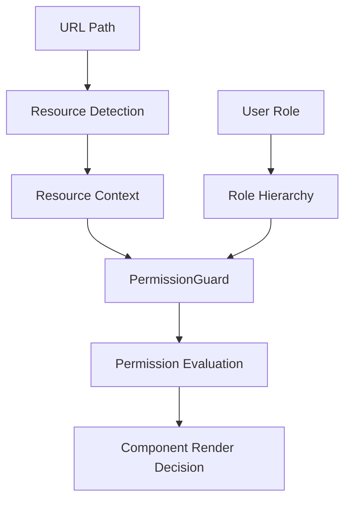

# Permission System Reference

Complete reference documentation for the resource context-based permission system.

## Table of Contents

- [Architecture Overview](#architecture-overview)
- [Core Components](#core-components)
- [Resource Context System](#resource-context-system)
- [Permission Guard API](#permission-guard-api)
- [Available Resources](#available-resources)
- [Permission Actions](#permission-actions)
- [Role Hierarchy](#role-hierarchy)
- [Usage Examples](#usage-examples)
- [Advanced Patterns](#advanced-patterns)

## Architecture Overview

The permission system is built on three core concepts:

1. **Resource Context**: Automatic detection of resources from URL paths
2. **Action-Based Permissions**: Clean, semantic permission checks
3. **Role Hierarchy**: Inherited permissions based on user roles



## Core Components

### ResourceProvider

Provides resource context to child components.

```tsx
interface ResourceProviderProps {
  resource: ResourceName | null;
  children: React.ReactNode;
}

// Usage
<ResourceProvider resource="billing">
  {children}
</ResourceProvider>
```

### PermissionGuard

Primary component for permission-based conditional rendering.

```tsx
interface PermissionGuardProps {
  // Action-based permissions (uses context resource)
  action?: PermissionAction;
  
  // Explicit resource + action
  resource?: ResourceName;
  
  // Direct permission string
  permission?: string;
  
  // Role-based permissions
  minRole?: UserRole;
  role?: UserRole;
  roles?: UserRole[];
  
  // Multiple permissions
  permissions?: string[];
  requireAll?: boolean;
  
  // Rendering
  children: React.ReactNode;
  fallback?: React.ReactNode;
  showLoading?: boolean;
}
```

### Helper Components

**Semantic permission components:**
```tsx
<CanRead resource="billing">Content</CanRead>
<CanCreate resource="staff">Content</CanCreate>
<CanUpdate resource="payrolls">Content</CanUpdate>
<CanDelete resource="clients">Content</CanDelete>
<CanApprove resource="billing">Content</CanApprove>
<CanExport resource="reports">Content</CanExport>
```

## Resource Context System

### Automatic Path Detection

The system automatically detects resources from URL paths:

```typescript
// Path-to-resource mappings (priority-ordered)
const pathMappings = [
  // Specific sub-resources (higher priority)
  { path: "/billing/items", resource: "billing_items", priority: 100 },
  { path: "/billing/invoices", resource: "billing", priority: 90 },
  
  // General resources (lower priority)
  { path: "/billing", resource: "billing", priority: 50 },
  { path: "/staff", resource: "staff", priority: 50 },
  { path: "/payrolls", resource: "payrolls", priority: 50 },
  { path: "/clients", resource: "clients", priority: 50 },
]
```

### Custom Path Mappings

Add custom path mappings for specific routes:

```typescript
import { addPathMapping } from "@/hooks/use-path-resource";

// Add custom mapping
addPathMapping({
  path: "/custom-reports",
  resource: "reports",
  priority: 80
});
```

### Layout Integration

The dashboard layout automatically provides resource context:

```tsx
// app/(dashboard)/layout.tsx
export default function DashboardLayout({ children }) {
  const pageResource = usePathResource(); // Auto-detect from URL
  
  return (
    <ResourceProvider resource={pageResource}>
      {children}
    </ResourceProvider>
  );
}
```

## Permission Guard API

### Priority Order (Highest to Lowest)

1. **Direct permission**: `permission="billing.create"`
2. **Resource override**: `resource="billing" action="create"`
3. **Context resource**: `action="create"` (uses layout-provided resource)
4. **Role-based**: `minRole="manager"`

### Action-Based Permissions (Recommended)

```tsx
// Uses layout-provided resource context
<PermissionGuard action="create">
  <CreateButton />
</PermissionGuard>

// Resolves to: billing.create (on /billing/* pages)
//              staff.create (on /staff/* pages)
//              payrolls.create (on /payrolls/* pages)
```

### Resource Override

```tsx
// Explicitly specify resource (for cross-cutting components)
<PermissionGuard resource="payrolls" action="read">
  <PayrollTracker />
</PermissionGuard>

// Always resolves to: payrolls.read (regardless of page context)
```

### Role-Based Permissions

```tsx
// Minimum role requirement
<PermissionGuard minRole="manager">
  <ManagerTools />
</PermissionGuard>

// Specific role only
<PermissionGuard role="developer">
  <DevTools />
</PermissionGuard>

// Multiple roles
<PermissionGuard roles={["org_admin", "manager"]}>
  <AdminTools />
</PermissionGuard>
```

### Multiple Permissions

```tsx
// Any permission (OR logic)
<PermissionGuard 
  permissions={["billing.read", "payrolls.read"]} 
  requireAll={false}
>
  <Dashboard />
</PermissionGuard>

// All permissions (AND logic)
<PermissionGuard 
  permissions={["billing.admin", "payrolls.admin"]} 
  requireAll={true}
>
  <SuperAdminPanel />
</PermissionGuard>
```

## Available Resources

### Core Business Resources

```typescript
type ResourceName = 
  | "billing"        // General billing operations
  | "billing_items"  // Specific billing items
  | "staff"          // Staff management
  | "payrolls"       // Payroll processing
  | "clients"        // Client management
  | "reports"        // Report generation
  | "leave"          // Leave management
  | "schedule"       // Payroll schedules
  | "workschedule"   // Work schedules
  | "settings"       // System settings
  | "security"       // Security & audit
  | "invitations"    // User invitations
  | "email"          // Email management
  | "ai"             // AI features
  | "bulkupload"     // Bulk operations
  | "calendar"       // Calendar features
  | "tax"            // Tax calculations
  | "profile"        // User profiles
  | "onboarding"     // User onboarding
  | "system"         // System administration
  | "dashboard";     // Dashboard access
```

### Resource Constants

```typescript
import { RESOURCES } from "@/components/auth/resource-context";

// Usage with constants (recommended for type safety)
<PermissionGuard resource={RESOURCES.BILLING} action="create">
```

## Permission Actions

### Standard Actions

```typescript
type PermissionAction =
  | "read"      // View/access resource
  | "create"    // Create new items
  | "update"    // Modify existing items  
  | "delete"    // Remove items
  | "list"      // List/browse items
  | "manage"    // Full management access
  | "approve"   // Approval workflows
  | "export"    // Export data
  | "admin"     // Administrative access
  | "assign"    // Assign/delegate
  | "invite";   // Send invitations
```

### Action Patterns

- **`read`**: Basic access to view content
- **`create`**: Permission to add new items
- **`update`**: Permission to modify existing items
- **`delete`**: Permission to remove items
- **`manage`**: Comprehensive management (typically includes read/create/update)
- **`admin`**: Administrative access (highest level for resource)
- **`approve`**: Workflow approvals (billing items, leave requests)
- **`export`**: Data export capabilities

## Role Hierarchy

### Role Levels (Lowest to Highest)

```typescript
enum UserRole {
  VIEWER = "viewer",           // Level 1: Read-only access
  CONSULTANT = "consultant",   // Level 2: Basic operations
  MANAGER = "manager",         // Level 3: Team management
  ORG_ADMIN = "org_admin",     // Level 4: Organization admin
  DEVELOPER = "developer"      // Level 5: Full system access
}
```

### Inherited Permissions

Higher roles automatically inherit lower role permissions:

- **Developer**: Can access everything
- **Org Admin**: Can access manager, consultant, viewer permissions
- **Manager**: Can access consultant, viewer permissions
- **Consultant**: Can access viewer permissions
- **Viewer**: Read-only access only

### Role-Based Access Patterns

```tsx
// Minimum role (inclusive)
<PermissionGuard minRole="consultant">
  {/* Accessible to consultant, manager, org_admin, developer */}
</PermissionGuard>

// Exact role (exclusive)
<PermissionGuard role="manager">
  {/* Only accessible to managers */}
</PermissionGuard>

// Multiple specific roles
<PermissionGuard roles={["org_admin", "developer"]}>
  {/* Only org_admin and developer */}
</PermissionGuard>
```

## Usage Examples

### Dashboard Page Example

```tsx
// app/(dashboard)/billing/page.tsx
export default function BillingPage() {
  return (
    <div>
      <h1>Billing Dashboard</h1>
      
      {/* Uses layout resource context (billing) */}
      <PermissionGuard action="create">
        <CreateInvoiceButton />
      </PermissionGuard>
      
      <PermissionGuard action="read">
        <BillingItemsList />
      </PermissionGuard>
      
      <PermissionGuard action="admin">
        <BillingSettings />
      </PermissionGuard>
    </div>
  );
}
```

### Cross-Cutting Component Example

```tsx
// components/widgets/payroll-status-widget.tsx
export function PayrollStatusWidget() {
  return (
    <PermissionGuard resource="payrolls" action="read">
      <Card>
        <CardHeader>Payroll Status</CardHeader>
        <CardContent>
          {/* Widget content */}
        </CardContent>
      </Card>
    </PermissionGuard>
  );
}
```

### Complex Permission Logic Example

```tsx
export function BillingItemActions({ item }) {
  return (
    <div className="flex gap-2">
      {/* Basic read access */}
      <PermissionGuard action="read">
        <ViewButton item={item} />
      </PermissionGuard>
      
      {/* Update with business logic */}
      <PermissionGuard action="update">
        {!item.approved && <EditButton item={item} />}
      </PermissionGuard>
      
      {/* Approval workflow */}
      <PermissionGuard action="approve">
        {item.status === 'pending' && <ApproveButton item={item} />}
      </PermissionGuard>
      
      {/* Admin-only delete */}
      <PermissionGuard action="admin">
        <DeleteButton item={item} />
      </PermissionGuard>
    </div>
  );
}
```

## Advanced Patterns

### Conditional Resource Detection

```tsx
function DynamicPermissionComponent({ context }) {
  const resource = context === 'billing' ? 'billing' : 'payrolls';
  
  return (
    <PermissionGuard resource={resource} action="read">
      <Content />
    </PermissionGuard>
  );
}
```

### Fallback Patterns

```tsx
<PermissionGuard 
  action="admin" 
  fallback={
    <PermissionGuard action="read">
      <ReadOnlyView />
    </PermissionGuard>
  }
>
  <AdminView />
</PermissionGuard>
```

### Hook-Based Permissions (Alternative Pattern)

```tsx
import { usePermissions } from "@/hooks/use-permissions";

function MyComponent() {
  const { can, canAny, canAll } = usePermissions();
  
  const canEdit = can('billing', 'update');
  const canViewAny = canAny(['billing.read', 'payrolls.read']);
  const canManageAll = canAll(['billing.admin', 'payrolls.admin']);
  
  return (
    <div>
      {canEdit && <EditButton />}
      {canViewAny && <ViewButton />}
      {canManageAll && <AdminPanel />}
    </div>
  );
}
```

### Performance Optimization

```tsx
// Avoid nesting permission guards - use business logic instead
// ❌ Not recommended
<PermissionGuard action="read">
  <PermissionGuard action="update">
    <EditableContent />
  </PermissionGuard>
</PermissionGuard>

// ✅ Recommended
<PermissionGuard action="update">
  <EditableContent />
</PermissionGuard>
```

## TypeScript Integration

### Type Safety

```tsx
import { type ResourceName, type PermissionAction } from "@/components/auth/resource-context";

interface MyComponentProps {
  resource: ResourceName;
  action: PermissionAction;
}

function MyComponent({ resource, action }: MyComponentProps) {
  return (
    <PermissionGuard resource={resource} action={action}>
      <Content />
    </PermissionGuard>
  );
}
```

### Generic Permission Components

```tsx
interface ProtectedComponentProps<T> {
  resource: ResourceName;
  action: PermissionAction;
  data: T;
  render: (data: T) => React.ReactNode;
}

function ProtectedComponent<T>({ resource, action, data, render }: ProtectedComponentProps<T>) {
  return (
    <PermissionGuard resource={resource} action={action}>
      {render(data)}
    </PermissionGuard>
  );
}
```

## Debugging and Development

### Debug Information

```tsx
import { usePathResourceInfo } from "@/hooks/use-path-resource";

function DebugPanel() {
  const { pathname, resource, matchedMapping } = usePathResourceInfo();
  
  return (
    <div>
      <p>Path: {pathname}</p>
      <p>Resource: {resource}</p>
      <p>Mapping: {matchedMapping?.path}</p>
    </div>
  );
}
```

### Testing Utilities

```tsx
import { debugPathDetection } from "@/hooks/use-path-resource";

// Development only
if (process.env.NODE_ENV === 'development') {
  const testResults = debugPathDetection([
    '/billing/items',
    '/staff/123',
    '/payrolls/new'
  ]);
  console.log('Path detection results:', testResults);
}
```

## Migration from Legacy System

See [Permission Migration Guide](./PERMISSION_MIGRATION.md) for detailed migration instructions and patterns.