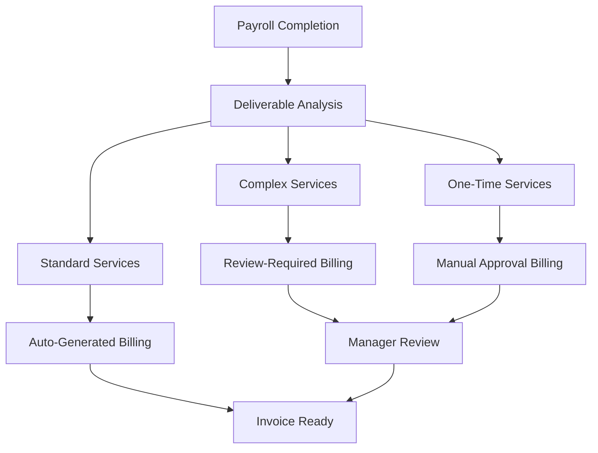

# Tier 1 Immediate Billing System Documentation

## Table of Contents

1. [Overview](#overview)
2. [Business Architecture](#business-architecture)
3. [Pricing Model](#pricing-model)
4. [Technical Implementation](#technical-implementation)
5. [Billing Generation Workflow](#billing-generation-workflow)
6. [Configuration Management](#configuration-management)
7. [Approval & Authorization](#approval--authorization)
8. [Monitoring & Analytics](#monitoring--analytics)
9. [API Reference](#api-reference)
10. [Examples & Use Cases](#examples--use-cases)

---

## Overview

The **Tier 1 Immediate Billing System** is a transaction-based revenue capture mechanism that automatically generates billing items based on actual deliverables completed during payroll processing. Unlike traditional time-based billing, this system charges for specific outcomes and services delivered.

### Key Principles
- **Outcome-Based Pricing**: Bill for what was delivered, not time spent
- **Immediate Revenue Capture**: Generate billing items upon payroll completion
- **Flexible Service Catalog**: Support client-specific and payroll-specific pricing
- **Automated Generation**: Minimize manual billing entry while maintaining oversight

### Value Proposition

- **For the Business**: Immediate revenue recognition, improved profit margins
- **For Clients**: Transparent, predictable pricing based on actual services received
- **For Consultants**: Focus on delivery quality rather than time tracking

---

## Business Architecture

### Revenue Streams



### Service Categories

| Category | Examples | Pricing Model | Approval Level |
|----------|----------|---------------|----------------|
| **Standard Services** | Payslip processing, Super contributions | Per-unit | Auto-approve |
| **Complex Services** | New starters, Terminations, Leave calculations | Per-transaction | Review required |
| **Premium Services** | Bonus processing, Tax adjustments | Per-transaction | Manager approval |
| **Statutory Services** | PAYG summaries, FBT reporting | Per-employee/Fixed | Review required |
| **Recurring Services** | Monthly servicing fee, System maintenance | Fixed monthly | Auto-approve |
| **One-Time Services** | System setup, Audit preparation | Fixed/Hourly | Manual approval |

---

## Pricing Model

### Hierarchical Pricing Structure

#### Level 1: Client Service Agreement (Base Rates)
```typescript
interface ClientServiceAgreement {
  clientId: string;
  agreementName: string;
  effectiveFrom: Date;
  effectiveTo?: Date;
  
  services: {
    // Standard recurring services
    standardPayslip: ServiceRate;
    newStarterSetup: ServiceRate;
    terminationProcessing: ServiceRate;
    leaveCalculation: ServiceRate;
    bonusProcessing: ServiceRate;
    superProcessing: ServiceRate;
    taxAdjustment: ServiceRate;
    
    // Statutory services
    payGSummaryGeneration: ServiceRate;
    fbtReporting: ServiceRate;
    workersCompReporting: ServiceRate;
    
    // Recurring services
    monthlyServicingFee: ServiceRate;
    systemMaintenanceFee: ServiceRate;
    complianceMonitoringFee: ServiceRate;
  };
  
  billingFrequency: 'immediate' | 'weekly' | 'monthly';
  autoApprovalThresholds: ApprovalThresholds;
}

interface ServiceRate {
  rate: number;
  unit: 'per_payslip' | 'per_employee' | 'per_calculation' | 'per_payment' | 'fixed' | 'per_hour';
  minimumCharge?: number;
  maximumCharge?: number;
  seasonalMultiplier?: SeasonalRate[];
}
```

#### Level 2: Payroll Service Overrides
```typescript
interface PayrollServiceAgreement {
  payrollId: string;
  clientId: string;
  overrideReason: string;
  approvedBy: string;
  effectiveForPayrollOnly: boolean;
  
  serviceOverrides: {
    [serviceCode: string]: {
      customRate: number;
      reason: string;
      approvalRequired: boolean;
    };
  };
  
  additionalServices: {
    [serviceCode: string]: {
      rate: number;
      unit: ServiceUnit;
      quantity?: number;
      description: string;
      isOneTime: boolean;
    };
  };
}
```

### Service Rate Examples

| Service | Standard Rate | Unit | Complexity | Approval |
|---------|---------------|------|------------|----------|
| Standard Payslip | $2.50 | per_payslip | Low | Auto |
| New Starter Setup | $25.00 | per_employee | Medium | Review |
| Termination Processing | $35.00 | per_employee | High | Manager |
| Leave Calculation | $5.00 | per_calculation | Medium | Review |
| Bonus Processing | $8.00 | per_payment | Medium | Review |
| Tax Adjustment | $12.00 | per_adjustment | High | Manager |
| Super Processing | $1.50 | per_employee | Low | Auto |
| PAYG Summary | $4.50 | per_employee | Medium | Review |
| FBT Calculation | $25.00 | per_employee | High | Manager |
| Monthly Servicing Fee | $150.00 | fixed_monthly | Low | Auto |
| System Maintenance | $75.00 | fixed_monthly | Low | Auto |
| Compliance Monitoring | $50.00 | fixed_monthly | Low | Auto |

### Recurring Service Fees & Monthly Charges

The billing system supports both transaction-based charges (generated upon payroll completion) and recurring monthly fees that are automatically generated on a schedule.

#### Monthly Recurring Services

| Service Type | Description | Standard Rate | Billing Cycle | Auto-Generation |
|--------------|-------------|---------------|---------------|-----------------|
| **Monthly Servicing Fee** | Base client relationship fee covering account management, basic support, and system access | $150.00 | 1st of month | Yes |
| **System Maintenance Fee** | Technology platform maintenance, updates, and infrastructure costs | $75.00 | 1st of month | Yes |
| **Compliance Monitoring** | Ongoing compliance monitoring, regulatory updates, and audit support | $50.00 | 1st of month | Yes |
| **Premium Support** | Priority support, dedicated account manager, extended hours | $200.00 | 1st of month | Optional |
| **Data Backup & Security** | Enhanced data backup, security monitoring, and disaster recovery | $100.00 | 1st of month | Optional |

#### Recurring Fee Configuration

```typescript
interface RecurringServiceConfiguration {
  serviceCode: string;
  serviceName: string;
  baseRate: number;
  billingCycle: 'monthly' | 'quarterly' | 'annually';
  generationDay: number; // Day of month (1-31)
  prorationRules: {
    newClientProration: boolean;
    terminationProration: boolean;
    minimumCharge?: number;
  };
  clientOverrides?: {
    [clientId: string]: {
      customRate: number;
      effectiveFrom: Date;
      reason: string;
    };
  };
}

const RECURRING_SERVICES: RecurringServiceConfiguration[] = [
  {
    serviceCode: 'MONTHLY_SERVICE',
    serviceName: 'Monthly Servicing Fee',
    baseRate: 150.00,
    billingCycle: 'monthly',
    generationDay: 1,
    prorationRules: {
      newClientProration: true,
      terminationProration: true,
      minimumCharge: 50.00
    }
  },
  {
    serviceCode: 'SYSTEM_MAINTENANCE',
    serviceName: 'System Maintenance Fee',
    baseRate: 75.00,
    billingCycle: 'monthly',
    generationDay: 1,
    prorationRules: {
      newClientProration: false, // Full fee regardless of start date
      terminationProration: true
    }
  }
];
```

#### Automated Monthly Billing Generation

```typescript
// Scheduled job runs on 1st of each month
async function generateMonthlyRecurringBilling(): Promise<void> {
  const currentMonth = new Date();
  const activeClients = await getActiveClientsWithRecurringServices();
  
  for (const client of activeClients) {
    const clientAgreement = await getClientServiceAgreement(client.id);
    const recurringServices = getEnabledRecurringServices(clientAgreement);
    
    for (const service of recurringServices) {
      // Check if already generated for this month
      const existingBilling = await checkExistingRecurringBilling(
        client.id, 
        service.serviceCode, 
        currentMonth
      );
      
      if (!existingBilling) {
        await generateRecurringBillingItem({
          clientId: client.id,
          serviceCode: service.serviceCode,
          serviceName: service.serviceName,
          baseRate: service.baseRate,
          billingMonth: currentMonth,
          prorationRules: service.prorationRules
        });
      }
    }
  }
}

async function generateRecurringBillingItem(config: RecurringBillingConfig): Promise<void> {
  // Calculate prorated amount if needed
  const amount = calculateRecurringFeeAmount(config);
  
  const billingItem: GeneratedBillingItem = {
    id: generateUUID(),
    clientId: config.clientId,
    serviceCode: config.serviceCode,
    serviceName: config.serviceName,
    description: `${config.serviceName} - ${formatMonth(config.billingMonth)}`,
    category: 'recurring',
    
    quantity: 1,
    unitPrice: amount,
    totalAmount: amount,
    currency: 'AUD',
    
    autoGenerated: true,
    generatedFrom: 'recurring_schedule',
    generatedAt: new Date(),
    generatedBy: 'system',
    
    status: 'approved', // Recurring fees auto-approved
    requiresApproval: false,
    approvalLevel: 'auto',
    
    billingPeriod: {
      start: startOfMonth(config.billingMonth),
      end: endOfMonth(config.billingMonth)
    },
    
    rateJustification: 'Standard recurring service fee per client agreement'
  };
  
  await insertBillingItem(billingItem);
  await notifyRecurringBillingGenerated(billingItem);
}
```

#### Pro-ration Logic for New/Terminated Clients

```typescript
function calculateRecurringFeeAmount(config: RecurringBillingConfig): number {
  const { baseRate, billingMonth, prorationRules, clientId } = config;
  
  // Check if client started or ended during the month
  const clientHistory = getClientHistory(clientId, billingMonth);
  
  if (clientHistory.startedDuringMonth && prorationRules.newClientProration) {
    const daysInMonth = getDaysInMonth(billingMonth);
    const daysActive = daysInMonth - clientHistory.startDay + 1;
    const prorationMultiplier = daysActive / daysInMonth;
    const proratedAmount = baseRate * prorationMultiplier;
    
    // Apply minimum charge if specified
    return Math.max(proratedAmount, prorationRules.minimumCharge || 0);
  }
  
  if (clientHistory.terminatedDuringMonth && prorationRules.terminationProration) {
    const daysInMonth = getDaysInMonth(billingMonth);
    const daysActive = clientHistory.terminationDay;
    const prorationMultiplier = daysActive / daysInMonth;
    return baseRate * prorationMultiplier;
  }
  
  return baseRate; // Full amount
}
```

#### Integration with Tier 1 Immediate Billing

Recurring fees work alongside transaction-based billing:

1. **Monthly Generation**: Recurring fees generate automatically on the 1st of each month
2. **Immediate Billing**: Transaction fees generate upon payroll completion
3. **Consolidated Invoicing**: Both types can be included in the same client invoice
4. **Separate Tracking**: Different billing categories for reporting and analytics

```typescript
// Example: Combined billing for a client in one month
const monthlyBillingExample = {
  client: "ABC Manufacturing",
  billingMonth: "2024-12",
  
  recurringFees: [
    {
      service: "Monthly Servicing Fee",
      amount: 150.00,
      generatedOn: "2024-12-01",
      category: "recurring"
    },
    {
      service: "System Maintenance Fee", 
      amount: 75.00,
      generatedOn: "2024-12-01",
      category: "recurring"
    }
  ],
  
  transactionBasedFees: [
    {
      service: "Standard Payslip Processing",
      amount: 450.00, // 180 payslips @ $2.50
      generatedOn: "2024-12-15",
      category: "transaction"
    },
    {
      service: "New Starter Setup",
      amount: 75.00, // 3 new starters @ $25.00
      generatedOn: "2024-12-22", 
      category: "transaction"
    }
  ],
  
  totalMonthlyBilling: 750.00,
  recurringPortion: 225.00, // 30%
  transactionPortion: 525.00 // 70%
};
```

---

## Technical Implementation

### Core Data Models

#### Payroll Completion Metrics
```typescript
interface PayrollCompletionMetrics {
  payrollDateId: string;
  completedBy: string;
  completedAt: Date;
  
  // Core deliverables
  payslipsProcessed: number;
  employeesProcessed: number;
  
  // Complexity indicators
  newStarters: number;
  terminations: number;
  leaveCalculations: number;
  bonusPayments: number;
  taxAdjustments: number;
  
  // Additional services
  superContributions: number;
  workersCompClaims: number;
  garnishmentOrders: number;
  
  // Statutory requirements
  payGSummaries?: number;
  fbtCalculations?: number;
  
  // Quality metrics
  exceptionsHandled: number;
  correctionsRequired: number;
  clientCommunications: number;
  
  // Monthly recurring services flag
  includeRecurringServices?: boolean;
}
```

#### Generated Billing Item
```typescript
interface GeneratedBillingItem {
  id: string;
  payrollId: string;
  payrollDateId: string;
  clientId: string;
  
  // Service details
  serviceCode: string;
  serviceName: string;
  description: string;
  category: ServiceCategory;
  
  // Pricing
  quantity: number;
  unitPrice: number;
  totalAmount: number;
  currency: string;
  
  // Generation metadata
  autoGenerated: boolean;
  generatedFrom: 'completion_metrics' | 'manual_entry' | 'template' | 'recurring_schedule';
  generatedAt: Date;
  generatedBy: string;
  
  // Approval workflow
  status: BillingItemStatus;
  requiresApproval: boolean;
  approvalLevel: 'auto' | 'manager' | 'admin';
  
  // Audit trail
  sourceMetrics?: PayrollCompletionMetrics; // Only for transaction-based items
  billingPeriod?: { start: Date; end: Date }; // For recurring services
  rateJustification: string;
  notes?: string;
}
```

### Database Schema

#### Tables
```sql
-- Core completion tracking
CREATE TABLE payroll_completion_metrics (
    id UUID PRIMARY KEY DEFAULT gen_random_uuid(),
    payroll_date_id UUID NOT NULL REFERENCES payroll_dates(id),
    completed_by UUID NOT NULL REFERENCES users(id),
    completed_at TIMESTAMP WITH TIME ZONE NOT NULL,
    
    -- Deliverable counts
    payslips_processed INTEGER NOT NULL DEFAULT 0,
    employees_processed INTEGER NOT NULL DEFAULT 0,
    new_starters INTEGER NOT NULL DEFAULT 0,
    terminations INTEGER NOT NULL DEFAULT 0,
    leave_calculations INTEGER NOT NULL DEFAULT 0,
    bonus_payments INTEGER NOT NULL DEFAULT 0,
    tax_adjustments INTEGER NOT NULL DEFAULT 0,
    super_contributions INTEGER NOT NULL DEFAULT 0,
    workers_comp_claims INTEGER NOT NULL DEFAULT 0,
    garnishment_orders INTEGER NOT NULL DEFAULT 0,
    payg_summaries INTEGER DEFAULT NULL,
    fbt_calculations INTEGER DEFAULT NULL,
    
    -- Quality metrics
    exceptions_handled INTEGER NOT NULL DEFAULT 0,
    corrections_required INTEGER NOT NULL DEFAULT 0,
    client_communications INTEGER NOT NULL DEFAULT 0,
    
    created_at TIMESTAMP WITH TIME ZONE DEFAULT NOW(),
    updated_at TIMESTAMP WITH TIME ZONE DEFAULT NOW()
);

-- Service rate configurations
CREATE TABLE client_service_agreements (
    id UUID PRIMARY KEY DEFAULT gen_random_uuid(),
    client_id UUID NOT NULL REFERENCES clients(id),
    agreement_name VARCHAR(255) NOT NULL,
    effective_from DATE NOT NULL,
    effective_to DATE,
    
    -- Service rates (JSONB for flexibility)
    service_rates JSONB NOT NULL,
    billing_frequency VARCHAR(50) NOT NULL DEFAULT 'immediate',
    auto_approval_thresholds JSONB,
    
    is_active BOOLEAN NOT NULL DEFAULT true,
    created_at TIMESTAMP WITH TIME ZONE DEFAULT NOW(),
    updated_at TIMESTAMP WITH TIME ZONE DEFAULT NOW(),
    created_by UUID NOT NULL REFERENCES users(id),
    
    UNIQUE(client_id, effective_from)
);

-- Payroll-specific overrides
CREATE TABLE payroll_service_agreements (
    id UUID PRIMARY KEY DEFAULT gen_random_uuid(),
    payroll_id UUID NOT NULL REFERENCES payrolls(id),
    client_id UUID NOT NULL REFERENCES clients(id),
    override_reason TEXT NOT NULL,
    approved_by UUID NOT NULL REFERENCES users(id),
    effective_for_payroll_only BOOLEAN NOT NULL DEFAULT true,
    
    service_overrides JSONB,
    additional_services JSONB,
    
    created_at TIMESTAMP WITH TIME ZONE DEFAULT NOW(),
    created_by UUID NOT NULL REFERENCES users(id),
    
    UNIQUE(payroll_id)
);

-- Enhanced billing items with generation metadata
ALTER TABLE billing_items ADD COLUMN IF NOT EXISTS payroll_date_id UUID REFERENCES payroll_dates(id);
ALTER TABLE billing_items ADD COLUMN IF NOT EXISTS service_code VARCHAR(100);
ALTER TABLE billing_items ADD COLUMN IF NOT EXISTS service_category VARCHAR(100);
ALTER TABLE billing_items ADD COLUMN IF NOT EXISTS auto_generated BOOLEAN DEFAULT false;
ALTER TABLE billing_items ADD COLUMN IF NOT EXISTS generated_from VARCHAR(50);
ALTER TABLE billing_items ADD COLUMN IF NOT EXISTS source_metrics_id UUID REFERENCES payroll_completion_metrics(id);
ALTER TABLE billing_items ADD COLUMN IF NOT EXISTS requires_approval BOOLEAN DEFAULT false;
ALTER TABLE billing_items ADD COLUMN IF NOT EXISTS approval_level VARCHAR(50);
ALTER TABLE billing_items ADD COLUMN IF NOT EXISTS rate_justification TEXT;
ALTER TABLE billing_items ADD COLUMN IF NOT EXISTS billing_period_start DATE;
ALTER TABLE billing_items ADD COLUMN IF NOT EXISTS billing_period_end DATE;
ALTER TABLE billing_items ADD COLUMN IF NOT EXISTS is_recurring BOOLEAN DEFAULT false;

-- Recurring services configuration table
CREATE TABLE recurring_service_configurations (
    id UUID PRIMARY KEY DEFAULT gen_random_uuid(),
    service_code VARCHAR(100) NOT NULL UNIQUE,
    service_name VARCHAR(255) NOT NULL,
    description TEXT,
    base_rate DECIMAL(10,2) NOT NULL,
    billing_cycle VARCHAR(50) NOT NULL DEFAULT 'monthly',
    generation_day INTEGER NOT NULL DEFAULT 1,
    
    -- Proration rules
    new_client_proration BOOLEAN NOT NULL DEFAULT true,
    termination_proration BOOLEAN NOT NULL DEFAULT true,
    minimum_charge DECIMAL(10,2),
    
    is_active BOOLEAN NOT NULL DEFAULT true,
    created_at TIMESTAMP WITH TIME ZONE DEFAULT NOW(),
    updated_at TIMESTAMP WITH TIME ZONE DEFAULT NOW(),
    created_by UUID NOT NULL REFERENCES users(id)
);

-- Client recurring service subscriptions
CREATE TABLE client_recurring_services (
    id UUID PRIMARY KEY DEFAULT gen_random_uuid(),
    client_id UUID NOT NULL REFERENCES clients(id),
    service_code VARCHAR(100) NOT NULL REFERENCES recurring_service_configurations(service_code),
    custom_rate DECIMAL(10,2), -- Override default rate
    effective_from DATE NOT NULL,
    effective_to DATE,
    is_active BOOLEAN NOT NULL DEFAULT true,
    
    created_at TIMESTAMP WITH TIME ZONE DEFAULT NOW(),
    created_by UUID NOT NULL REFERENCES users(id),
    
    UNIQUE(client_id, service_code, effective_from)
);

-- Recurring billing generation log
CREATE TABLE recurring_billing_log (
    id UUID PRIMARY KEY DEFAULT gen_random_uuid(),
    client_id UUID NOT NULL REFERENCES clients(id),
    service_code VARCHAR(100) NOT NULL,
    billing_month DATE NOT NULL,
    generated_at TIMESTAMP WITH TIME ZONE NOT NULL,
    billing_item_id UUID REFERENCES billing_items(id),
    amount DECIMAL(10,2) NOT NULL,
    prorated BOOLEAN NOT NULL DEFAULT false,
    proration_reason TEXT,
    
    UNIQUE(client_id, service_code, billing_month)
);
```

---

## Billing Generation Workflow

### Step 1: Payroll Completion Event
```typescript
async function completePayrollDate(
  payrollDateId: string, 
  completionData: PayrollCompletionData,
  completedBy: string
): Promise<void> {
  
  // 1. Validate completion data
  await validateCompletionData(completionData);
  
  // 2. Store completion metrics
  const metrics = await storeCompletionMetrics({
    payrollDateId,
    completedBy,
    completedAt: new Date(),
    ...completionData
  });
  
  // 3. Update payroll date status
  await updatePayrollDateStatus(payrollDateId, 'completed', completedBy);
  
  // 4. Trigger billing generation
  await generateTier1Billing(payrollDateId, metrics);
  
  // 5. Send notifications
  await notifyBillingGenerated(payrollDateId, metrics);
}
```

### Step 2: Billing Generation Engine
```typescript
async function generateTier1Billing(
  payrollDateId: string, 
  metrics: PayrollCompletionMetrics
): Promise<GeneratedBillingItem[]> {
  
  const payroll = await getPayrollWithClient(payrollDateId);
  const clientAgreement = await getActiveClientAgreement(payroll.clientId);
  const payrollOverrides = await getPayrollServiceAgreements(payroll.id);
  
  const billingItems: GeneratedBillingItem[] = [];
  
  // Generate billing for each deliverable type
  for (const [deliverableType, count] of Object.entries(metrics)) {
    if (count > 0 && isChargeableDeliverable(deliverableType)) {
      const billingItem = await generateBillingItem(
        deliverableType,
        count,
        clientAgreement,
        payrollOverrides,
        metrics
      );
      
      if (billingItem) {
        billingItems.push(billingItem);
      }
    }
  }
  
  // Generate additional services from payroll overrides
  if (payrollOverrides?.additionalServices) {
    const additionalItems = await generateAdditionalServiceBilling(
      payrollOverrides.additionalServices,
      metrics
    );
    billingItems.push(...additionalItems);
  }
  
  // Bulk insert billing items
  await insertBillingItems(billingItems);
  
  // Trigger approval workflow
  await triggerApprovalWorkflow(billingItems);
  
  return billingItems;
}
```

### Step 3: Service-Specific Billing Generation
```typescript
async function generateBillingItem(
  deliverableType: string,
  quantity: number,
  clientAgreement: ClientServiceAgreement,
  payrollOverrides: PayrollServiceAgreement | null,
  metrics: PayrollCompletionMetrics
): Promise<GeneratedBillingItem | null> {
  
  const serviceConfig = getServiceConfiguration(deliverableType);
  if (!serviceConfig) return null;
  
  // Determine rate (override > client agreement > default)
  const rate = payrollOverrides?.serviceOverrides?.[deliverableType]?.customRate ||
               clientAgreement.services[deliverableType]?.rate ||
               serviceConfig.defaultRate;
  
  if (!rate) return null;
  
  // Apply seasonal multipliers if applicable
  const effectiveRate = applySeasonalMultiplier(rate, new Date());
  
  // Calculate total amount
  const totalAmount = quantity * effectiveRate;
  
  // Determine approval requirements
  const requiresApproval = determineApprovalRequirement(
    deliverableType,
    totalAmount,
    clientAgreement.autoApprovalThresholds
  );
  
  return {
    id: generateUUID(),
    payrollId: metrics.payrollId,
    payrollDateId: metrics.payrollDateId,
    clientId: clientAgreement.clientId,
    
    serviceCode: serviceConfig.code,
    serviceName: serviceConfig.name,
    description: generateServiceDescription(deliverableType, quantity),
    category: serviceConfig.category,
    
    quantity,
    unitPrice: effectiveRate,
    totalAmount,
    currency: 'AUD',
    
    autoGenerated: true,
    generatedFrom: 'completion_metrics',
    generatedAt: new Date(),
    generatedBy: 'system',
    
    status: requiresApproval ? 'draft' : 'approved',
    requiresApproval,
    approvalLevel: determineApprovalLevel(deliverableType, totalAmount),
    
    sourceMetrics: metrics,
    rateJustification: generateRateJustification(deliverableType, rate, effectiveRate)
  };
}
```

---

## Configuration Management

### Service Definitions
```typescript
interface ServiceDefinition {
  code: string;
  name: string;
  description: string;
  category: ServiceCategory;
  defaultRate: number;
  unit: ServiceUnit;
  complexity: 'low' | 'medium' | 'high' | 'critical';
  requiresApproval: boolean;
  seasonalRates?: SeasonalRate[];
  minimumCharge?: number;
  maximumCharge?: number;
}

const SERVICE_CATALOG: ServiceDefinition[] = [
  {
    code: 'PAYSLIP_STD',
    name: 'Standard Payslip Processing',
    description: 'Processing of regular employee payslips',
    category: 'standard',
    defaultRate: 2.50,
    unit: 'per_payslip',
    complexity: 'low',
    requiresApproval: false
  },
  {
    code: 'NEW_STARTER',
    name: 'New Starter Setup',
    description: 'Complete setup for new employees',
    category: 'complex',
    defaultRate: 25.00,
    unit: 'per_employee',
    complexity: 'medium',
    requiresApproval: true,
    minimumCharge: 25.00
  },
  {
    code: 'TERMINATION',
    name: 'Employee Termination Processing',
    description: 'Complete termination processing including final pays',
    category: 'complex',
    defaultRate: 35.00,
    unit: 'per_employee',
    complexity: 'high',
    requiresApproval: true,
    minimumCharge: 35.00
  },
  {
    code: 'PAYG_SUMMARY',
    name: 'PAYG Payment Summary Generation',
    description: 'Annual PAYG payment summary generation',
    category: 'statutory',
    defaultRate: 4.50,
    unit: 'per_employee',
    complexity: 'medium',
    requiresApproval: true,
    seasonalRates: [
      { period: 'year_end', multiplier: 1.0, months: [6, 7] }
    ]
  },
  {
    code: 'MONTHLY_SERVICE',
    name: 'Monthly Servicing Fee',
    description: 'Base client relationship fee covering account management and support',
    category: 'recurring',
    defaultRate: 150.00,
    unit: 'fixed_monthly',
    complexity: 'low',
    requiresApproval: false
  },
  {
    code: 'SYSTEM_MAINTENANCE',
    name: 'System Maintenance Fee',
    description: 'Technology platform maintenance and infrastructure costs',
    category: 'recurring',
    defaultRate: 75.00,
    unit: 'fixed_monthly',
    complexity: 'low',
    requiresApproval: false
  },
  {
    code: 'COMPLIANCE_MONITORING',
    name: 'Compliance Monitoring Fee',
    description: 'Ongoing compliance monitoring and regulatory updates',
    category: 'recurring',
    defaultRate: 50.00,
    unit: 'fixed_monthly',
    complexity: 'low',
    requiresApproval: false
  }
];
```

### Client Agreement Templates
```typescript
interface AgreementTemplate {
  name: string;
  description: string;
  targetClientType: string;
  serviceRates: Record<string, ServiceRate>;
  autoApprovalThresholds: ApprovalThresholds;
}

const AGREEMENT_TEMPLATES: AgreementTemplate[] = [
  {
    name: 'Standard SME Client',
    description: 'Standard rates for small-medium enterprise clients',
    targetClientType: 'sme',
    serviceRates: {
      PAYSLIP_STD: { rate: 2.50, unit: 'per_payslip' },
      NEW_STARTER: { rate: 25.00, unit: 'per_employee' },
      TERMINATION: { rate: 35.00, unit: 'per_employee' },
      LEAVE_CALC: { rate: 5.00, unit: 'per_calculation' },
      BONUS_PROC: { rate: 8.00, unit: 'per_payment' },
      MONTHLY_SERVICE: { rate: 150.00, unit: 'fixed_monthly' },
      SYSTEM_MAINTENANCE: { rate: 75.00, unit: 'fixed_monthly' }
    },
    autoApprovalThresholds: {
      maxAmount: 500,
      maxQuantity: 50,
      trustedServices: ['PAYSLIP_STD', 'SUPER_PROC']
    }
  },
  {
    name: 'Enterprise Client',
    description: 'Premium rates for large enterprise clients',
    targetClientType: 'enterprise',
    serviceRates: {
      PAYSLIP_STD: { rate: 3.50, unit: 'per_payslip' },
      NEW_STARTER: { rate: 45.00, unit: 'per_employee' },
      TERMINATION: { rate: 65.00, unit: 'per_employee' },
      LEAVE_CALC: { rate: 8.00, unit: 'per_calculation' },
      BONUS_PROC: { rate: 15.00, unit: 'per_payment' },
      MONTHLY_SERVICE: { rate: 250.00, unit: 'fixed_monthly' },
      SYSTEM_MAINTENANCE: { rate: 100.00, unit: 'fixed_monthly' },
      COMPLIANCE_MONITORING: { rate: 50.00, unit: 'fixed_monthly' }
    },
    autoApprovalThresholds: {
      maxAmount: 2000,
      maxQuantity: 200,
      trustedServices: ['PAYSLIP_STD', 'SUPER_PROC', 'LEAVE_CALC']
    }
  }
];
```

---

## Approval & Authorization

### Approval Workflow
```typescript
interface ApprovalRules {
  autoApprove: {
    services: string[];           // Auto-approved service codes
    maxAmount: number;            // Maximum auto-approval amount
    maxQuantity: number;          // Maximum quantity threshold
    trustedConsultants: string[]; // Pre-approved consultant IDs
  };
  
  requiresReview: {
    services: string[];           // Services requiring review
    amountThreshold: number;      // Amount requiring review
    quantityThreshold: number;    // Quantity requiring review
    newClientPeriod: number;      // Days for new client review
  };
  
  requiresManagerApproval: {
    services: string[];           // Critical services
    amountThreshold: number;      // High-value threshold
    customRates: boolean;         // Custom rate approvals
    oneTimeServices: boolean;     // One-time service approvals
  };
}

const DEFAULT_APPROVAL_RULES: ApprovalRules = {
  autoApprove: {
    services: ['PAYSLIP_STD', 'SUPER_PROC'],
    maxAmount: 500,
    maxQuantity: 100,
    trustedConsultants: []
  },
  
  requiresReview: {
    services: ['NEW_STARTER', 'LEAVE_CALC', 'BONUS_PROC'],
    amountThreshold: 500,
    quantityThreshold: 50,
    newClientPeriod: 90
  },
  
  requiresManagerApproval: {
    services: ['TERMINATION', 'TAX_ADJ', 'PAYG_SUMMARY'],
    amountThreshold: 1000,
    customRates: true,
    oneTimeServices: true
  }
};
```

### Approval Workflow Implementation
```typescript
async function triggerApprovalWorkflow(billingItems: GeneratedBillingItem[]): Promise<void> {
  for (const item of billingItems) {
    const approvalLevel = determineApprovalLevel(item);
    
    switch (approvalLevel) {
      case 'auto':
        await autoApproveBillingItem(item);
        break;
        
      case 'review':
        await submitForReview(item, 'supervisor');
        break;
        
      case 'manager':
        await submitForReview(item, 'manager');
        break;
        
      case 'admin':
        await submitForReview(item, 'admin');
        break;
    }
  }
}

async function autoApproveBillingItem(item: GeneratedBillingItem): Promise<void> {
  await updateBillingItemStatus(item.id, 'approved', 'system');
  await logApprovalAction(item.id, 'auto_approved', 'system');
}

async function submitForReview(item: GeneratedBillingItem, reviewerRole: string): Promise<void> {
  await updateBillingItemStatus(item.id, 'pending_review', 'system');
  await createApprovalTask(item.id, reviewerRole);
  await notifyReviewers(item, reviewerRole);
}
```

---

## Monitoring & Analytics

### Key Performance Indicators
```typescript
interface Tier1BillingKPIs {
  // Volume metrics
  totalItemsGenerated: number;
  autoApprovedItems: number;
  manualReviewItems: number;
  
  // Revenue metrics
  totalRevenueGenerated: number;
  averageRevenuePerPayroll: number;
  revenueByServiceCategory: Record<string, number>;
  
  // Efficiency metrics
  autoGenerationRate: number;        // % of items auto-generated
  straightThroughProcessing: number; // % of items auto-approved
  averageApprovalTime: number;       // Hours to approval
  
  // Quality metrics
  disputeRate: number;               // % of items disputed
  correctionRate: number;            // % of items requiring correction
  clientSatisfactionScore: number;   // Average satisfaction rating
  
  // Profitability metrics
  averageMarginPerItem: number;
  profitabilityByService: Record<string, number>;
  consultantProductivity: Record<string, number>;
}
```

### Real-Time Monitoring Dashboard
```typescript
async function getBillingDashboardMetrics(dateRange: DateRange): Promise<Tier1BillingKPIs> {
  const [
    volumeMetrics,
    revenueMetrics,
    efficiencyMetrics,
    qualityMetrics,
    profitabilityMetrics
  ] = await Promise.all([
    getVolumeMetrics(dateRange),
    getRevenueMetrics(dateRange),
    getEfficiencyMetrics(dateRange),
    getQualityMetrics(dateRange),
    getProfitabilityMetrics(dateRange)
  ]);
  
  return {
    ...volumeMetrics,
    ...revenueMetrics,
    ...efficiencyMetrics,
    ...qualityMetrics,
    ...profitabilityMetrics
  };
}
```

### Automated Alerting
```typescript
interface AlertThresholds {
  lowAutoApprovalRate: number;      // Alert if < 70%
  highDisputeRate: number;          // Alert if > 5%
  longApprovalTime: number;         // Alert if > 24 hours
  lowMargin: number;                // Alert if margin < 20%
  unusualVolumeVariance: number;    // Alert if volume varies >50%
}

async function checkBillingAlerts(): Promise<Alert[]> {
  const alerts: Alert[] = [];
  const metrics = await getBillingDashboardMetrics(getToday());
  
  if (metrics.autoGenerationRate < ALERT_THRESHOLDS.lowAutoApprovalRate) {
    alerts.push({
      type: 'LOW_AUTO_APPROVAL_RATE',
      severity: 'warning',
      message: `Auto-approval rate is ${metrics.autoGenerationRate}%, below threshold`,
      recommendedAction: 'Review approval rules and thresholds'
    });
  }
  
  if (metrics.disputeRate > ALERT_THRESHOLDS.highDisputeRate) {
    alerts.push({
      type: 'HIGH_DISPUTE_RATE',
      severity: 'critical',
      message: `Dispute rate is ${metrics.disputeRate}%, above acceptable threshold`,
      recommendedAction: 'Investigate recent billing items for accuracy issues'
    });
  }
  
  return alerts;
}
```

---

## API Reference

### Completion Metrics API

#### Record Payroll Completion
```http
POST /api/payroll-dates/{payrollDateId}/complete
Content-Type: application/json
Authorization: Bearer {token}

{
  "completedBy": "user-uuid",
  "metrics": {
    "payslipsProcessed": 127,
    "employeesProcessed": 127,
    "newStarters": 5,
    "terminations": 3,
    "leaveCalculations": 23,
    "bonusPayments": 89,
    "taxAdjustments": 12,
    "superContributions": 127,
    "payGSummaries": 127,
    "fbtCalculations": 15
  },
  "notes": "Year-end payroll completed successfully"
}
```

#### Get Completion Metrics
```http
GET /api/payroll-dates/{payrollDateId}/metrics
Authorization: Bearer {token}

Response:
{
  "id": "metrics-uuid",
  "payrollDateId": "payroll-date-uuid",
  "completedBy": "user-uuid",
  "completedAt": "2024-12-31T12:00:00Z",
  "metrics": {
    "payslipsProcessed": 127,
    "employeesProcessed": 127,
    // ... other metrics
  },
  "generatedBillingItems": [
    {
      "id": "billing-item-uuid",
      "serviceCode": "PAYSLIP_STD",
      "quantity": 127,
      "unitPrice": 3.50,
      "totalAmount": 444.50,
      "status": "approved"
    }
  ]
}
```

### Billing Generation API

#### Trigger Manual Billing Generation
```http
POST /api/billing/tier1/generate
Content-Type: application/json
Authorization: Bearer {token}

{
  "payrollDateId": "payroll-date-uuid",
  "forceRegenerate": false,
  "approvalOverride": false
}
```

#### Get Generated Billing Items
```http
GET /api/billing/items?payrollDateId={uuid}&autoGenerated=true
Authorization: Bearer {token}

Response:
{
  "items": [
    {
      "id": "billing-item-uuid",
      "serviceCode": "PAYSLIP_STD",
      "serviceName": "Standard Payslip Processing",
      "description": "Payslip Processing - 127 payslips",
      "quantity": 127,
      "unitPrice": 3.50,
      "totalAmount": 444.50,
      "status": "approved",
      "autoGenerated": true,
      "generatedAt": "2024-12-31T12:05:00Z"
    }
  ],
  "summary": {
    "totalItems": 7,
    "totalAmount": 2903.00,
    "autoApproved": 3,
    "pendingReview": 4
  }
}
```

### Configuration API

#### Get Client Service Agreement
```http
GET /api/clients/{clientId}/service-agreement
Authorization: Bearer {token}

Response:
{
  "id": "agreement-uuid",
  "clientId": "client-uuid",
  "agreementName": "ACME Corp Standard Agreement",
  "effectiveFrom": "2024-01-01",
  "services": {
    "standardPayslip": {
      "rate": 3.50,
      "unit": "per_payslip"
    },
    "newStarterSetup": {
      "rate": 25.00,
      "unit": "per_employee"
    }
  },
  "billingFrequency": "immediate",
  "autoApprovalThresholds": {
    "maxAmount": 500,
    "trustedServices": ["PAYSLIP_STD"]
  }
}
```

#### Update Service Rates
```http
PUT /api/clients/{clientId}/service-agreement
Content-Type: application/json
Authorization: Bearer {token}

{
  "services": {
    "standardPayslip": {
      "rate": 4.00,
      "unit": "per_payslip"
    }
  },
  "effectiveFrom": "2025-01-01",
  "reason": "Annual rate increase"
}
```

### Recurring Services API

#### Get Client Recurring Services
```http
GET /api/clients/{clientId}/recurring-services
Authorization: Bearer {token}

Response:
{
  "subscriptions": [
    {
      "id": "subscription-uuid",
      "serviceCode": "MONTHLY_SERVICE",
      "serviceName": "Monthly Servicing Fee",
      "baseRate": 150.00,
      "customRate": 175.00,
      "effectiveFrom": "2024-01-01",
      "isActive": true
    }
  ],
  "nextBillingDate": "2025-01-01",
  "totalMonthlyRecurring": 275.00
}
```

#### Subscribe Client to Recurring Service
```http
POST /api/clients/{clientId}/recurring-services
Content-Type: application/json
Authorization: Bearer {token}

{
  "serviceCode": "MONTHLY_SERVICE",
  "customRate": 175.00,
  "effectiveFrom": "2025-01-01"
}
```

#### Generate Recurring Billing (Manual Trigger)
```http
POST /api/billing/recurring/generate
Content-Type: application/json
Authorization: Bearer {token}

{
  "billingMonth": "2025-01-01",
  "clientIds": ["client-uuid-1", "client-uuid-2"],
  "serviceCode": "MONTHLY_SERVICE"
}
```

---

## Examples & Use Cases

### Example 1: Standard Weekly Payroll
```typescript
const weeklyPayrollExample = {
  client: "ABC Manufacturing",
  payrollDate: "2024-12-27",
  completionMetrics: {
    payslipsProcessed: 45,
    employeesProcessed: 45,
    newStarters: 1,
    terminations: 0,
    leaveCalculations: 8,
    bonusPayments: 2,
    superContributions: 45
  },
  
  generatedBilling: [
    {
      service: "Standard Payslip Processing",
      quantity: 45,
      unitPrice: 2.50,
      amount: 112.50,
      status: "auto_approved"
    },
    {
      service: "New Starter Setup", 
      quantity: 1,
      unitPrice: 25.00,
      amount: 25.00,
      status: "pending_review"
    },
    {
      service: "Leave Calculations",
      quantity: 8,
      unitPrice: 5.00,
      amount: 40.00,
      status: "pending_review"
    },
    {
      service: "Bonus Processing",
      quantity: 2, 
      unitPrice: 8.00,
      amount: 16.00,
      status: "pending_review"
    }
  ],
  
  totalAmount: 193.50,
  estimatedApprovalTime: "2 hours"
};
```

### Example 2: Year-End Complex Payroll
```typescript
const yearEndPayrollExample = {
  client: "XYZ Corporation",
  payrollDate: "2024-12-31",
  completionMetrics: {
    payslipsProcessed: 200,
    employeesProcessed: 200,
    newStarters: 8,
    terminations: 5,
    leaveCalculations: 45,
    bonusPayments: 150,
    taxAdjustments: 20,
    payGSummaries: 200,
    fbtCalculations: 25
  },
  
  serviceOverrides: {
    standardPayslip: {
      customRate: 4.00,
      reason: "Year-end complexity premium"
    },
    bonusProcessing: {
      customRate: 12.00,
      reason: "Complex bonus calculations"
    }
  },
  
  additionalServices: {
    yearEndReporting: {
      rate: 800.00,
      unit: "fixed",
      description: "Comprehensive year-end reporting package"
    }
  },
  
  generatedBilling: [
    {
      service: "Standard Payslip Processing (Year-end)",
      quantity: 200,
      unitPrice: 4.00,
      amount: 800.00,
      status: "manager_approval_required"
    },
    {
      service: "New Starter Setup",
      quantity: 8,
      unitPrice: 25.00,
      amount: 200.00,
      status: "pending_review"
    },
    {
      service: "Employee Termination Processing",
      quantity: 5,
      unitPrice: 35.00,
      amount: 175.00,
      status: "manager_approval_required"
    },
    {
      service: "Complex Bonus Processing",
      quantity: 150,
      unitPrice: 12.00,
      amount: 1800.00,
      status: "manager_approval_required"
    },
    {
      service: "PAYG Payment Summary Generation",
      quantity: 200,
      unitPrice: 4.50,
      amount: 900.00,
      status: "pending_review"
    },
    {
      service: "Year-end Reporting Package",
      quantity: 1,
      unitPrice: 800.00,
      amount: 800.00,
      status: "manager_approval_required"
    }
  ],
  
  totalAmount: 4675.00,
  estimatedApprovalTime: "4-6 hours",
  profitMargin: "68%"
};
```

### Example 3: Emergency Payroll Correction
```typescript
const emergencyPayrollExample = {
  client: "Emergency Client Ltd",
  scenario: "Payroll correction due to award interpretation error",
  payrollDate: "2024-12-20",
  completionMetrics: {
    payslipsProcessed: 75,
    employeesProcessed: 75,
    taxAdjustments: 75,      // All employees affected
    correctionsRequired: 75,  // Quality metric
    clientCommunications: 5   // Multiple client calls
  },
  
  serviceOverrides: {
    taxAdjustment: {
      customRate: 18.00,      // Premium for emergency work
      reason: "Emergency correction - after hours work"
    }
  },
  
  additionalServices: {
    emergencySupport: {
      rate: 120.00,
      unit: "per_hour",
      quantity: 4,
      description: "After-hours emergency payroll correction"
    },
    clientCommunication: {
      rate: 50.00,
      unit: "per_communication",
      quantity: 5,
      description: "Client consultation and explanation calls"
    }
  },
  
  generatedBilling: [
    {
      service: "Re-processed Payslips",
      quantity: 75,
      unitPrice: 2.50,
      amount: 187.50,
      status: "auto_approved"
    },
    {
      service: "Emergency Tax Adjustments",
      quantity: 75,
      unitPrice: 18.00,
      amount: 1350.00,
      status: "manager_approval_required"
    },
    {
      service: "After-hours Emergency Support",
      quantity: 4,
      unitPrice: 120.00,
      amount: 480.00,
      status: "admin_approval_required"
    },
    {
      service: "Client Communication & Consultation",
      quantity: 5,
      unitPrice: 50.00,
      amount: 250.00,
      status: "manager_approval_required"
    }
  ],
  
  totalAmount: 2267.50,
  urgencyLevel: "critical",
  approvalDeadline: "2 hours"
};
```

---

## Best Practices

### Configuration Management

1. **Version Control**: All service agreements and rate changes must be versioned
2. **Effective Dating**: Always use effective date ranges for rate changes
3. **Approval Trails**: Maintain audit trails for all configuration changes
4. **Testing**: Test rate changes in staging environment before production

### Quality Assurance

1. **Validation Rules**: Implement data validation for completion metrics
2. **Reconciliation**: Daily reconciliation of generated vs expected billing
3. **Exception Handling**: Robust error handling for edge cases
4. **Monitoring**: Real-time monitoring of generation rates and accuracy

### Performance Optimization

1. **Batch Processing**: Process multiple payroll completions in batches
2. **Caching**: Cache frequently accessed service rates and agreements
3. **Indexing**: Proper database indexing for quick lookups
4. **Async Processing**: Use async processing for non-critical operations

### Security & Compliance

1. **Access Control**: Role-based access to billing configuration
2. **Audit Logging**: Comprehensive audit trails for all billing activities
3. **Data Protection**: Encrypt sensitive financial data
4. **Compliance**: Regular compliance checks for billing accuracy

---

This documentation provides a comprehensive guide to implementing and operating the Tier 1 Immediate Billing System, ensuring accurate, automated, and efficient revenue capture based on actual payroll deliverables.