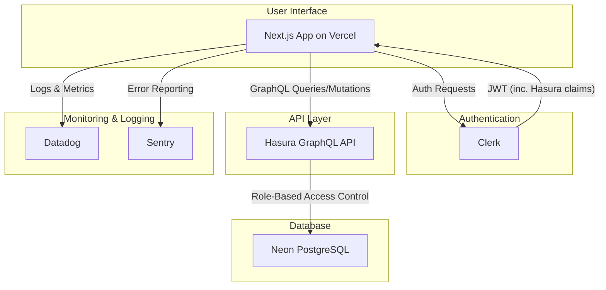

# Payroll System Documentation

This document provides a comprehensive overview of the Payroll-ByteMy system, including its architecture, core functionality, security measures, and future enhancement plans.

## 1. System Overview & Architecture

_This section combines information from `PAYROLL_BYTEMY_DEEP_DIVE_ANALYSIS.md` and `PAYROLL_PLATFORM_ARCHITECTURE.md`._

The Payroll-ByteMy application is an enterprise-grade payroll management system built with a modern technology stack designed for security, scalability, and compliance.

### 1.1. Core Technology Stack

- **Frontend**: Next.js 15, React 19, TypeScript
- **UI**: shadcn/ui, Radix UI, Tailwind CSS
- **Authentication**: Clerk (with custom JWT for Hasura)
- **Database**: PostgreSQL (Neon)
- **GraphQL API**: Hasura GraphQL Engine
- **Deployment**: Vercel
- **Monitoring**: Datadog, Sentry
- **Testing**: Jest, Cypress, Playwright

### 1.2. Architectural Principles

The system is built on a set of core principles:

- **Domain-Driven Design (DDD)**: Logic is organized by functional domains (`users`, `payrolls`, `clients`) for clear separation of concerns.
- **Security-First**: SOC2 compliance, multi-layer authentication (Route -> Component -> Database), and comprehensive audit logging are central to the design.
- **Native Clerk Integration**: Leverages Clerk's native hooks and session management, avoiding custom JWT handling.
- **Scalable Infrastructure**: A serverless architecture with Vercel for the frontend and Neon for the database ensures scalability and resilience.

### 1.3. System Architecture Diagram

_From `PAYROLL_PLATFORM_ARCHITECTURE.md`_

### 1.4. Data Flow

1.  **User Interaction**: A user action triggers a request from the Next.js frontend.
2.  **Authentication**: Clerk authenticates the user and provides a JWT.
3.  **API Call**: The frontend uses a unified Apollo Client to send a GraphQL request to Hasura, including the JWT in the headers.
4.  **Authorization**: Hasura validates the JWT and uses session variables (like `x-hasura-user-id` and `x-hasura-role`) to enforce Row-Level Security (RLS) policies.
5.  **Database**: The query is executed on the Neon PostgreSQL database according to the RLS permissions.
6.  **Response**: The data is returned through the layers to the user.

## 2. Core Functionality

_This section summarizes content from the deep dive analysis and `PAYROLL_PROCESSING_AND_COMPLIANCE.md`._

### 2.1. Employee & Client Management

- **Core CRUD operations** for employees and clients.
- **Secure onboarding flows** with data validation.
- **Role-Based Access Control** to manage permissions for different user types (Admin, Manager, Employee).

### 2.2. Payroll Processing

- **Calculation Engine**: A robust, server-side engine for calculating salaries, wages, taxes, and superannuation.
- **Tax Integration**: Integration with ATO (Australian Taxation Office) APIs for real-time tax data.
- **Payslip Generation**: Automated generation of compliant payslips.
- **Compliance**: Adherence to STP (Single Touch Payroll) Phase 2 and Award Interpretation rules.

### 2.3. Audit & Compliance

- **Comprehensive Audit Trails**: All significant actions (e.g., creating a payroll, updating employee details) are logged for security and compliance purposes.
- **Data Classification**: A system categorizes data as CRITICAL, HIGH, MEDIUM, or LOW to apply appropriate security controls.
- **SOC2 Compliance**: The system is designed to meet SOC2 standards.

## 3. Security

_Key security points from the deep dive and general system rules._

- **Authentication**: Enforced via Clerk at multiple layers.
- **Authorization**: A 5-tier RBAC hierarchy (`developer`, `org_admin`, `manager`, `consultant`, `viewer`) controls access to data and features.
- **Input Validation**: Zod schemas are used to validate all API inputs.
- **SQL Injection Prevention**: All database access is through Hasura's parameterized queries, preventing SQL injection.
- **Secret Management**: Environment variables are validated at startup and managed securely via Vercel.

## 4. Monitoring & Observability

_This section incorporates the plan from `PAYROLL_DATADOG_INTEGRATION_PLAN.md`._

### 4.1. Datadog Integration

- **Real User Monitoring (RUM)**: Captures user journeys and frontend performance metrics.
- **APM (Application Performance Monitoring)**: Traces requests from the frontend through the GraphQL API to the database.
- **Log Management**: Centralized logging from Vercel, Hasura, and Neon.
- **Dashboards**: Pre-configured dashboards for monitoring key health indicators (error rates, latency, resource utilization).
- **Alerting**: Automated alerts for critical issues like high error rates, security threats, or performance degradation.

### 4.2. Sentry

- **Error Tracking**: Real-time error reporting and stack traces for rapid debugging of frontend and backend issues.

## 5. Future Enhancements & Roadmap

_Summarized from `PAYROLL_FEATURE_ENHANCEMENT_PROPOSAL.md` and the deep dive's recommendations._

### 5.1. Short-Term (Next 3 Months)

1.  **Full SOC2 Certification**: Complete the formal audit and certification process.
2.  **Advanced Reporting Suite**: Develop financial, compliance, and custom reporting dashboards.
3.  **Mobile-First Enhancements**: Improve the user experience on mobile devices for employee self-service.

### 5.2. Long-Term (Next 6-12 Months)

1.  **AI-Powered Insights**: Introduce features for anomaly detection in payroll runs and predictive analytics.
2.  **International Expansion**: Add support for multi-currency and multi-jurisdiction payroll processing.
3.  **Third-Party Integrations**: Integrate with accounting software like Xero and QuickBooks.
4.  **Automated Award Interpretation**: Develop an engine to automatically interpret and apply complex industry awards.

---

**Document Status**: Consolidated & Live
**Last Updated**: Current Date

---
