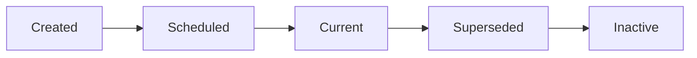

# 🔄 Payroll Versioning System Documentation

## Overview

The Payroll Versioning System provides a robust solution for managing payroll changes without disrupting existing schedules or causing data conflicts. Instead of modifying existing payrolls directly, the system creates new versions with controlled go-live dates.

## 🎯 **Key Benefits**

### **1. Data Integrity**

- ✅ No unique constraint violations
- ✅ Preserves historical payroll data
- ✅ Maintains audit trail of all changes
- ✅ Clean separation between old and new schedules

### **2. Business Continuity**

- ✅ Current payroll continues until go-live date
- ✅ Smooth transition to new schedule
- ✅ No interruption to existing workflows
- ✅ Future planning capabilities

### **3. Operational Control**

- ✅ Controlled go-live dates
- ✅ Ability to prepare changes in advance
- ✅ Clear version tracking
- ✅ Automated date management

## 🏗 **System Architecture**

### **Database Schema**

```sql
-- Additional columns in payrolls table
ALTER TABLE payrolls ADD COLUMN:
- version_number integer DEFAULT 1
- parent_payroll_id uuid REFERENCES payrolls(id)
- go_live_date date
- superseded_date date
- version_reason text
- created_by_user_id uuid
```

### **Version Hierarchy**

```
Original Payroll (v1)
├── Version 2 (Schedule Change)
├── Version 3 (Consultant Change)
└── Version 4 (Client Change)
```

### **Core Functions**

#### **1. create_payroll_version()**

Creates a new version of an existing payroll.

```sql
SELECT * FROM create_payroll_version(
  p_original_payroll_id := 'uuid-here',
  p_go_live_date := '2024-02-01',
  p_version_reason := 'schedule_change',
  p_new_cycle_id := 'new-cycle-uuid'
);
```

#### **2. get_latest_payroll_version()**

Returns the currently active version of a payroll.

```sql
SELECT * FROM get_latest_payroll_version('payroll-uuid');
```

#### **3. get_payroll_version_history()**

Returns complete version history for a payroll family.

```sql
SELECT * FROM get_payroll_version_history('payroll-uuid');
```

#### **4. activate_payroll_versions()**

Daily cron function to manage version transitions.

```sql
SELECT * FROM activate_payroll_versions();
```

## 🔄 **Versioning Workflow**

### **When Versioning is Triggered**

Changes to these fields require versioning:

- **Payroll Cycle** (`cycle_id`)
- **Date Type** (`date_type_id`)
- **Date Value** (`date_value`)
- **Client Assignment** (`client_id`)

### **Step-by-Step Process**

#### **1. User Makes Schedule Change**

```typescript
// User edits payroll in UI
const changes = {
  cycle_id: "new-weekly-cycle",
  date_value: 5, // Friday instead of Monday
};
```

#### **2. System Detects Versioning Requirement**

```typescript
const requiresVersion = requiresVersioning(originalPayroll, changes);
if (requiresVersion) {
  // Show versioning dialog
  setShowVersioningDialog(true);
}
```

#### **3. User Selects Go-Live Date**

```typescript
const versionInput = {
  originalPayrollId: payroll.id,
  goLiveDate: "2024-02-01",
  versionReason: "schedule_change",
  changes: changes,
};
```

#### **4. System Creates New Version**

```sql
-- Creates version 2 with new schedule
-- Deletes future dates from version 1 (from go-live date forward)
-- Generates 2 years of dates for version 2
-- Marks version 1 as superseded on go-live date
```

#### **5. Daily Cron Manages Transitions**

```sql
-- On go-live date:
-- Deactivates old version (v1)
-- Keeps new version active (v2)
```

## 🛠 **Technical Implementation**

### **Frontend Hooks**

#### **usePayrollVersioning()**

```typescript
const { createPayrollVersion, loading } = usePayrollVersioning();

const result = await createPayrollVersion({
  originalPayrollId: "uuid",
  goLiveDate: "2024-02-01",
  versionReason: "schedule_change",
  changes: { cycle_id: "new-cycle" },
});
```

#### **usePayrollVersionHistory()**

```typescript
const { versionHistory, loading } = usePayrollVersionHistory(payrollId);

// Returns array of versions with status
[
  { version_number: 1, is_current: false, superseded_date: "2024-02-01" },
  { version_number: 2, is_current: true, go_live_date: "2024-02-01" },
];
```

### **Version Reasons**

```typescript
enum VersionReason {
  INITIAL_CREATION = "initial_creation",
  SCHEDULE_CHANGE = "schedule_change",
  CONSULTANT_CHANGE = "consultant_change",
  CLIENT_CHANGE = "client_change",
  CORRECTION = "correction",
  ANNUAL_REVIEW = "annual_review",
}
```

### **UI Components**

#### **Version Creation Dialog**

- Go-live date selector (minimum: today)
- Version reason automatic detection
- Impact preview (dates deleted/generated)
- Confirmation workflow

#### **Version History Display**

- Timeline view of all versions
- Status badges (Current, Scheduled, Past, Inactive)
- Version reason display
- Navigation to version details

## 📊 **Version Status States**

### **Version Lifecycle**



### **Status Definitions**

| Status        | Description                        | Active | Visible |
| ------------- | ---------------------------------- | ------ | ------- |
| **Current**   | Active version being used          | ✅     | ✅      |
| **Scheduled** | Future version awaiting go-live    | ✅     | ✅      |
| **Past**      | Previous version, no longer active | ❌     | ✅      |
| **Inactive**  | Manually deactivated               | ❌     | ✅      |

## 🔧 **Configuration & Deployment**

### **1. Database Migration**

```bash
# Apply versioning schema
psql -d payroll_db -f database/payroll_versioning_schema.sql
```

### **2. Hasura Function Registration**

```bash
# Add functions to metadata
hasura metadata apply
```

### **3. Cron Job Setup**

```json
{
  "path": "/api/cron/activate-payroll-versions",
  "schedule": "0 1 * * *",
  "description": "Daily payroll version activation"
}
```

### **4. Environment Variables**

```bash
ENABLE_PAYROLL_VERSIONING=true
VERSIONING_RETENTION_DAYS=365
```

## 📈 **Monitoring & Analytics**

### **Key Metrics**

#### **Version Activity**

```sql
-- Version creation frequency
SELECT
  DATE_TRUNC('month', created_at) as month,
  version_reason,
  COUNT(*) as versions_created
FROM payrolls
WHERE parent_payroll_id IS NOT NULL
GROUP BY month, version_reason;
```

#### **Go-Live Success Rate**

```sql
-- Successful version transitions
SELECT
  COUNT(*) as total_transitions,
  COUNT(CASE WHEN active = false THEN 1 END) as successful_transitions,
  ROUND(COUNT(CASE WHEN active = false THEN 1 END) * 100.0 / COUNT(*), 2) as success_rate
FROM payrolls
WHERE superseded_date IS NOT NULL;
```

#### **Version Distribution**

```sql
-- Current version numbers across system
SELECT
  version_number,
  COUNT(*) as payroll_count
FROM current_payrolls
GROUP BY version_number
ORDER BY version_number;
```

## 🚨 **Common Scenarios & Solutions**

### **Scenario 1: Emergency Schedule Change**

**Need**: Change payroll cycle immediately for compliance

**Solution**:

```typescript
// Set go-live date to today
const result = await createPayrollVersion({
  originalPayrollId: payroll.id,
  goLiveDate: new Date().toISOString().split("T")[0],
  versionReason: "correction",
  changes: { cycle_id: "emergency-weekly" },
});
```

### **Scenario 2: Planned Annual Review**

**Need**: Update payroll for new fiscal year

**Solution**:

```typescript
// Set go-live date to start of fiscal year
const result = await createPayrollVersion({
  originalPayrollId: payroll.id,
  goLiveDate: "2024-04-01", // Fiscal year start
  versionReason: "annual_review",
  changes: { cycle_id: "updated-cycle" },
});
```

### **Scenario 3: Client Transfer**

**Need**: Move payroll to different client

**Solution**:

```typescript
// Create version with new client
const result = await createPayrollVersion({
  originalPayrollId: payroll.id,
  goLiveDate: "2024-03-01",
  versionReason: "client_change",
  changes: { client_id: "new-client-uuid" },
});
```

## 🔍 **Troubleshooting**

### **Issue**: Version not activating on go-live date

**Cause**: Cron job not running or date comparison issue
**Solution**:

```bash
# Check cron status
curl -X GET "/api/cron/activate-payroll-versions" -H "auth: token"

# Manually trigger activation
curl -X POST "/api/cron/activate-payroll-versions" -H "x-cron-secret: secret"
```

### **Issue**: Duplicate dates after versioning

**Cause**: Date deletion not working properly
**Solution**:

```sql
-- Check for orphaned dates
SELECT payroll_id, COUNT(*)
FROM payroll_dates pd
WHERE payroll_id NOT IN (SELECT id FROM payrolls WHERE active = true)
GROUP BY payroll_id;

-- Clean up manually if needed
DELETE FROM payroll_dates
WHERE payroll_id = 'inactive-payroll-uuid';
```

### **Issue**: Version history not loading

**Cause**: Circular reference in parent_payroll_id
**Solution**:

```sql
-- Check for circular references
WITH RECURSIVE version_tree AS (
  SELECT id, parent_payroll_id, version_number, 1 as depth
  FROM payrolls WHERE parent_payroll_id IS NULL
  UNION ALL
  SELECT p.id, p.parent_payroll_id, p.version_number, vt.depth + 1
  FROM payrolls p
  JOIN version_tree vt ON p.parent_payroll_id = vt.id
  WHERE vt.depth < 10
)
SELECT * FROM version_tree WHERE depth > 5;
```

## 🎯 **Best Practices**

### **1. Version Planning**

- ✅ Plan go-live dates during low-activity periods
- ✅ Communicate changes to stakeholders in advance
- ✅ Test version creation in staging environment
- ✅ Have rollback plan for emergency situations

### **2. Data Management**

- ✅ Regular cleanup of old inactive versions
- ✅ Monitor version history growth
- ✅ Archive very old versions to separate storage
- ✅ Maintain clear audit trail documentation

### **3. User Training**

- ✅ Train users on versioning concept
- ✅ Provide clear documentation on when versioning occurs
- ✅ Establish approval workflow for major changes
- ✅ Create troubleshooting guides for common issues

---

This versioning system ensures that payroll changes are managed professionally with full control, audit trails, and business continuity. The automated date management eliminates conflicts while providing flexibility for future planning.
