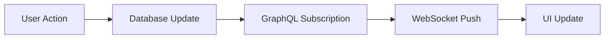

# Real-Time Features User Guide

This guide explains how real-time updates work in the Payroll-ByteMy application, what users can expect, and how to troubleshoot connection issues.

## Table of Contents

1. [Overview](#overview)
2. [How Real-Time Updates Work](#how-real-time-updates-work)
3. [Connection Status Indicators](#connection-status-indicators)
4. [Features with Real-Time Updates](#features-with-real-time-updates)
5. [Fallback Behavior](#fallback-behavior)
6. [User Experience](#user-experience)
7. [Troubleshooting](#troubleshooting)
8. [Performance Impact](#performance-impact)

## Overview

The Payroll-ByteMy application uses real-time technology to provide live updates across the system. This means that when data changes - whether by you or another user - you'll see those changes immediately without needing to refresh the page.

### Key Benefits

- **Instant Updates**: See changes as they happen
- **Collaborative Experience**: Multiple users can work simultaneously
- **Accurate Data**: Always see the most current information
- **Reduced Server Load**: Efficient data synchronization

### Technology Used

The application uses **WebSocket connections** for real-time communication, with automatic fallback to **periodic polling** when WebSocket connections are unavailable.

## How Real-Time Updates Work

### WebSocket Connection

When you load the application, it establishes a secure WebSocket connection to the server:

1. **Initial Connection**: WebSocket connects when you log in
2. **Subscription Setup**: The app subscribes to relevant data streams
3. **Live Updates**: Changes are pushed instantly to your browser
4. **Automatic Reconnection**: Connection is restored if temporarily lost

### Data Synchronization

Real-time updates work through GraphQL subscriptions:



### Security

All real-time updates respect your permissions:
- You only receive updates for data you're authorized to see
- Permission changes are reflected immediately
- Sensitive data is filtered based on your role

## Connection Status Indicators

The application provides visual feedback about your real-time connection status:

### Status Indicators

#### 🟢 Real-Time Connected
- **What it means**: WebSocket connection is active
- **Where to see it**: Small green dot in the top-right of relevant pages
- **Text**: "Real-time" 
- **Performance**: Optimal - instant updates

#### 🟠 Fallback Mode
- **What it means**: WebSocket disconnected, using polling
- **Where to see it**: Orange dot in the top-right of relevant pages  
- **Text**: "Fallback mode"
- **Performance**: Good - updates every 5 minutes

#### 🔴 Connection Issues
- **What it means**: Both WebSocket and polling have failed
- **Where to see it**: Red error message
- **Text**: "Connection error - some data may be outdated"
- **Performance**: Manual refresh needed

### Where to Find Status Indicators

Status indicators appear on pages with real-time features:

- **Security Dashboard**: Top-right of the page header
- **Staff Management**: Near the refresh button
- **Payroll Processing**: In the payroll status area
- **Client Management**: In the client list header

## Features with Real-Time Updates

### 1. Security Dashboard

**Real-Time Features**:
- Live security event monitoring
- Failed operation tracking
- Critical data access alerts
- System health metrics

**What You'll See**:
- New security events appear immediately
- Failure counts update in real-time
- Success rates recalculate automatically
- Alert badges update instantly

**Subscription Details**:
- Security events from the last 24 hours
- Failed operations stream
- Critical data access monitoring

### 2. Staff Management

**Real-Time Features**:
- New staff member additions
- Status changes (active/inactive)
- Role updates
- Profile modifications

**What You'll See**:
- Staff list updates when colleagues add new members
- Status indicators change when staff is activated/deactivated
- Role badges update when permissions change
- Profile information refreshes automatically

### 3. Audit Logging

**Real-Time Features**:
- Live audit trail updates
- Permission changes
- System access events
- Data modification tracking

**What You'll See**:
- New audit entries appear at the top of logs
- User activity streams update continuously
- Permission change notifications
- System event timeline updates

### 4. System Notifications

**Real-Time Features**:
- System alerts
- Maintenance notifications
- Security warnings
- Performance updates

**What You'll See**:
- Toast notifications for system events
- Alert banners for important updates
- Status message updates
- Maintenance mode notifications

## Fallback Behavior

### When WebSocket Disconnects

If your WebSocket connection is lost (due to network issues, server maintenance, etc.), the application automatically switches to fallback mode:

#### Automatic Fallback Process

1. **Detection**: Connection loss detected within 5 seconds
2. **Status Update**: Indicator changes to orange "Fallback mode"
3. **Polling Activation**: System switches to 5-minute polling
4. **Reconnection Attempts**: WebSocket reconnection tried every 30 seconds
5. **Restoration**: When connection restored, real-time updates resume

#### Fallback Performance

- **Update Frequency**: Every 5 minutes instead of instant
- **Data Accuracy**: Still accurate, just slightly delayed
- **User Experience**: Minimal impact on core functionality
- **Resource Usage**: Slightly higher due to periodic requests

### Manual Refresh Option

If you need the latest data immediately while in fallback mode:

1. Look for the **Refresh** button (🔄) on the page
2. Click to manually fetch the latest data
3. Page content will update with current information

## User Experience

### Visual Feedback

#### Loading States
- **Initial Load**: Skeleton loaders while data streams connect
- **Updates**: Smooth animations when data changes
- **Transitions**: Fade-in effects for new content

#### Update Animations
- **New Items**: Gentle highlight animation when items are added
- **Changes**: Brief color change when existing items update  
- **Removals**: Fade-out animation when items are deleted

#### Error States
- **Connection Issues**: Clear error messages with retry options
- **Permission Changes**: Immediate UI updates when access changes
- **Data Conflicts**: Conflict resolution with user choice

### Performance Optimizations

#### Efficient Updates
- **Incremental**: Only changed data is transmitted
- **Batched**: Multiple small changes are grouped together
- **Filtered**: You only receive updates relevant to your current page

#### Smart Reconnection
- **Exponential Backoff**: Reconnection attempts become less frequent over time
- **Background Retry**: Reconnection happens automatically without interrupting your work
- **Status Awareness**: System knows when you're actively using the page

## Troubleshooting

### Common Connection Issues

#### WebSocket Connection Fails

**Symptoms**:
- Orange "Fallback mode" indicator appears immediately
- Updates only occur every 5 minutes
- No real-time notifications

**Possible Causes**:
- Corporate firewall blocking WebSocket connections
- Network proxy interfering with connections
- Browser security settings
- Antivirus software blocking connections

**Solutions**:
1. **Check Network**: Ensure stable internet connection
2. **Browser Reset**: Try refreshing the page (F5 or Ctrl+R)
3. **Different Browser**: Test in incognito/private mode
4. **Network Admin**: Contact IT about WebSocket support
5. **VPN Issues**: Try disconnecting VPN temporarily

#### Frequent Disconnections

**Symptoms**:
- Status indicator frequently switches between green and orange
- Intermittent real-time updates
- Connection restored messages

**Possible Causes**:
- Unstable network connection
- Power management settings putting network to sleep
- Server maintenance or high load

**Solutions**:
1. **Network Stability**: Check WiFi signal strength
2. **Power Settings**: Disable network adapter power management
3. **Browser Update**: Ensure browser is up to date
4. **Server Status**: Check if others are experiencing issues

#### No Updates at All

**Symptoms**:
- Red connection error indicator
- No automatic updates (even in fallback mode)
- Manual refresh required for new data

**Possible Causes**:
- Complete network disconnection
- Server maintenance
- Authentication token expired
- Browser tab inactive for extended period

**Solutions**:
1. **Network Check**: Verify internet connectivity
2. **Page Refresh**: Hard refresh (Ctrl+F5 or Cmd+Shift+R)
3. **Re-login**: Sign out and sign back in
4. **Clear Cache**: Clear browser cache and cookies

### Browser-Specific Issues

#### Chrome
- **Issue**: Connection blocked by security policy
- **Solution**: Check chrome://settings/content/all for site permissions

#### Firefox  
- **Issue**: WebSocket connections disabled
- **Solution**: Verify `network.websocket.enabled` is true in about:config

#### Safari
- **Issue**: Connections dropped on mobile
- **Solution**: Disable "Low Power Mode" or enable "Background App Refresh"

#### Edge
- **Issue**: Corporate policies blocking connections
- **Solution**: Check with IT department about WebSocket policies

### Performance Issues

#### Slow Updates

**Symptoms**:
- Long delay between action and update
- Laggy animations
- High CPU usage

**Solutions**:
1. **Close Tabs**: Reduce browser tab count
2. **Check Extensions**: Disable unnecessary browser extensions
3. **Clear Memory**: Restart browser to clear memory leaks
4. **Update Browser**: Use latest browser version

#### High Data Usage

**Symptoms**:
- Rapid data consumption
- Slow mobile connection
- Data overage warnings

**Solutions**:
1. **WiFi Connection**: Switch to WiFi when available
2. **Close Unnecessary**: Close tabs you're not actively using
3. **Data Saver**: Enable browser data saver mode
4. **Fallback Mode**: Connection issues actually reduce data usage

## Performance Impact

### Resource Usage

#### WebSocket Mode (Optimal)
- **CPU Usage**: Very low - only processes actual changes
- **Memory Usage**: Minimal - maintains single connection
- **Network Usage**: Extremely efficient - only sends changed data
- **Battery Impact**: Low on mobile devices

#### Fallback Mode (Polling)
- **CPU Usage**: Low - periodic requests every 5 minutes
- **Memory Usage**: Slightly higher - caches data between polls
- **Network Usage**: Higher - fetches full data sets periodically
- **Battery Impact**: Moderate increase on mobile

### Optimization Features

#### Smart Subscriptions
- **Page-Aware**: Only subscribes to data for current page
- **Permission-Filtered**: Only receives data you can access
- **Lifecycle-Managed**: Automatically unsubscribes when leaving pages

#### Efficient Data Transfer
- **Incremental Updates**: Only changed fields are transmitted
- **Compression**: Data is compressed for transmission
- **Batching**: Multiple small changes are grouped together

#### Background Optimization
- **Tab Awareness**: Reduces activity when tab is not visible
- **Connection Pooling**: Reuses connections across components
- **Smart Retry**: Adjusts retry frequency based on connection stability

## Best Practices for Users

### Maximizing Real-Time Experience

1. **Keep Tabs Open**: Don't close the app tab if you need notifications
2. **Stable Connection**: Use reliable internet when possible
3. **Updated Browser**: Keep your browser up to date
4. **Close Unused Tabs**: Reduce browser resource usage

### When to Manually Refresh

- After long periods of inactivity
- When returning from sleep/hibernation
- If you suspect data is outdated
- During known server maintenance windows

### Working with Teammates

- **Coordinate Changes**: Communicate when making bulk updates
- **Watch for Conflicts**: Pay attention to real-time change notifications
- **Use Comments**: Leave notes when making significant changes
- **Refresh Before Major Actions**: Ensure you have latest data

## Technical Details for Developers

### Subscription Architecture

The real-time system uses GraphQL subscriptions over WebSocket with automatic fallback:

```typescript
// Example subscription usage
const { data, error } = useSubscription(SecurityEventsStreamDocument, {
  variables: { twentyFourHoursAgo: timeRanges.twentyFourHoursAgo },
  onError: (error) => {
    console.warn("Subscription error:", error);
    setIsWebSocketConnected(false);
  },
});
```

### Fallback Implementation

```typescript
// Fallback polling when WebSocket fails
const { data: fallbackData } = useStrategicQuery(
  SecurityOverviewDocument,
  "auditLogs",
  {
    variables: timeRanges,
    skip: isWebSocketConnected,
    pollInterval: isWebSocketConnected ? 0 : 300000, // 5 minutes
    fetchPolicy: "network-only",
  }
);
```

### Connection Monitoring

```typescript
// Monitor connection status
useEffect(() => {
  const hasSubscriptionErrors = !!(securityEventsError || failedOpsError);
  if (hasSubscriptionErrors) {
    setIsWebSocketConnected(false);
  } else if (securityEventsData || failedOpsData) {
    setIsWebSocketConnected(true);
  }
}, [securityEventsData, failedOpsData, securityEventsError, failedOpsError]);
```

## Related Documentation

- [Security Dashboard Implementation](/docs/domains/SECURITY_DASHBOARD_IMPLEMENTATION.md)
- [Apollo Client Architecture](/docs/architecture/APOLLO_CLIENT_ARCHITECTURE.md)
- [Performance Optimization](/docs/architecture/MODERN_LOADING_SYSTEM.md)
- [Troubleshooting Guide](/docs/TROUBLESHOOTING_QUICK_REFERENCE.md)

---

*Last Updated: December 2024*
*Next Review: January 2025*