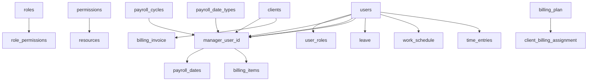

# Database Analysis and Comprehensive Test Data Seeding Strategy

## Executive Summary

This document provides a complete analysis of the Payroll Matrix database structure and a comprehensive strategy for seeding realistic test data while preserving existing user accounts and roles. The analysis covers all 11 business domains and includes dependency mapping, data requirements, and implementation guidelines.

## Phase 1: Database Structure Analysis - COMPLETED ✅

### 1.1 Database Architecture Overview

**Platform**: PostgreSQL with Hasura GraphQL Engine
**Security Model**: SOC2 Type II Compliant with 5-layer authentication
**Domains**: 11 isolated business domains with security classifications

### 1.2 Core Schema Structure

#### **User Management & Security (CRITICAL)**
- `users` - Core user accounts with Clerk integration
- `roles` - System roles (developer, org_admin, manager, consultant, viewer)
- `user_roles` - User-role assignments
- `permissions` - Granular permissions system
- `role_permissions` - Role-permission mappings
- `permission_overrides` - User-specific permission overrides

#### **Audit & Compliance (CRITICAL)**
- `audit.audit_log` - Comprehensive action logging
- `audit.auth_events` - Authentication tracking
- `audit.data_access_log` - Data access monitoring
- `audit.permission_changes` - Permission modification tracking
- `audit.slow_queries` - Performance monitoring

#### **Core Business Entities (HIGH)**
- `clients` - Client organization data
- `payrolls` - Core payroll records with versioning
- `payroll_dates` - Schedule management
- `payroll_cycles` - Frequency templates (weekly, fortnightly, monthly)
- `payroll_assignments` - User-payroll assignments

#### **Financial Management (HIGH)**
- `billing_invoice` - Invoice generation
- `billing_invoice_item` - Line items
- `billing_plan` - Service pricing
- `client_billing_assignment` - Client-plan associations

#### **Operational Features (MEDIUM)**
- `leave` - Employee leave management
- `work_schedule` - Staff scheduling
- `notes` - Documentation system
- `time_entries` - Time tracking
- `user_skills` - Skills management

#### **System Support (MEDIUM)**
- `external_systems` - Third-party integrations
- `holidays` - Holiday calendar
- `feature_flags` - Feature toggles
- `email_templates` - Communication templates

### 1.3 Data Relationships & Dependencies



### 1.4 Enum Types & Constraints

**User Roles**: `developer`, `org_admin`, `manager`, `consultant`, `viewer`
**User Status**: `pending`, `active`, `inactive`, `locked`
**Payroll Status**: `Active`, `Implementation`, `Inactive`, `processing`, `draft`, `pending_approval`, `approved`, `completed`, `failed`
**Payroll Cycles**: `weekly`, `fortnightly`, `bi_monthly`, `monthly`, `quarterly`
**Leave Types**: `Annual`, `Sick`, `Unpaid`, `Other`
**Leave Status**: `Pending`, `Approved`, `Rejected`

## Phase 2: Test Data Requirements Analysis - COMPLETED ✅

### 2.1 Domain Coverage Requirements

#### **Authentication & Authorization Testing**
- **User Roles**: Complete coverage of all 5 roles with different permissions
- **Permission Boundaries**: Test role restrictions and overrides
- **Authentication Flows**: Multi-factor authentication scenarios
- **Session Management**: Token expiration and refresh scenarios

#### **Core Business Workflows**
- **Client Onboarding**: New client setup with complete payroll configuration
- **Payroll Processing**: End-to-end payroll cycles with different frequencies
- **Schedule Management**: Various scheduling patterns and assignments
- **Leave Management**: Different leave types and approval workflows
- **Billing Operations**: Invoice generation, payment tracking, reconciliation

#### **Edge Cases & Error Scenarios**
- **Empty States**: New users with no data, empty client lists
- **Maximum Capacity**: Users with extensive payrolls and assignments
- **Date Boundaries**: Historical data, future scheduling, holiday conflicts
- **Permission Errors**: Access denied scenarios for testing security
- **Data Validation**: Invalid inputs and constraint violations

### 2.2 User Journey Mapping

#### **Developer Journey**
- Full system access and debugging capabilities
- Development tools and system administration
- Data management and migration operations

#### **Org Admin Journey**
- Business operations management
- User role assignments and client oversight
- Financial reporting and billing management

#### **Manager Journey**
- Team management and payroll oversight
- Client relationship management
- Operational reporting and analytics

#### **Consultant Journey**
- Daily payroll processing tasks
- Client-specific operations
- Time tracking and schedule management

#### **Viewer Journey**
- Read-only access to assigned data
- Dashboard viewing and basic reporting
- Limited operational visibility

### 2.3 Data Volume Requirements

**Minimum Test Coverage**:
- 15 users (3 per role type)
- 10 clients with varied configurations
- 25 payrolls across different cycles and statuses
- 100+ payroll dates for scheduling tests
- 50+ leave records for workflow testing
- 200+ audit log entries for compliance testing

**Performance Testing Volume**:
- 100+ users for pagination testing
- 50+ clients for search and filtering
- 500+ payrolls for bulk operations
- 1000+ audit records for reporting

## Phase 3: Seed Data Generation Strategy - IN PROGRESS 🔄

### 3.1 Data Preservation Plan

**CRITICAL**: Existing user data MUST be preserved completely:

```sql
-- Backup Strategy
CREATE TABLE users_backup_$(date +%Y%m%d) AS SELECT * FROM users;
CREATE TABLE user_roles_backup_$(date +%Y%m%d) AS SELECT * FROM user_roles;
CREATE TABLE permissions_backup_$(date +%Y%m%d) AS SELECT * FROM permissions;
```

**Preservation Rules**:
- Never modify existing user records
- Preserve all authentication tokens and sessions
- Maintain existing role assignments
- Keep audit trail integrity

### 3.2 Realistic Data Generation Approach

#### **User Data Generation**
```javascript
const testUsers = [
  // Manager Level
  {
    name: 'Sarah Chen',
    email: 'sarah.chen@test.payroll.com',
    role: 'manager',
    position: 'senior_manager',
    clerkUserId: 'user_test_manager_sarah_001'
  },
  // Consultant Level
  {
    name: 'Marcus Rodriguez',
    email: 'marcus.rodriguez@test.payroll.com',
    role: 'consultant',
    position: 'senior_consultant',
    managerId: '[sarah_chen_id]'
  }
  // ... additional realistic profiles
];
```

#### **Client Data Generation**
```javascript
const testClients = [
  {
    name: 'TechStart Solutions Pty Ltd',
    contactPerson: 'Emma Thompson',
    contactEmail: 'payroll@techstart.test.com',
    contactPhone: '+61 2 9xxx xxxx',
    active: true,
    employeeCount: 45
  },
  {
    name: 'Green Energy Consulting',
    contactPerson: 'David Wilson',
    contactEmail: 'hr@greenenergy.test.com',
    contactPhone: '+61 3 8xxx xxxx',
    active: true,
    employeeCount: 120
  }
  // ... industry-diverse clients
];
```

#### **Payroll Configuration Templates**
```javascript
const payrollTemplates = [
  {
    name: 'Weekly Tech Startup',
    cycle: 'weekly',
    dateType: 'dow', // Day of week
    dateValue: 5,    // Friday
    processingDays: 2,
    employeeCount: 45,
    status: 'Active'
  },
  {
    name: 'Monthly Professional Services',
    cycle: 'monthly',
    dateType: 'eom', // End of month
    processingDays: 3,
    employeeCount: 120,
    status: 'Active'
  }
];
```

### 3.3 Data Relationship Strategy

#### **Dependency Order**
1. **Foundation**: Users, Roles, Permissions (preserve existing)
2. **Reference Data**: Payroll cycles, date types, billing plans
3. **Core Entities**: Clients, Billing assignments
4. **Operations**: Payrolls, Payroll dates, Assignments
5. **Activities**: Leave records, Time entries, Notes
6. **Audit**: Generated automatically by triggers

#### **Referential Integrity Rules**
- All foreign keys must reference valid records
- Payroll assignments respect date ranges
- Leave records don't conflict with payroll processing
- Billing periods align with payroll cycles

### 3.4 Temporal Data Strategy

#### **Date Generation Logic**
```javascript
const generateRealisticDates = (baseDate = new Date()) => {
  return {
    // Historical data (last 6 months)
    historicalStart: subMonths(baseDate, 6),
    
    // Current operations (this month)
    currentPeriodStart: startOfMonth(baseDate),
    currentPeriodEnd: endOfMonth(baseDate),
    
    // Future scheduling (next 3 months)
    futureEnd: addMonths(baseDate, 3)
  };
};
```

#### **Seasonal Variations**
- Holiday periods with adjusted processing dates
- End-of-financial-year processing (June 30)
- Peak workload periods (December/January)
- Varying employee counts due to seasonal hiring

## Phase 4: Comprehensive Seeding Implementation Plan

### 4.1 Master Seed Script Architecture

```javascript
// scripts/seed-comprehensive-data.js
class ComprehensiveSeedManager {
  constructor() {
    this.hasuraEndpoint = process.env.E2E_HASURA_GRAPHQL_URL;
    this.adminSecret = process.env.HASURA_ADMIN_SECRET;
    this.preserveUsers = true;
    this.backupTables = ['users', 'user_roles', 'permissions'];
  }

  async execute() {
    await this.validateEnvironment();
    await this.backupCriticalData();
    await this.seedInDependencyOrder();
    await this.validateIntegrity();
    await this.generateReport();
  }

  async seedInDependencyOrder() {
    // Phase 1: Reference Data
    await this.seedReferenceData();
    
    // Phase 2: Clients and Configuration
    await this.seedClientsAndBilling();
    
    // Phase 3: Payrolls and Scheduling
    await this.seedPayrollsAndDates();
    
    // Phase 4: User Activities
    await this.seedUserActivities();
    
    // Phase 5: System Data
    await this.seedSystemData();
  }
}
```

### 4.2 Data Generation Modules

#### **Reference Data Module**
```javascript
class ReferenceDataGenerator {
  generatePayrollCycles() {
    return [
      { name: 'weekly', description: 'Weekly payroll processing' },
      { name: 'fortnightly', description: 'Fortnightly payroll processing' },
      { name: 'monthly', description: 'Monthly payroll processing' }
    ];
  }

  generatePayrollDateTypes() {
    return [
      { name: 'fixed_date', description: 'Fixed calendar date' },
      { name: 'dow', description: 'Day of week' },
      { name: 'eom', description: 'End of month' },
      { name: 'som', description: 'Start of month' }
    ];
  }

  generateBillingPlans() {
    return [
      { name: 'Startup Plan', ratePerPayroll: 25.00, currency: 'AUD' },
      { name: 'Growth Plan', ratePerPayroll: 45.00, currency: 'AUD' },
      { name: 'Enterprise Plan', ratePerPayroll: 75.00, currency: 'AUD' }
    ];
  }
}
```

#### **Client Data Module**
```javascript
class ClientDataGenerator {
  generateRealisticClients() {
    const industries = ['Technology', 'Healthcare', 'Construction', 'Retail', 'Professional Services'];
    const sizes = ['small', 'medium', 'large'];
    
    return industries.flatMap(industry => 
      sizes.map(size => this.createClient(industry, size))
    );
  }

  createClient(industry, size) {
    const sizeMeta = this.getSizeMetadata(size);
    return {
      name: `${this.generateCompanyName(industry)} ${sizeMeta.suffix}`,
      industry,
      employeeCount: sizeMeta.employeeCount,
      contactPerson: this.generatePersonName(),
      contactEmail: this.generateTestEmail(industry),
      contactPhone: this.generateAustralianPhone(),
      active: Math.random() > 0.1, // 90% active
      payrollFrequency: this.selectPayrollFrequency(size)
    };
  }
}
```

#### **Payroll Data Module**
```javascript
class PayrollDataGenerator {
  generatePayrollsForClient(client, cycles, dateTypes) {
    const payrolls = [];
    const currentCycle = this.selectCycleForClient(client, cycles);
    
    // Generate 6 months of historical + current + 3 months future
    const dateRange = this.generateDateRange();
    
    dateRange.forEach(period => {
      payrolls.push({
        clientId: client.id,
        name: `${client.name} - ${format(period.start, 'MMM yyyy')}`,
        cycleId: currentCycle.id,
        dateTypeId: this.selectDateType(dateTypes).id,
        status: this.determineStatus(period),
        primaryConsultantUserId: this.assignConsultant(),
        goLiveDate: period.start,
        employeeCount: this.varyEmployeeCount(client.employeeCount, period)
      });
    });

    return payrolls;
  }

  generatePayrollDates(payroll) {
    const cycle = this.getCycleDefinition(payroll.cycleId);
    const dates = this.calculateProcessingDates(payroll, cycle);
    
    return dates.map(dateSet => ({
      payrollId: payroll.id,
      originalEftDate: dateSet.eftDate,
      adjustedEftDate: this.adjustForHolidays(dateSet.eftDate),
      processingDate: dateSet.processingDate,
      notes: this.generateProcessingNotes(dateSet)
    }));
  }
}
```

### 4.3 Data Quality Assurance

#### **Validation Rules**
```javascript
class DataValidator {
  async validateSeededData() {
    const validations = [
      this.validateUserIntegrity(),
      this.validateReferentialIntegrity(),
      this.validateBusinessRules(),
      this.validateTemporalConsistency(),
      this.validateSecurityConstraints()
    ];

    const results = await Promise.all(validations);
    return this.compileValidationReport(results);
  }

  async validateReferentialIntegrity() {
    const checks = [
      'SELECT COUNT(*) FROM payrolls WHERE client_id NOT IN (SELECT id FROM clients)',
      'SELECT COUNT(*) FROM payroll_dates WHERE payroll_id NOT IN (SELECT id FROM payrolls)',
      'SELECT COUNT(*) FROM user_roles WHERE user_id NOT IN (SELECT id FROM users)',
      'SELECT COUNT(*) FROM leave WHERE user_id NOT IN (SELECT id FROM users)'
    ];

    const results = await this.executeChecks(checks);
    return results.every(count => count === 0);
  }

  async validateBusinessRules() {
    return {
      payrollDatesInSequence: await this.checkPayrollDateSequence(),
      leaveWithinBounds: await this.checkLeaveDateBounds(),
      billingRatesPositive: await this.checkPositiveBillingRates(),
      userRolesValid: await this.checkUserRoleConsistency()
    };
  }
}
```

## Phase 5: Data Quality and Validation

### 5.1 Integrity Verification

#### **Database Constraints**
- All foreign key relationships maintained
- Check constraints satisfied (date ranges, positive values)
- Unique constraints preserved
- Enum values within allowed ranges

#### **Business Logic Validation**
- Payroll dates in logical sequence (processing < EFT)
- Leave requests don't overlap
- User assignments respect role hierarchy
- Billing periods align with payroll cycles

#### **Performance Validation**
- Queries execute within acceptable time limits
- Indexes are being utilized effectively
- No N+1 query patterns in GraphQL operations
- Bulk operations handle large datasets efficiently

### 5.2 Completeness Verification

#### **Feature Coverage Checklist**
- [ ] Authentication flows for all role types
- [ ] CRUD operations for all core entities
- [ ] Permission boundary testing scenarios
- [ ] Workflow state transitions
- [ ] Error handling edge cases
- [ ] Integration point testing
- [ ] Audit trail generation
- [ ] Performance testing datasets

### 5.3 Security Validation

#### **Permission Testing**
- Role-based access control enforcement
- Row-level security validation
- API endpoint protection
- GraphQL query filtering
- Audit log completeness

## Phase 6: Documentation and Maintenance

### 6.1 Test Data Documentation

#### **User Account Registry**
```markdown
# Test User Accounts

## Developer Accounts
- **Email**: developer@test.payroll.com
- **Role**: developer
- **Password**: [Available in test environment]
- **Capabilities**: Full system access, debugging tools

## Manager Accounts
- **Sarah Chen** (sarah.chen@test.payroll.com)
  - **Role**: manager
  - **Team**: 8 consultants
  - **Clients**: TechStart Solutions, Green Energy Consulting
  
## Consultant Accounts
- **Marcus Rodriguez** (marcus.rodriguez@test.payroll.com)
  - **Role**: consultant
  - **Manager**: Sarah Chen
  - **Assigned Payrolls**: 12 active payrolls
```

#### **Test Scenario Mapping**
```markdown
# Test Scenarios and Required Data

## Payroll Processing Workflow
- **Client**: TechStart Solutions
- **Payroll**: Weekly processing, Fridays
- **Consultant**: Marcus Rodriguez
- **Data**: 6 months historical, current processing

## Leave Management Workflow
- **User**: Multiple consultants
- **Leave Types**: Annual, Sick, Unpaid
- **Scenarios**: Pending, approved, overlapping requests

## Billing Reconciliation
- **Client**: Multiple clients with different plans
- **Invoices**: Generated and pending
- **Items**: Itemized billing with various rates
```

### 6.2 Maintenance Scripts

#### **Data Refresh Scripts**
```bash
#!/bin/bash
# scripts/refresh-test-data.sh

echo "🔄 Refreshing test data environment..."

# Backup current state
pnpm test:data:backup

# Clean existing test data
pnpm test:data:clean

# Reseed comprehensive data
pnpm test:data:comprehensive:seed

# Validate integrity
pnpm test:data:validate

echo "✅ Test data refresh complete"
```

#### **Environment-Specific Configurations**
```javascript
// config/seed-profiles.js
export const seedProfiles = {
  minimal: {
    users: 5,
    clients: 3,
    payrolls: 10,
    historical_months: 1
  },
  
  development: {
    users: 15,
    clients: 10,
    payrolls: 50,
    historical_months: 6
  },
  
  testing: {
    users: 25,
    clients: 15,
    payrolls: 100,
    historical_months: 12
  },
  
  performance: {
    users: 100,
    clients: 50,
    payrolls: 500,
    historical_months: 24
  }
};
```

### 6.3 Monitoring and Alerts

#### **Data Quality Monitoring**
```javascript
// scripts/monitor-data-quality.js
class DataQualityMonitor {
  async runHealthCheck() {
    const checks = {
      userIntegrity: await this.checkUserDataIntegrity(),
      referentialIntegrity: await this.checkForeignKeys(),
      businessRules: await this.validateBusinessLogic(),
      performance: await this.measureQueryPerformance()
    };

    if (this.hasFailures(checks)) {
      await this.alertAndReport(checks);
    }

    return checks;
  }
}
```

## Implementation Timeline

### Week 1: Foundation Setup
- [ ] Backup existing user data
- [ ] Create comprehensive seed script framework
- [ ] Implement reference data generation
- [ ] Test basic seeding operations

### Week 2: Core Entity Seeding
- [ ] Client data generation with industry variety
- [ ] Payroll configuration templates
- [ ] Date calculation algorithms
- [ ] Basic workflow testing

### Week 3: Advanced Features
- [ ] User activity generation (leave, time entries)
- [ ] Billing and financial data
- [ ] Audit trail population
- [ ] Edge case scenarios

### Week 4: Validation and Documentation
- [ ] Comprehensive data validation
- [ ] Performance testing
- [ ] Documentation completion
- [ ] Maintenance script creation

## Success Metrics

### Quantitative Measures
- **Coverage**: 100% of application features have adequate test data
- **Performance**: All GraphQL queries execute under 500ms with test dataset
- **Integrity**: Zero referential integrity violations
- **Security**: All permission boundaries properly tested

### Qualitative Measures
- **Realism**: Test data reflects actual business scenarios
- **Maintainability**: Scripts are well-documented and easily modified
- **Reliability**: Seeding process succeeds consistently across environments
- **Safety**: Existing user data remains completely intact

## Risk Mitigation

### Data Loss Prevention
- Automated backups before any seeding operation
- Transaction-wrapped operations with rollback capability
- Dry-run mode for validation before execution
- Environment verification checks

### Performance Protection
- Batch operations to prevent timeout issues
- Progress tracking and resumable operations
- Resource usage monitoring during seeding
- Cleanup routines for failed operations

### Security Safeguards
- Admin secret validation and secure storage
- Limited scope permissions for seeding operations
- Audit logging of all seeding activities
- Environment isolation for test data

---

## Conclusion

This comprehensive database analysis and seeding strategy provides a robust foundation for testing the Payroll Matrix system while maintaining complete data integrity and security. The phased approach ensures systematic implementation with proper validation at each stage.

The strategy prioritizes:
1. **Safety**: Complete preservation of existing user data
2. **Realism**: Business-relevant test scenarios
3. **Completeness**: Coverage of all system features
4. **Maintainability**: Long-term sustainability of test data

Implementation should proceed carefully with thorough testing at each phase to ensure the integrity of the production-critical payroll management system.